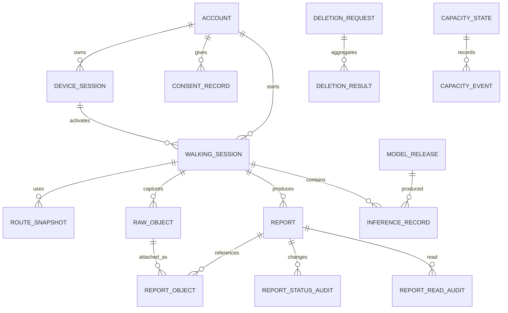

# WalkSafe 인터페이스·데이터 설계

이 문서는 WalkSafe 설계를 사람이 검토하기 위한 **독립적인 Draft**입니다. 승인된 정책을 설계 언어로 옮겼지만, 이 문서 자체는 아직 승인되지 않았고 현재 코드가 이 설계를 따른다는 판정이나 시험 완료를 뜻하지 않습니다.

| 통제 항목 | 값 |
|---|---|
| 문서 ID | `WS-DES-INTERFACE-DATA-DRAFT-20260721-001` |
| 포함 산출물 | `DES-09`, `DES-10`, `DES-11`, `DES-12`, `DES-13`, `DES-26` |
| 버전·기준일 | `0.2.0` · `2026-07-22` |
| 문서 생명주기 | `DRAFT` |
| 문서 승인 | `NOT_APPROVED` |
| 설계·구현 적합성 | `NOT_ASSESSED` |
| 시험 | `NOT_RUN` |
| 출시 | `NOT_ELIGIBLE` |
| 남은 게이트 | `5개 NOT_RUN`, 면제 없음 |
| 요구사항 연결 상태 | `DRAFT_REFERENCE_PRESENT_NOT_BASELINED` |
| 기계 추적 | `docs/deliverables/04-design/design-traceability-register.json` |

## 먼저 읽을 핵심 경계

- 정식 사용자 제품은 **Android 사용자 앱**이다.
- 정식 관리 제품은 사용자 앱과 앱 ID·서명·배포·로그인을 분리한 **별도 Android 관리자 앱**이다. 현재 저장소에서는 이 독립 앱 경계를 확인하지 못했으므로 구현 공백으로 둔다.
- Web/PWA는 과거 구현을 이해하기 위한 `LEGACY_REFERENCE_ONLY`이며 정식 사용자·관리자 제품으로 채택하지 않는다.
- `contracts/walksafe.openapi.json`, Android·backend 코드, ORM·migration은 현재 상태를 보여 주는 후보 사실이다. 파일 경로와 SHA-256으로 묶지만 승인된 설계나 적합 증거로 승격하지 않는다.
- 정책 기준선은 승인·기준선화됐지만 이 설계 Draft, 구현, 시험, 배포는 별도 검토 대상이다.
- `WS-FEATURE-POLICY-FP035-CORRECTION-CANDIDATE-20260722-001` / `DEC-FP035-NETWORK-NORMALIZATION-20260722`는 새 질문이 아니라 기존 SP-13·FP-035 답변을 한 Draft 규칙으로 정리한 정정 후보다. 보행 중에는 전송하지 않고, 정지 뒤 Wi-Fi 또는 사용자가 명시적으로 허용한 이동통신망만 사용한다. 상태는 `NOT_APPROVED / NOT_EFFECTIVE`이며 정책 1.0.0 원본, 구현·시험 완료를 바꾸거나 주장하지 않는다.

## 입력 기준과 읽는 법

| 구분 | 기준 |
|---|---|
| 승인 정책 입력 | `PB-WALKSAFE-FEATURE-POLICY-1.0.0` |
| 정책 파일 | `docs/control/decision-interview/walksafe-feature-policy-comprehensive-draft.json` |
| 기존 답변 정규화 근거 | `docs/control/decision-interview/source-records/walksafe-feature-policy-comprehensive-review-20260719-answers.json`의 `SP-13`, `FP-035` |
| FP-035 정정 후보 | `docs/control/decision-interview/walksafe-feature-policy-fp035-correction-candidate-20260722-r001.json` · `NOT_APPROVED / NOT_EFFECTIVE` · 영향 산출물과 새 묶음 승인 필요 |
| 정렬 결정 | `docs/control/decision-interview/walksafe-effective-decision-register-aligned-20260721-r001.json`의 135건 |
| 요구예정 | REQ 유형과 `RQ-FP-*`, `RQ-NPC-*`, `RQ-GATE-*` Draft ID; 요구사항 기준선 승인 전까지 계획 연결 |
| 구현 후보 | 아래 후보 근거 표의 경로·SHA-256; 적합성 `NOT_ASSESSED` |
| 상태 해석 | “설계한다”는 목표 구조, “현재 후보”는 저장소 관찰 사실, “남은 일”은 승인·구현·시험 전 차단 항목 |

각 DES 절의 관리표에는 왜 만드는지, 무엇을 채우는지, 누가 작성·검토·승인하는지, 언제 고치고 어떻게 대체·폐기하는지를 함께 적는다.

## 자주 나오는 기술용어를 쉽게 읽기

| 용어 | 쉬운 뜻 |
|---|---|
| gateway | 앱의 요청이 서버로 들어오는 한 개의 확인된 입구 |
| worker | 사용자 화면 없이 서버 뒤에서 접수·삭제·검사 같은 일을 처리하는 프로그램 |
| resource | 계정, 신고, 원본처럼 권한검사의 대상이 되는 자료 |
| object storage | 영상·음성 같은 큰 파일을 두는 서버 저장소 |
| digest·SHA-256 | 파일이 바뀌었는지 비교하는 긴 지문값 |
| TTL | 받은 상태나 자료를 다시 확인해야 하는 유효시간 |
| backoff·backpressure | 실패나 과부하 때 재시도·유입 속도를 늦추는 방법 |
| provenance | 파일·빌드·모델이 어떤 입력과 과정에서 만들어졌는지 남긴 이력 |
| idempotency | 같은 요청을 다시 보내도 한 번 처리한 것과 같은 결과가 되게 하는 성질 |
| lease | 한 기기나 작업자에게 일정 시간만 주는 임시 독점 권한 |
| session | 로그인이나 한 번의 보행처럼 시작과 끝이 있는 사용 단위 |
| token | 비밀번호를 매번 보내지 않고 로그인·권한을 증명하는 짧은 전자표 |
| MFA·passkey | 비밀번호 하나에만 의존하지 않는 추가 로그인 확인수단 |
| attestation | 등록된 진짜 앱·기기·보안수단인지 확인하는 절차 |
| KMS·HSM | 암호화·서명 열쇠를 일반 파일과 분리해 보호하는 전용 관리수단 |
| break-glass | 평상시에는 막아 두고 사고 때만 승인·기록 후 여는 긴급 접근 |
| rate limit·timeout·circuit | 요청 횟수를 제한하고, 오래 걸리는 요청을 끝내며, 연속 실패한 외부 호출을 잠시 막는 보호장치 |
| audit·append-only | 누가 무엇을 했는지 남기고 과거 기록을 덮어쓰지 않는 감사기록 방식 |
| redaction | 로그에서 비밀값·정확 위치·원본 주소 같은 민감정보를 가리는 처리 |
| alert·on-call | 이상을 자동 통보하고 정해진 담당자가 대응하는 운영체계 |
| RTO·RPO·drill | 장애 뒤 복구 목표시간, 허용 가능한 자료 손실범위, 실제 복구 연습 |
| quota·5xx | 외부서비스 사용한도와 외부 서버 쪽 오류 응답 |
| subprocessor·region | 자료처리에 다시 참여하는 하위업체와 자료가 저장·처리되는 국가·지역 |
| SBOM·SCA | 사용한 소프트웨어 부품 목록과 그 부품의 알려진 취약점 검사 |
| TLS | 앱과 서버 사이 전송내용을 암호화하고 상대 서버를 확인하는 통신 보호 |
| sandbox | 앱이나 작업이 다른 자료에 함부로 접근하지 못하게 나눈 격리공간 |

## 현재 구현 후보 근거와 SHA-256

이 표는 현재 저장소를 재현하기 위한 근거다. `NOT_ASSESSED`이므로 설계 충족이나 시험 통과를 의미하지 않는다.

| 근거 ID | 분류 | 경로 | SHA-256 | 읽는 법 |
|---|---|---|---|---|
| `SRC-ANDROID-REPORT-UPLOADER` | `CANDIDATE_IMPLEMENTATION_FACT_REVALIDATION_REQUIRED` | `apps/android/app/src/main/java/kr/co/hanium/dreamup/walksafe/report/AndroidReportUploader.kt` | `ac8186277ec3f88e0ff848818ef15059a6512ff5f8a7bd24deb1f00dd9259205` | 현재 신고 전송 후보 |
| `SRC-OPENAPI` | `CANDIDATE_IMPLEMENTATION_FACT_REVALIDATION_REQUIRED` | `contracts/walksafe.openapi.json` | `808c23492d7c942c4d30fee44f6c824af8d9f3aff541a9f361b85aa7fe963cdb` | 현재 API 계약 후보; 승인된 DES-09·10 기준선 아님 |
| `SRC-BACKEND-MAIN` | `CANDIDATE_IMPLEMENTATION_FACT` | `backend/app/main.py` | `c7953d9e7a3b046da0154baf0832dfc9b294d5760552dea19d31785794dada99` | 현재 FastAPI 조합 경계 후보 |
| `SRC-BACKEND-MODELS` | `CANDIDATE_IMPLEMENTATION_FACT_REVALIDATION_REQUIRED` | `backend/app/models.py` | `b337202f43beb99b506e11ca563c4479c32d2691e2a4857d698a490e3e801946` | 현재 DB ORM 후보; 목표 데이터 모델 전체가 아님 |
| `SRC-BACKEND-SCHEMAS` | `CANDIDATE_IMPLEMENTATION_FACT_REVALIDATION_REQUIRED` | `backend/app/schemas.py` | `f6bd1eeb57f578050f16e1673f84a729beeb502ee7c80fdcadbb7ffb72b62c3d` | 현재 request·response 데이터 구조 후보 |
| `SRC-BACKEND-TMAP` | `CANDIDATE_IMPLEMENTATION_FACT_REVALIDATION_REQUIRED` | `backend/app/services/tmap_pedestrian.py` | `369eaee6d42be77965e77734a5eb94572bbdd8d71836d90f6091cc402347cd06` | 현재 TMAP 보행 경로 중계 후보 |
| `SRC-BACKEND-REQUIREMENTS` | `CANDIDATE_IMPLEMENTATION_FACT` | `backend/requirements.txt` | `b961d7554e769c567c86b5430c13ec55d911bd5bfeba3eba68c4bb9e49802e69` | 현재 backend 기술 버전 후보 |
| `SRC-DOCKER-COMPOSE` | `CANDIDATE_IMPLEMENTATION_FACT_NOT_DEPLOYMENT_EVIDENCE` | `docker-compose.yml` | `d3ca3c4caf272919712ee21ce8ae59c14894bff8f3270596a06c8601a2df6de5` | 로컬 PostGIS 배치 후보; 외부 인프라 배포 증거 아님 |
| `SRC-BACKUP-SCRIPT` | `CANDIDATE_IMPLEMENTATION_FACT_REVALIDATION_REQUIRED` | `scripts/backup_walksafe_data_20260711.sh` | `f0b262f6e7d7c248905a127980202bd380937fa07db0a898a121a7ef94bca97c` | 현재 백업 절차 후보 |
| `SRC-RESTORE-SCRIPT` | `CANDIDATE_IMPLEMENTATION_FACT_NOT_CURRENT_DRILL_EVIDENCE` | `scripts/restore_walksafe_backup_drill_20260711.sh` | `a6014ef922caed329370a16113c65713eb6756f3450de944e5d59f7860b4b89b` | 복원훈련 도구 후보; 현재 복구훈련 완료 증거 아님 |

## DES-09 API·인터페이스 명세

### 설계할 API 경계

모바일 앱은 한 개의 검증된 HTTPS gateway origin만 사용한다. 사용자 앱·관리자 앱·내부 worker는 같은 endpoint를 보더라도 앱 종류, 계정, 역할, resource 소유권으로 권한을 다시 검사한다. DB, object storage, TMAP 비밀값에 앱이 직접 접근하지 않는다.

**FP-035 하류 의존성:** DES-09는 `RELATED_DOWNSTREAM_DEPENDENCY`이며 이동통신망 정책을 독립적으로 정하거나 직접 승인하지 않는다. 일반 활동원본 API의 필드·상태 계약은 `WS-FEATURE-POLICY-FP035-CORRECTION-CANDIDATE-20260722-001` / `DEC-FP035-NETWORK-NORMALIZATION-20260722`를 직접 반영하는 DES-04·DES-13·DES-20의 승인된 결정을 따른다. 승인 전에는 schema 작성·계획만 허용하고 이동통신망 분기 구현·정식 계약시험은 `BLOCKED_PENDING_BUNDLED_APPROVAL`로 동결한다. 후보는 `NOT_APPROVED / NOT_EFFECTIVE`이고, 정확한 묶음 승인 전에는 API가 정책 효력을 만들지 않는다.

| API 묶음 | 주요 행위 | 인증·권한 | 중복·실패 원칙 |
|---|---|---|---|
| 계정·동의·기기 session | 가입, 로그인, token 회전, 로그아웃, 기기 폐기, 동의 버전·철회·삭제요청 | 사용자 앱, 자기 계정; 민감 변경 재인증 | refresh 재사용 탐지, 삭제요청 ID 고정 |
| 보행 session·기기 상태 | 한 계정 한 활성보행 lease, 권한/기능 수준, 시작·중지 상태 | 사용자 앱, 자기 기기 | lease 충돌은 기존 상태 확인 후 사용자 선택 |
| 목적지·보행 경로 | 검색, TMAP 중계, route version·TTL | 사용자 앱 | timeout 후 추정 경로 금지; 오래된 회전안내 중단 |
| 신고·원본 전송 | 중복조회, 후보/수동신고 생성, chunk/object 접수, digest receipt, 상태 조회 | 사용자 앱; 고정 report/session ID | 응답 불명 시 상태조회 우선, 같은 ID 재시도 |
| 용량 상태 | server state version·observed_at·TTL·reason | 사용자 앱 read only, 관리자 상세 | 오래된 상태는 단말 상한 적용; 수치 gate 전 확정 금지 |
| 관리자 신고 | 목록·상세·상태 변경·export 최소화 | **별도 관리자 앱**, MFA/패스키, 민감 작업 단계상승 | 원본 기본 차단, 모든 read/export/status 감사 |
| 모델 registry | 승인 모델·config·digest 조회, rollback 대상 | 배포 서비스와 관리자 승인 경로 | 서명·digest 불일치면 활성화 금지 |
| 운영 health | liveness/readiness, 제한된 진단 | 내부 모니터·운영자 | 개인정보·비밀·원본 경로 노출 금지 |

모든 request는 `X-Request-ID` 또는 동등한 상관 ID, 앱 ID, API version, 인증정보를 가진다. 상태 변경·신고·원본 접수·삭제 요청은 idempotency key를 요구한다. 오류 응답은 `code`, 쉬운 `message`, 사용자가 할 `action`, `request_id`, 재시도 가능 여부를 같은 envelope로 제공한다. timeout·재시도 횟수·backoff 수치는 요구·부하시험 뒤 기준선화한다.

### 현재 OpenAPI 후보와 차이

현재 후보는 OpenAPI `3.1.0`, service version `0.1.0`, path 22개, schema 28개다. top-level security 선언은 `false`, server 선언은 `false`다. 따라서 이 파일만으로 정식 인증·server·오류·idempotency 계약이 충족됐다고 판단하지 않는다.

현재 path 후보:

- `/android/debug/depth-logs`
- `/android/debug/depth-logs/recent`
- `/android/debug/frame-captures`
- `/android/debug/frame-captures/recent`
- `/detect`
- `/detect/health`
- `/detect/v2`
- `/detect/v2/health`
- `/health`
- `/navigation/destinations/search`
- `/navigation/destinations/search/health`
- `/navigation/walking`
- `/navigation/walking/health`
- `/ready`
- `/reports`
- `/reports/duplicate-check`
- `/reports/export`
- `/reports/summary`
- `/reports/v2`
- `/reports/{report_id}`
- `/reports/{report_id}/status`
- `/uploads/{filename}`

`/android/debug/*`, `/uploads/{filename}`, Web/PWA 전제, 인증 없는 operation은 정식 제품 경계에서 각각 제거·격리·재설계 여부를 검토해야 한다.

### 이 산출물의 작성·관리 기준

| 항목 | 현재 값 |
|---|---|
| 작성 목적 | 각 인터페이스의 동작 의미와 호출 계약을 사람과 구현자가 동일하게 해석하게 한다. |
| 필수/조건 | `REQUIRED` · 요구사항 기준선 승인 후 구현·통합 전에 활성 |
| 들어갈 내용 | - endpoint·행위·책임 - request·response·header - 상태코드·오류 envelope - 인증·권한 - timeout·재시도·idempotency - 버전·deprecated 정책 |
| 작성 입력 | - 승인된 요구사항 기준선과 RTM - 현재 코드·OpenAPI·DB migration·배포 형상 - ADR 후보와 품질·보안·안전 제약 |
| 선행 → 후속 | `DES-03`, `DES-04`, `REQ-07` → `DES-10`, `DES-22`, `DEV-01`, `SEC-13`, `WS-11` |
| 작성·검토·승인 | 기술책임자 · 제품책임자, 보안·개인정보책임자, QA책임자, 독립기술검토자 · 프로젝트책임자 |
| 형식·정본 위치 | `CANONICAL_DOCUMENT` · `docs/deliverables/04-design/interface-and-data-design.md#des-09` |
| 보조 파일 | `docs/deliverables/04-design/design-traceability-register.json` |
| 완료·승인 기준 | - 다음 핵심 내용이 근거·버전과 함께 구체적으로 작성되어 있다: endpoint·행위·책임, request·response·header. - 필수 내용에 공란·암묵적 가정이 없고 미결정은 소유자·기한이 있는 차단 항목으로 표시되어 있다. - 상위 입력과 요구·설계·코드·시험·변경요청의 해당 추적 링크가 유효하다. - 지정 검토자가 사실·일관성·추적성을 확인하고 승인자가 명시적으로 승인했다. |
| 갱신 조건 | - 요구·아키텍처·API·DB·배포·보안 경계 변경 - 연결된 상위 기준선·사용자 승인 결정·외부 의무 변경 - 검토에서 사실 오류·누락·stale 판정 또는 유효기간 만료 |
| 검토 주기 | 초안의 필수내용을 채운 때, 상위 요구·정책·설계 경계가 바뀐 때, 설계 기준선 승인 전에 검토한다. |
| 변경·대체·폐기 | 승인본을 덮어쓰지 않는다. 변경요청과 영향분석을 남겨 새 버전을 만들고, 대체된 버전은 Superseded로 표시한 뒤 정해진 보존기간이 끝나면 Archived로 옮긴다. |

쉽게 말하면, 이 표는 이 설계 산출물을 왜 만들고 누가 언제까지 무엇을 확인하며, 바뀌면 어떻게 새 버전으로 관리할지를 정한 약속이다.

### 추적과 판정 경계

- 입력: 승인 정책 [`PB-WALKSAFE-FEATURE-POLICY-1.0.0`](../../control/baselines/walksafe-feature-policy-baseline-1.0.0-manifest-20260721-r001.json), [정렬 결정 등록부](../../control/decision-interview/walksafe-effective-decision-register-aligned-20260721-r001.json), [기존 답변](../../control/decision-interview/source-records/walksafe-feature-policy-comprehensive-review-20260719-answers.json), [FP-035 정정 후보](../../control/decision-interview/walksafe-feature-policy-fp035-correction-candidate-20260722-r001.json), 산출물 유형 작성계약.
- 정책 결정: 영역 `FA-04`, `FA-05`, `FA-08`, `FA-11`, `FA-12`, `FA-14`, `FA-15`, `FA-16`; 기능 `FP-010`, `FP-011`, `FP-012`, `FP-013`, `FP-015`, `FP-022`, `FP-023`, `FP-024`, `FP-031`, `FP-032`, `FP-035`, `FP-040`, `FP-042`, `FP-044`, `FP-047`, `FP-048`; 공통정책 `NPC-AUTO-REPORT`, `NPC-SERVER-CAPACITY-STATE-SYNC`, `NPC-PERMISSION-SESSION-LIFECYCLE`; 흐름 `FLOW-03`, `FLOW-05`, `FLOW-07`, `FLOW-08`, `FLOW-10`.
- 기존 답변 정규화: 없음; 적용 요구유형 없음. 해당 없는 산출물은 `없음`이다.
- 정정 후보·묶음 승인 의존성: 없음. 값이 있으면 `NOT_APPROVED / NOT_EFFECTIVE`이며 이 산출물과 함께 새 묶음 승인이 필요하다.

- FP-035 관련 하류 의존성: `RELATED_DOWNSTREAM_DEPENDENCY`. 이 산출물은 직접 영향 산출물이 아니며 `DES-04`, `DES-13`, `DES-20`의 승인된 결정을 참조한다. 관련 후보·효력 발생 사건은 `WS-FEATURE-POLICY-FP035-CORRECTION-CANDIDATE-20260722-001`, `EXACT_NEW_BUNDLED_OWNER_APPROVAL_STATEMENT`이고 이동통신망 분기 구현·정식시험은 `BLOCKED_PENDING_BUNDLED_APPROVAL`이다.
- 정렬 결정: 등록부의 73건(`DEC-USER-AGE`, `DEC-APP-SEPARATION`, `DEC-DEPTH-UNSUPPORTED`, `DEC-IBQ-016`, `DEC-IBQ-017`, `DEC-IBQ-019`, `DEC-SIGNUP-DATA`, `DEC-IDENTITY-VERIFY`, `DEC-LOGIN-PERSISTENCE`, `DEC-MULTI-DEVICE-KEEP`, `DEC-CONCURRENT-WALK`, `DEC-REMOTE-LOGOUT` 외 61건). 전체 목록과 해시는 추적 등록부에 있다.
- 요구예정 유형: [`REQ-07`](../03-requirements/system-requirements.md#req-07) (DRAFT_FILE_PRESENT_NOT_BASELINED); [`REQ-09`](../03-requirements/system-requirements.md#req-09) (DRAFT_FILE_PRESENT_NOT_BASELINED); [`REQ-13`](../03-requirements/system-requirements.md#req-13) (DRAFT_FILE_PRESENT_NOT_BASELINED).
- 요구예정 상세: 23건([`RQ-FP-010-001`](../03-requirements/system-requirements.md#RQ-FP-010-001), [`RQ-FP-011-001`](../03-requirements/system-requirements.md#RQ-FP-011-001), [`RQ-FP-012-001`](../03-requirements/system-requirements.md#RQ-FP-012-001), [`RQ-FP-013-001`](../03-requirements/system-requirements.md#RQ-FP-013-001), [`RQ-FP-015-001`](../03-requirements/system-requirements.md#RQ-FP-015-001), [`RQ-FP-022-001`](../03-requirements/system-requirements.md#RQ-FP-022-001), [`RQ-FP-023-001`](../03-requirements/system-requirements.md#RQ-FP-023-001), [`RQ-FP-024-001`](../03-requirements/system-requirements.md#RQ-FP-024-001), [`RQ-FP-031-001`](../03-requirements/system-requirements.md#RQ-FP-031-001), [`RQ-FP-032-001`](../03-requirements/system-requirements.md#RQ-FP-032-001), [`RQ-FP-035-001`](../03-requirements/system-requirements.md#RQ-FP-035-001), [`RQ-FP-040-001`](../03-requirements/system-requirements.md#RQ-FP-040-001) 외 11건); 상태 `DRAFT_REFERENCE_PRESENT_NOT_BASELINED`.
- 현재 후보 근거: `SRC-ANDROID-REPORT-UPLOADER`, `SRC-OPENAPI`, `SRC-BACKEND-MAIN`, `SRC-BACKEND-MODELS`, `SRC-BACKEND-SCHEMAS`, `SRC-BACKEND-TMAP`, `SRC-BACKEND-REQUIREMENTS`, `SRC-DOCKER-COMPOSE`, `SRC-BACKUP-SCRIPT`, `SRC-RESTORE-SCRIPT`; 구현 적합성 `NOT_ASSESSED`.
- 이 절의 문서 상태는 `DRAFT`, 승인 `NOT_APPROVED`, 검증 `NOT_RUN`이다.

## DES-10 OpenAPI·이벤트 스키마

`contracts/walksafe.openapi.json`은 현재 구현 후보 snapshot이다. 최종 DES-10 기준선은 승인된 요구 ID, operation ID, security scheme, 오류 envelope, 예시, 개인정보 분류와 호환성 규칙을 모두 가져야 한다.

### 목표 schema 원칙

- 날짜·시각은 timezone이 있는 ISO 8601, 위치는 WGS84와 정확도(m), 방향은 0 이상 360 미만 도(degree)로 명시한다.
- 모델 결과는 `model_id`, `model_version`, `config_version`, `class_id`, `confidence`, bbox, 거리 산출 방법과 기능 수준을 함께 보낸다.
- 원본은 metadata와 object를 분리하고 `raw_object_id`, content type, byte length, SHA-256, consent version, capture interval로 묶는다.
- 상태는 자유문자열 대신 versioned enum과 허용 전이표를 사용한다.
- 민감 필드에는 목적·보존 class·log redaction 여부를 schema extension 또는 데이터 사전으로 연결한다.

### 내부·비동기 이벤트 Draft

| 이벤트 | 생산자→소비자 | 최소 payload | 순서·중복 |
|---|---|---|---|
| `walking.session.started.v1` | 사용자 앱→backend | session/device/account pseudonymous ID, mode, consent/config versions, occurred_at | session ID당 한 번, 재수신 무해 |
| `report.candidate.queued.v1` | 단말 신고→단말 queue | report ID, trigger, object refs, network preference | 로컬 순서, 후보별 사용자 알림 없음 |
| `raw.object.received.v1` | object ingest→metadata worker | object ID, digest, byte length, receipt_at | digest 일치한 receipt만 완료 |
| `report.status.changed.v1` | 관리자 API→audit/notification | report ID, from/to, actor, purpose, request ID | 낙관적 version 검사 |
| `capacity.state.changed.v1` | capacity worker→gateway/app state | version, state, observed_at, TTL, reason | 최신 version만 채택; 주기·TTL gate 전 미정 |
| `data.deletion.requested.v1` | 사용자 권리행사→각 저장소 worker | request ID, scope, deadlines, exceptions | 위치별 결과를 같은 request ID에 집계 |
| `model.release.activated.v1` | model registry→배포 | model/config/dataset/evaluation IDs와 digest | 승인·서명 확인 전 활성화 금지 |

event broker나 전달 방식은 아직 선택하지 않는다. 먼저 동기 API+DB outbox 후보와 운영복잡도를 비교하고, 순서·재전송·개인정보 보존 요구를 충족할 때 ADR로 확정한다.

### 이 산출물의 작성·관리 기준

| 항목 | 현재 값 |
|---|---|
| 작성 목적 | 실행 가능한 schema로 HTTP API와 이벤트 payload의 형식·검증을 자동화한다. |
| 필수/조건 | `REQUIRED` · 요구사항 기준선 승인 후 구현·통합 전에 활성 |
| 들어갈 내용 | - OpenAPI 버전·server - path·operation·security - component schema·제약 - 오류·예시 - 이벤트명·payload·순서 - 생성·검증·호환 규칙 |
| 작성 입력 | - 승인된 요구사항 기준선과 RTM - 현재 코드·OpenAPI·DB migration·배포 형상 - ADR 후보와 품질·보안·안전 제약 |
| 선행 → 후속 | `DES-09` → `TST-08` |
| 작성·검토·승인 | 기술책임자 · 제품책임자, 보안·개인정보책임자, QA책임자, 독립기술검토자 · 프로젝트책임자 |
| 형식·정본 위치 | `CONTROLLED_ARTIFACT` · `docs/deliverables/04-design/interface-and-data-design.md#des-10` |
| 보조 파일 | `docs/deliverables/04-design/design-traceability-register.json` |
| 완료·승인 기준 | - 다음 핵심 내용이 근거·버전과 함께 구체적으로 작성되어 있다: OpenAPI 버전·server, path·operation·security. - 필수 내용에 공란·암묵적 가정이 없고 미결정은 소유자·기한이 있는 차단 항목으로 표시되어 있다. - 상위 입력과 요구·설계·코드·시험·변경요청의 해당 추적 링크가 유효하다. - 지정 검토자가 사실·일관성·추적성을 확인하고 승인자가 명시적으로 승인했다. |
| 갱신 조건 | - 요구·아키텍처·API·DB·배포·보안 경계 변경 - 연결된 상위 기준선·사용자 승인 결정·외부 의무 변경 - 검토에서 사실 오류·누락·stale 판정 또는 유효기간 만료 |
| 검토 주기 | 초안의 필수내용을 채운 때, 상위 요구·정책·설계 경계가 바뀐 때, 설계 기준선 승인 전에 검토한다. |
| 변경·대체·폐기 | 승인본을 덮어쓰지 않는다. 변경요청과 영향분석을 남겨 새 버전을 만들고, 대체된 버전은 Superseded로 표시한 뒤 정해진 보존기간이 끝나면 Archived로 옮긴다. |

쉽게 말하면, 이 표는 이 설계 산출물을 왜 만들고 누가 언제까지 무엇을 확인하며, 바뀌면 어떻게 새 버전으로 관리할지를 정한 약속이다.

### 추적과 판정 경계

- 입력: 승인 정책 [`PB-WALKSAFE-FEATURE-POLICY-1.0.0`](../../control/baselines/walksafe-feature-policy-baseline-1.0.0-manifest-20260721-r001.json), [정렬 결정 등록부](../../control/decision-interview/walksafe-effective-decision-register-aligned-20260721-r001.json), [기존 답변](../../control/decision-interview/source-records/walksafe-feature-policy-comprehensive-review-20260719-answers.json), [FP-035 정정 후보](../../control/decision-interview/walksafe-feature-policy-fp035-correction-candidate-20260722-r001.json), 산출물 유형 작성계약.
- 정책 결정: 영역 `FA-04`, `FA-06`, `FA-08`, `FA-11`, `FA-12`, `FA-13`, `FA-14`, `FA-15`, `FA-16`, `FA-18`; 기능 `FP-012`, `FP-018`, `FP-022`, `FP-023`, `FP-031`, `FP-032`, `FP-035`, `FP-039`, `FP-040`, `FP-044`, `FP-047`, `FP-052`; 공통정책 `NPC-AUTO-REPORT`, `NPC-SERVER-CAPACITY-STATE-SYNC`; 흐름 `FLOW-03`, `FLOW-05`, `FLOW-07`, `FLOW-08`, `FLOW-09`, `FLOW-10`.
- 기존 답변 정규화: 없음; 적용 요구유형 없음. 해당 없는 산출물은 `없음`이다.
- 정정 후보·묶음 승인 의존성: 없음. 값이 있으면 `NOT_APPROVED / NOT_EFFECTIVE`이며 이 산출물과 함께 새 묶음 승인이 필요하다.

- 정렬 결정: 등록부의 77건(`DEC-POOR-IMAGE-BEHAVIOR`, `DEC-APP-SEPARATION`, `DEC-DEPTH-UNSUPPORTED`, `DEC-IBQ-017`, `DEC-SIGNUP-DATA`, `DEC-IDENTITY-VERIFY`, `DEC-LOGIN-PERSISTENCE`, `DEC-MULTI-DEVICE-KEEP`, `DEC-CONCURRENT-WALK`, `DEC-REMOTE-LOGOUT`, `DEC-IBQ-027`, `DEC-IBQ-028` 외 65건). 전체 목록과 해시는 추적 등록부에 있다.
- 요구예정 유형: [`REQ-07`](../03-requirements/system-requirements.md#req-07) (DRAFT_FILE_PRESENT_NOT_BASELINED); [`REQ-08`](../03-requirements/system-requirements.md#req-08) (DRAFT_FILE_PRESENT_NOT_BASELINED).
- 요구예정 상세: 18건([`RQ-FP-012-001`](../03-requirements/system-requirements.md#RQ-FP-012-001), [`RQ-FP-018-001`](../03-requirements/system-requirements.md#RQ-FP-018-001), [`RQ-FP-022-001`](../03-requirements/system-requirements.md#RQ-FP-022-001), [`RQ-FP-023-001`](../03-requirements/system-requirements.md#RQ-FP-023-001), [`RQ-FP-031-001`](../03-requirements/system-requirements.md#RQ-FP-031-001), [`RQ-FP-032-001`](../03-requirements/system-requirements.md#RQ-FP-032-001), [`RQ-FP-035-001`](../03-requirements/system-requirements.md#RQ-FP-035-001), [`RQ-FP-039-001`](../03-requirements/system-requirements.md#RQ-FP-039-001), [`RQ-FP-040-001`](../03-requirements/system-requirements.md#RQ-FP-040-001), [`RQ-FP-044-001`](../03-requirements/system-requirements.md#RQ-FP-044-001), [`RQ-FP-047-001`](../03-requirements/system-requirements.md#RQ-FP-047-001), [`RQ-FP-052-001`](../03-requirements/system-requirements.md#RQ-FP-052-001) 외 6건); 상태 `DRAFT_REFERENCE_PRESENT_NOT_BASELINED`.
- 현재 후보 근거: `SRC-ANDROID-REPORT-UPLOADER`, `SRC-OPENAPI`, `SRC-BACKEND-MAIN`, `SRC-BACKEND-MODELS`, `SRC-BACKEND-SCHEMAS`, `SRC-BACKEND-TMAP`, `SRC-BACKEND-REQUIREMENTS`, `SRC-DOCKER-COMPOSE`, `SRC-BACKUP-SCRIPT`, `SRC-RESTORE-SCRIPT`; 구현 적합성 `NOT_ASSESSED`.
- 이 절의 문서 상태는 `DRAFT`, 승인 `NOT_APPROVED`, 검증 `NOT_RUN`이다.

## DES-11 ERD

현재 ORM에는 4개 table 후보(`reports`, `report_export_audits`, `report_status_audits`, `report_read_audits`)가 보인다. 이것은 신고와 감사 일부이며 계정·동의·기기·보행·경로·원본·삭제·용량·모델 전체 목표 ERD가 아니다.

### 목표 논리 ERD Draft

### 핵심 관계·삭제 원칙

- 계정과 기기 session은 1:N이지만 활성 보행 lease는 계정당 최대 하나다.
- 동의 기록은 내용을 덮어쓰지 않고 문서·선택·시각별 새 record로 남긴다.
- `WALKING_SESSION`은 route snapshot, raw object, inference, report의 공통 correlation ID다.
- 원본 object는 DB에 넣지 않고 object storage에 두며 DB에는 immutable ID·digest·크기·보존기한·삭제상태를 둔다.
- 신고가 원본을 참조하더라도 계정 삭제·법적 보존·신고 보존의 충돌을 별도 상태로 해결하고 cascade delete로 조용히 유실하지 않는다.
- 감사 table은 append-only이며 원본 민감값 대신 목적·actor·resource·digest·결과를 남긴다.
- 위치는 PostGIS `POINT` SRID 4326과 위·경도·정확도의 일관성을 검사한다.

물리 ERD는 최종 migration을 생성하고 빈 DB·기존 DB 업그레이드에 적용한 뒤 다시 생성해야 정합성을 주장할 수 있다.

### 이 산출물의 작성·관리 기준

| 항목 | 현재 값 |
|---|---|
| 작성 목적 | 신고·사용자·감사·운영 데이터의 개체·관계·카디널리티·무결성을 시각화한다. |
| 필수/조건 | `REQUIRED` · 요구사항 기준선 승인 후 구현·통합 전에 활성 |
| 들어갈 내용 | - 엔터티와 식별자 - 관계·카디널리티 - 필수·선택 관계 - 참조·삭제 규칙 - 공간 데이터 타입 - ERD와 migration 정합성 |
| 작성 입력 | - 승인된 요구사항 기준선과 RTM - 현재 코드·OpenAPI·DB migration·배포 형상 - ADR 후보와 품질·보안·안전 제약 |
| 선행 → 후속 | `DES-03`, `REQ-08` → `DES-12`, `DES-25`, `DES-26` |
| 작성·검토·승인 | 기술책임자 · 제품책임자, 보안·개인정보책임자, QA책임자, 독립기술검토자 · 프로젝트책임자 |
| 형식·정본 위치 | `CANONICAL_DOCUMENT` · `docs/deliverables/04-design/interface-and-data-design.md#des-11` |
| 보조 파일 | `docs/deliverables/04-design/design-traceability-register.json` |
| 완료·승인 기준 | - 다음 핵심 내용이 근거·버전과 함께 구체적으로 작성되어 있다: 엔터티와 식별자, 관계·카디널리티. - 필수 내용에 공란·암묵적 가정이 없고 미결정은 소유자·기한이 있는 차단 항목으로 표시되어 있다. - 상위 입력과 요구·설계·코드·시험·변경요청의 해당 추적 링크가 유효하다. - 지정 검토자가 사실·일관성·추적성을 확인하고 승인자가 명시적으로 승인했다. |
| 갱신 조건 | - 요구·아키텍처·API·DB·배포·보안 경계 변경 - 연결된 상위 기준선·사용자 승인 결정·외부 의무 변경 - 검토에서 사실 오류·누락·stale 판정 또는 유효기간 만료 |
| 검토 주기 | 초안의 필수내용을 채운 때, 상위 요구·정책·설계 경계가 바뀐 때, 설계 기준선 승인 전에 검토한다. |
| 변경·대체·폐기 | 승인본을 덮어쓰지 않는다. 변경요청과 영향분석을 남겨 새 버전을 만들고, 대체된 버전은 Superseded로 표시한 뒤 정해진 보존기간이 끝나면 Archived로 옮긴다. |

쉽게 말하면, 이 표는 이 설계 산출물을 왜 만들고 누가 언제까지 무엇을 확인하며, 바뀌면 어떻게 새 버전으로 관리할지를 정한 약속이다.

### 추적과 판정 경계

- 입력: 승인 정책 [`PB-WALKSAFE-FEATURE-POLICY-1.0.0`](../../control/baselines/walksafe-feature-policy-baseline-1.0.0-manifest-20260721-r001.json), [정렬 결정 등록부](../../control/decision-interview/walksafe-effective-decision-register-aligned-20260721-r001.json), [기존 답변](../../control/decision-interview/source-records/walksafe-feature-policy-comprehensive-review-20260719-answers.json), [FP-035 정정 후보](../../control/decision-interview/walksafe-feature-policy-fp035-correction-candidate-20260722-r001.json), 산출물 유형 작성계약.
- 정책 결정: 영역 `FA-04`, `FA-05`, `FA-08`, `FA-09`, `FA-11`, `FA-12`, `FA-13`, `FA-14`, `FA-16`, `FA-18`; 기능 `FP-010`, `FP-011`, `FP-012`, `FP-013`, `FP-015`, `FP-022`, `FP-026`, `FP-031`, `FP-032`, `FP-034`, `FP-035`, `FP-037`, `FP-038`, `FP-039`, `FP-041`, `FP-047`, `FP-048`, `FP-053`; 공통정책 `NPC-DATA-LIFECYCLE`, `NPC-RAW-ORIGINAL-COLLECTION`; 흐름 `FLOW-03`, `FLOW-05`, `FLOW-07`, `FLOW-08`, `FLOW-09`, `FLOW-10`.
- 기존 답변 정규화: 없음; 적용 요구유형 없음. 해당 없는 산출물은 `없음`이다.
- 정정 후보·묶음 승인 의존성: 없음. 값이 있으면 `NOT_APPROVED / NOT_EFFECTIVE`이며 이 산출물과 함께 새 묶음 승인이 필요하다.

- 정렬 결정: 등록부의 84건(`DEC-USER-AGE`, `DEC-APP-SEPARATION`, `DEC-IBQ-016`, `DEC-IBQ-017`, `DEC-IBQ-019`, `DEC-SIGNUP-DATA`, `DEC-IDENTITY-VERIFY`, `DEC-LOGIN-PERSISTENCE`, `DEC-MULTI-DEVICE-KEEP`, `DEC-CONCURRENT-WALK`, `DEC-REMOTE-LOGOUT`, `DEC-IBQ-027` 외 72건). 전체 목록과 해시는 추적 등록부에 있다.
- 요구예정 유형: [`REQ-08`](../03-requirements/system-requirements.md#req-08) (DRAFT_FILE_PRESENT_NOT_BASELINED).
- 요구예정 상세: 25건([`RQ-FP-010-001`](../03-requirements/system-requirements.md#RQ-FP-010-001), [`RQ-FP-011-001`](../03-requirements/system-requirements.md#RQ-FP-011-001), [`RQ-FP-012-001`](../03-requirements/system-requirements.md#RQ-FP-012-001), [`RQ-FP-013-001`](../03-requirements/system-requirements.md#RQ-FP-013-001), [`RQ-FP-015-001`](../03-requirements/system-requirements.md#RQ-FP-015-001), [`RQ-FP-022-001`](../03-requirements/system-requirements.md#RQ-FP-022-001), [`RQ-FP-026-001`](../03-requirements/system-requirements.md#RQ-FP-026-001), [`RQ-FP-031-001`](../03-requirements/system-requirements.md#RQ-FP-031-001), [`RQ-FP-032-001`](../03-requirements/system-requirements.md#RQ-FP-032-001), [`RQ-FP-034-001`](../03-requirements/system-requirements.md#RQ-FP-034-001), [`RQ-FP-035-001`](../03-requirements/system-requirements.md#RQ-FP-035-001), [`RQ-FP-037-001`](../03-requirements/system-requirements.md#RQ-FP-037-001) 외 13건); 상태 `DRAFT_REFERENCE_PRESENT_NOT_BASELINED`.
- 현재 후보 근거: `SRC-ANDROID-REPORT-UPLOADER`, `SRC-OPENAPI`, `SRC-BACKEND-MAIN`, `SRC-BACKEND-MODELS`, `SRC-BACKEND-SCHEMAS`, `SRC-BACKEND-TMAP`, `SRC-BACKEND-REQUIREMENTS`, `SRC-DOCKER-COMPOSE`, `SRC-BACKUP-SCRIPT`, `SRC-RESTORE-SCRIPT`; 구현 적합성 `NOT_ASSESSED`.
- 이 절의 문서 상태는 `DRAFT`, 승인 `NOT_APPROVED`, 검증 `NOT_RUN`이다.

## DES-12 테이블 정의서·데이터 사전

### 목표 데이터 묶음 사전

| 데이터 묶음 | 식별자·핵심 필드 | 의미·단위 | 민감도 | 저장·인덱스 원칙 |
|---|---|---|---|---|
| 계정 | account ID, 연령조건·보호자 상태 | 실명 최소화, 계정 상태 | 개인정보 | ID·상태, 삭제요청 query |
| 동의 | consent ID, 문서 version, 목적별 선택, actor, time | 무엇을 언제 허용했는지 | 고위험 개인정보 증거 | append-only, 문서 version unique 조합 |
| 기기 session | device/session ID, token family, last used, revoked | 기기별 로그인 | 보안민감 | token 원문 저장 금지, 폐기/만료 인덱스 |
| 보행 session | walking ID, start/end, mode, state, config/model versions | 한 번의 보행 상관 단위 | 민감 활동정보 | account+active lease unique 후보 |
| 위치·경로 | WGS84 point, accuracy m, heading degree, route geometry/version | 현재 위치와 저장 TMAP 경로 | 정밀 위치 | GiST 공간 인덱스, 오래된 경로 상태 분리 |
| 탐지·위험 | class, confidence 0..1, normalized bbox, distance method, risk state | 모델 후보와 별도 위험판단 | 행동/영상 파생 | session/time/model 복합 인덱스; raw 연결 |
| 신고 | report UUID, trigger manual/auto, status, class, point, captured_at | 손상 점자블록 신고 | 위치·영상 | 상태·시각·공간 인덱스, 중복 key |
| 원본 object | object ID, type, bytes, SHA-256, URI, consent, retention/deletion | 압축 수집 원본 | **최고 민감도** | URI 비공개, digest unique 후보, object는 DB 밖 |
| 학습자료 | dataset/model lineage, label, split, approval, digest | 승인된 학습·검증 자료 | 최고 민감도 | 원본 lineage와 3년 만료일 |
| 용량 상태 | scope phone/server, state, version, observed_at, TTL | 저장 backpressure 판단 | 운영정보 | 최신 version query, history append |
| 감사 | audit ID, actor, purpose, resource, request ID, result, occurred_at | 누가 왜 무엇을 했는지 | 보안민감 | append-only, 원본·token·정밀값 기록 금지 |
| 삭제 요청·결과 | request ID, scope, requested_at, deadline, store, result, proof digest | 위치별 삭제 진행과 증명 | 개인정보 권리행사 | deadline·status 인덱스, proof 3년 |

각 실제 column에는 SQL type, null, default, PK/FK/unique/check, 단위, 예, owner, 보존 class, migration ID를 붙여야 한다. 이 Draft는 목표 개념 사전이며 현재 ORM 4개 table을 완전한 정의서로 승인하지 않는다.

### 이 산출물의 작성·관리 기준

| 항목 | 현재 값 |
|---|---|
| 작성 목적 | DB 테이블·열·제약·인덱스의 의미와 개인정보·보존 속성을 필드 단위로 정의한다. |
| 필수/조건 | `REQUIRED` · 요구사항 기준선 승인 후 구현·통합 전에 활성 |
| 들어갈 내용 | - table·column·type·null - PK·FK·unique·check - 의미·단위·예시 - index·query 용도 - 민감도·보존·삭제 - 소유자·migration 연결 |
| 작성 입력 | - 승인된 요구사항 기준선과 RTM - 현재 코드·OpenAPI·DB migration·배포 형상 - ADR 후보와 품질·보안·안전 제약 |
| 선행 → 후속 | `DES-11`, `REQ-08` → `DES-13`, `DES-21`, `DES-26`, `DEV-13` |
| 작성·검토·승인 | 기술책임자 · 제품책임자, 보안·개인정보책임자, QA책임자, 독립기술검토자 · 프로젝트책임자 |
| 형식·정본 위치 | `CANONICAL_DOCUMENT` · `docs/deliverables/04-design/interface-and-data-design.md#des-12` |
| 보조 파일 | `docs/deliverables/04-design/design-traceability-register.json` |
| 완료·승인 기준 | - 다음 핵심 내용이 근거·버전과 함께 구체적으로 작성되어 있다: table·column·type·null, PK·FK·unique·check. - 필수 내용에 공란·암묵적 가정이 없고 미결정은 소유자·기한이 있는 차단 항목으로 표시되어 있다. - 상위 입력과 요구·설계·코드·시험·변경요청의 해당 추적 링크가 유효하다. - 지정 검토자가 사실·일관성·추적성을 확인하고 승인자가 명시적으로 승인했다. |
| 갱신 조건 | - 요구·아키텍처·API·DB·배포·보안 경계 변경 - 연결된 상위 기준선·사용자 승인 결정·외부 의무 변경 - 검토에서 사실 오류·누락·stale 판정 또는 유효기간 만료 |
| 검토 주기 | 초안의 필수내용을 채운 때, 상위 요구·정책·설계 경계가 바뀐 때, 설계 기준선 승인 전에 검토한다. |
| 변경·대체·폐기 | 승인본을 덮어쓰지 않는다. 변경요청과 영향분석을 남겨 새 버전을 만들고, 대체된 버전은 Superseded로 표시한 뒤 정해진 보존기간이 끝나면 Archived로 옮긴다. |

쉽게 말하면, 이 표는 이 설계 산출물을 왜 만들고 누가 언제까지 무엇을 확인하며, 바뀌면 어떻게 새 버전으로 관리할지를 정한 약속이다.

### 추적과 판정 경계

- 입력: 승인 정책 [`PB-WALKSAFE-FEATURE-POLICY-1.0.0`](../../control/baselines/walksafe-feature-policy-baseline-1.0.0-manifest-20260721-r001.json), [정렬 결정 등록부](../../control/decision-interview/walksafe-effective-decision-register-aligned-20260721-r001.json), [기존 답변](../../control/decision-interview/source-records/walksafe-feature-policy-comprehensive-review-20260719-answers.json), [FP-035 정정 후보](../../control/decision-interview/walksafe-feature-policy-fp035-correction-candidate-20260722-r001.json), 산출물 유형 작성계약.
- 정책 결정: 영역 `FA-04`, `FA-05`, `FA-06`, `FA-07`, `FA-08`, `FA-09`, `FA-11`, `FA-12`, `FA-13`, `FA-14`, `FA-16`, `FA-18`; 기능 `FP-010`, `FP-011`, `FP-012`, `FP-013`, `FP-015`, `FP-017`, `FP-018`, `FP-019`, `FP-020`, `FP-021`, `FP-022`, `FP-023`, `FP-025`, `FP-026`, `FP-031`, `FP-034`, `FP-035`, `FP-036`, `FP-037`, `FP-038`, `FP-039`, `FP-041`, `FP-046`, `FP-047`, `FP-048`, `FP-053`; 공통정책 `NPC-DATA-LIFECYCLE`, `NPC-RAW-ORIGINAL-COLLECTION`; 흐름 `FLOW-03`, `FLOW-05`, `FLOW-07`, `FLOW-08`, `FLOW-09`, `FLOW-10`.
- 기존 답변 정규화: 없음; 적용 요구유형 없음. 해당 없는 산출물은 `없음`이다.
- 정정 후보·묶음 승인 의존성: 없음. 값이 있으면 `NOT_APPROVED / NOT_EFFECTIVE`이며 이 산출물과 함께 새 묶음 승인이 필요하다.

- 정렬 결정: 등록부의 114건(`DEC-USER-AGE`, `DEC-POOR-IMAGE-BEHAVIOR`, `DEC-LANGUAGE-SCOPE`, `DEC-APP-SEPARATION`, `DEC-DEPTH-UNSUPPORTED`, `DEC-IBQ-015`, `DEC-IBQ-016`, `DEC-IBQ-017`, `DEC-IBQ-019`, `DEC-SIGNUP-DATA`, `DEC-IDENTITY-VERIFY`, `DEC-LOGIN-PERSISTENCE` 외 102건). 전체 목록과 해시는 추적 등록부에 있다.
- 요구예정 유형: [`REQ-08`](../03-requirements/system-requirements.md#req-08) (DRAFT_FILE_PRESENT_NOT_BASELINED); [`REQ-10`](../03-requirements/system-requirements.md#req-10) (DRAFT_FILE_PRESENT_NOT_BASELINED).
- 요구예정 상세: 33건([`RQ-FP-010-001`](../03-requirements/system-requirements.md#RQ-FP-010-001), [`RQ-FP-011-001`](../03-requirements/system-requirements.md#RQ-FP-011-001), [`RQ-FP-012-001`](../03-requirements/system-requirements.md#RQ-FP-012-001), [`RQ-FP-013-001`](../03-requirements/system-requirements.md#RQ-FP-013-001), [`RQ-FP-015-001`](../03-requirements/system-requirements.md#RQ-FP-015-001), [`RQ-FP-017-001`](../03-requirements/system-requirements.md#RQ-FP-017-001), [`RQ-FP-018-001`](../03-requirements/system-requirements.md#RQ-FP-018-001), [`RQ-FP-019-001`](../03-requirements/system-requirements.md#RQ-FP-019-001), [`RQ-FP-020-001`](../03-requirements/system-requirements.md#RQ-FP-020-001), [`RQ-FP-021-001`](../03-requirements/system-requirements.md#RQ-FP-021-001), [`RQ-FP-022-001`](../03-requirements/system-requirements.md#RQ-FP-022-001), [`RQ-FP-023-001`](../03-requirements/system-requirements.md#RQ-FP-023-001) 외 21건); 상태 `DRAFT_REFERENCE_PRESENT_NOT_BASELINED`.
- 현재 후보 근거: `SRC-ANDROID-REPORT-UPLOADER`, `SRC-OPENAPI`, `SRC-BACKEND-MAIN`, `SRC-BACKEND-MODELS`, `SRC-BACKEND-SCHEMAS`, `SRC-BACKEND-TMAP`, `SRC-BACKEND-REQUIREMENTS`, `SRC-DOCKER-COMPOSE`, `SRC-BACKUP-SCRIPT`, `SRC-RESTORE-SCRIPT`; 구현 적합성 `NOT_ASSESSED`.
- 이 절의 문서 상태는 `DRAFT`, 승인 `NOT_APPROVED`, 검증 `NOT_RUN`이다.

## DES-13 데이터 생명주기·보존·삭제 설계

### 수집 경계

원본 수집에 명확히 동의한 사용자가 활성 보행을 시작하면 압축 원본을 수집한다. 카메라 영상·색상·거리·확신도, 음성과 STT 결과, 정확 위치·속도·방향, TMAP 검색·목적지·경로, 가속도·회전·보폭·걸음, 탐지·위험·모델·설정, 신고, 성능·오류·전송 상태를 포함하며 주변인의 얼굴·번호판·목소리를 가리지 않는다. 일시중지·종료·의존 권한 철회·전체 삭제요청·용량상 새 수집 보류 때 해당 수집을 멈춘다.

### 위치별 보존·삭제 기준

| 위치·자료 | 정상 보존 | 삭제요청 또는 특별 조건 | 검증 방법 |
|---|---|---|---|
| 단말, 서버 수신 확인 사본 | 수신 확인 뒤 24시간 이내 삭제 | 전체 삭제요청 시 24시간 | queue row와 encrypted object 부재, receipt 연결 |
| 단말, 미전송 원본 | 최대 30일; 확신도와 무관한 절대 상한 | 자동신고를 끈 경우 그 미전송 후보는 24시간 | 원본 ID·digest의 deletion result |
| 단말, 안내용 경로 사본 | 보행 종료와 24시간 중 먼저 온 때 | 전체 삭제요청 시 즉시 처리대상 | route cache version 부재 |
| 서버 수신·검역 원본 | 14일 | 전체 삭제요청 시 7일 | object+metadata+복사본 위치별 확인 |
| 일반·자동신고 원본 | 180일 | 자동신고를 끈 뒤 해당 서버 원본 7일; 전체 삭제요청 7일 | report/object 연결과 예외 근거 확인 |
| 승인 학습 원본·라벨·고정 검증자료 | 승인 뒤 3년 | 전체 삭제요청 시 30일, 예외 근거 별도 | dataset lineage에서 제거·재생성 영향 확인 |
| 운영 백업 | 35일 순환 | 삭제목록을 복원 시 먼저 재적용, 최대 35일 | 분리 복원에서 삭제된 ID가 되살아나지 않음 |
| 원본 없는 삭제 확인 기록 | 3년 | 원본·직접 식별값은 넣지 않음 | ID digest·처리시각·결과만 확인 |

### 자동신고·통신망·삭제

`WS-FEATURE-POLICY-FP035-CORRECTION-CANDIDATE-20260722-001` / `DEC-FP035-NETWORK-NORMALIZATION-20260722` 정정 후보의 normative rule은 다음과 같다. 후보는 `NOT_APPROVED / NOT_EFFECTIVE`이며 아래 내용은 영향 산출물과 새 묶음 승인 전까지 Draft다. 일반 활동원본은 보행 중 전송하지 않는다. 사용자가 이동통신망 전송을 명시적으로 선택한 경우 보행이 정지한 뒤 허용된 이동통신망으로 전송할 수 있으며, 선택하지 않은 경우에는 Wi-Fi에서만 전송한다.

| 상태 | 전송 결과 | 저장·전송 생명주기 |
|---|---|---|
| `WALKING` | `BLOCKED` | 일반 활동원본은 앱 전용 암호화 대기열에만 추가하고 서버 전송은 시작하지 않는다. |
| `STATIONARY + Wi-Fi` | `WIFI_ALLOWED` | Wi-Fi로 조각 전송을 시작·재개하고 전체 digest receipt 전에는 완료로 바꾸지 않는다. |
| `STATIONARY + Wi-Fi 없음 + 이동통신망 선택` | `APPROVED_MOBILE_NETWORK_ALLOWED` | 사용자가 저장한 현재 선택값이 참일 때만 허용된 이동통신망으로 전송한다. |
| `STATIONARY + Wi-Fi 없음 + 미선택/상태 불명` | `QUEUED_UNTIL_WIFI` | 사용자에게 장기 미전송 알림 없이 최대 30일 암호화 보관하고 다음 Wi-Fi를 기다린다. |
| 다시 움직임 | `BLOCKED` | 새 조각을 즉시 막고 마지막 서버 receipt 다음 지점부터 다음 허용 시점에 이어 보낸다. |

이 규칙은 `REQ-03·REQ-06`, `DES-04·DES-20`에 같은 ID로 연결한다. 승인된 정책 원본 파일은 고치지 않았고, 전송 상태기계·보존 worker·시험 실행은 아직 `NOT_RUN`이다. 자동신고를 끄면 새 후보와 미전송 후보 전송을 즉시 중단하지만, 일반 활동원본은 자동신고를 껐다는 이유만으로 삭제하지 않고 별도 동의 철회·전체 삭제·보존기간을 따른다.

### 용량과 비용은 조기삭제 사유가 아님

- 서버 주 원본 300 GiB, 백업 300 GiB, 합계 600 GiB, 월 저장비 상한 30,000원은 정책 가정이다.
- 주 원본 70%=210 GiB 관리자 경고, 85%=255 GiB 신규 현장시험 참여자 추가 중단, 95%=285 GiB 만료자료 정리 후 새 원본수집 보류, 100%=300 GiB 새 학습자료·자동신고 후보 생성을 조용히 보류한다.
- 이 70/85/95/100%는 **서버 기준**이며 휴대전화에 적용하지 않는다. 휴대전화 바이트 상한은 기기 실측 gate 전 미정이다.
- 만료되지 않은 원본과 실시간 탐지·길안내를 유지한다. 공간이 생기면 자료 수집·전송만 자동 재개하며 보행 자체를 자동 재개하지 않는다.

독립 원본수집 검토, 실제 저장비, 단말 바이트 한도는 모두 `NOT_RUN`이다. 따라서 보존표를 구현해도 출시 적합 판정은 별도다.

### 이 산출물의 작성·관리 기준

| 항목 | 현재 값 |
|---|---|
| 작성 목적 | 데이터가 수집부터 사용·공유·보관·삭제까지 이동하는 경로와 통제를 설계한다. |
| 필수/조건 | `REQUIRED` · 요구사항 기준선 승인 후 구현·통합 전에 활성 |
| 들어갈 내용 | - 데이터 유형별 생명주기 - 수집·변환·저장 위치 - 접근·공유·export - 보존 기간·법적 근거 - 삭제·익명화·검증 - 백업·로그 잔존 처리 |
| 작성 입력 | - 승인된 요구사항 기준선과 RTM - 현재 코드·OpenAPI·DB migration·배포 형상 - ADR 후보와 품질·보안·안전 제약 |
| 선행 → 후속 | `DES-12`, `REQ-10`, `REQ-15`, `WS-05` → `DES-21`, `DES-25`, `SEC-07` |
| 작성·검토·승인 | 기술책임자 · 제품책임자, 보안·개인정보책임자, QA책임자, 독립기술검토자 · 프로젝트책임자 |
| 형식·정본 위치 | `CANONICAL_DOCUMENT` · `docs/deliverables/04-design/interface-and-data-design.md#des-13` |
| 보조 파일 | `docs/deliverables/04-design/design-traceability-register.json` |
| 완료·승인 기준 | - 다음 핵심 내용이 근거·버전과 함께 구체적으로 작성되어 있다: 데이터 유형별 생명주기, 수집·변환·저장 위치. - 필수 내용에 공란·암묵적 가정이 없고 미결정은 소유자·기한이 있는 차단 항목으로 표시되어 있다. - 상위 입력과 요구·설계·코드·시험·변경요청의 해당 추적 링크가 유효하다. - 지정 검토자가 사실·일관성·추적성을 확인하고 승인자가 명시적으로 승인했다. |
| 갱신 조건 | - 요구·아키텍처·API·DB·배포·보안 경계 변경 - 연결된 상위 기준선·사용자 승인 결정·외부 의무 변경 - 검토에서 사실 오류·누락·stale 판정 또는 유효기간 만료 |
| 검토 주기 | 초안의 필수내용을 채운 때, 상위 요구·정책·설계 경계가 바뀐 때, 설계 기준선 승인 전에 검토한다. |
| 변경·대체·폐기 | 승인본을 덮어쓰지 않는다. 변경요청과 영향분석을 남겨 새 버전을 만들고, 대체된 버전은 Superseded로 표시한 뒤 정해진 보존기간이 끝나면 Archived로 옮긴다. |

쉽게 말하면, 이 표는 이 설계 산출물을 왜 만들고 누가 언제까지 무엇을 확인하며, 바뀌면 어떻게 새 버전으로 관리할지를 정한 약속이다.

### 추적과 판정 경계

- 입력: 승인 정책 [`PB-WALKSAFE-FEATURE-POLICY-1.0.0`](../../control/baselines/walksafe-feature-policy-baseline-1.0.0-manifest-20260721-r001.json), [정렬 결정 등록부](../../control/decision-interview/walksafe-effective-decision-register-aligned-20260721-r001.json), [기존 답변](../../control/decision-interview/source-records/walksafe-feature-policy-comprehensive-review-20260719-answers.json), [FP-035 정정 후보](../../control/decision-interview/walksafe-feature-policy-fp035-correction-candidate-20260722-r001.json), 산출물 유형 작성계약.
- 정책 결정: 영역 `FA-05`, `FA-06`, `FA-07`, `FA-08`, `FA-09`, `FA-11`, `FA-12`, `FA-13`, `FA-14`, `FA-16`, `FA-18`; 기능 `FP-013`, `FP-015`, `FP-017`, `FP-018`, `FP-019`, `FP-020`, `FP-021`, `FP-022`, `FP-023`, `FP-025`, `FP-031`, `FP-032`, `FP-034`, `FP-035`, `FP-036`, `FP-038`, `FP-041`, `FP-046`, `FP-048`, `FP-053`, `FP-054`; 공통정책 `NPC-RAW-ORIGINAL-COLLECTION`, `NPC-DATA-LIFECYCLE`, `NPC-SERVER-STORAGE-CAPACITY`, `NPC-PHONE-QUEUE-CAPACITY`, `NPC-AUTO-REPORT`; 흐름 `FLOW-03`, `FLOW-07`, `FLOW-08`, `FLOW-09`, `FLOW-10`.
- 기존 답변 정규화: `DEC-FP035-NETWORK-NORMALIZATION-20260722`; 적용 요구유형 `REQ-03`, `REQ-06`. 해당 없는 산출물은 `없음`이다.
- 정정 후보·묶음 승인 의존성: `WS-FEATURE-POLICY-FP035-CORRECTION-CANDIDATE-20260722-001`. 값이 있으면 `NOT_APPROVED / NOT_EFFECTIVE`이며 이 산출물과 함께 새 묶음 승인이 필요하다.

- FP-035 승인 차단: `WS-FEATURE-POLICY-FP035-CORRECTION-CANDIDATE-20260722-001`, `EXACT_NEW_BUNDLED_OWNER_APPROVAL_STATEMENT`; 효력 발생 사건 `EXACT_NEW_BUNDLED_OWNER_APPROVAL_STATEMENT`. 작성·계획은 `ALLOWED`이지만 이동통신망 분기 구현·정식시험은 `BLOCKED_PENDING_BUNDLED_APPROVAL`이다.
- 정렬 결정: 등록부의 101건(`DEC-USER-AGE`, `DEC-POOR-IMAGE-BEHAVIOR`, `DEC-LANGUAGE-SCOPE`, `DEC-DEPTH-UNSUPPORTED`, `DEC-IBQ-015`, `DEC-IBQ-016`, `DEC-IBQ-019`, `DEC-SIGNUP-DATA`, `DEC-IDENTITY-VERIFY`, `DEC-CONCURRENT-WALK`, `DEC-IBQ-028`, `DEC-IBQ-029` 외 89건). 전체 목록과 해시는 추적 등록부에 있다.
- 요구예정 유형: [`REQ-03`](../03-requirements/system-requirements.md#req-03) (DRAFT_FILE_PRESENT_NOT_BASELINED); [`REQ-06`](../03-requirements/acceptance-specification.md#req-06) (DRAFT_FILE_PRESENT_NOT_BASELINED); [`REQ-08`](../03-requirements/system-requirements.md#req-08) (DRAFT_FILE_PRESENT_NOT_BASELINED); [`REQ-10`](../03-requirements/system-requirements.md#req-10) (DRAFT_FILE_PRESENT_NOT_BASELINED); [`REQ-15`](../03-requirements/system-requirements.md#req-15) (DRAFT_FILE_PRESENT_NOT_BASELINED).
- 요구예정 상세: 31건([`RQ-FP-013-001`](../03-requirements/system-requirements.md#RQ-FP-013-001), [`RQ-FP-015-001`](../03-requirements/system-requirements.md#RQ-FP-015-001), [`RQ-FP-017-001`](../03-requirements/system-requirements.md#RQ-FP-017-001), [`RQ-FP-018-001`](../03-requirements/system-requirements.md#RQ-FP-018-001), [`RQ-FP-019-001`](../03-requirements/system-requirements.md#RQ-FP-019-001), [`RQ-FP-020-001`](../03-requirements/system-requirements.md#RQ-FP-020-001), [`RQ-FP-021-001`](../03-requirements/system-requirements.md#RQ-FP-021-001), [`RQ-FP-022-001`](../03-requirements/system-requirements.md#RQ-FP-022-001), [`RQ-FP-023-001`](../03-requirements/system-requirements.md#RQ-FP-023-001), [`RQ-FP-025-001`](../03-requirements/system-requirements.md#RQ-FP-025-001), [`RQ-FP-031-001`](../03-requirements/system-requirements.md#RQ-FP-031-001), [`RQ-FP-032-001`](../03-requirements/system-requirements.md#RQ-FP-032-001) 외 19건); 상태 `DRAFT_REFERENCE_PRESENT_NOT_BASELINED`.
- 현재 후보 근거: `SRC-ANDROID-REPORT-UPLOADER`, `SRC-OPENAPI`, `SRC-BACKEND-MAIN`, `SRC-BACKEND-MODELS`, `SRC-BACKEND-SCHEMAS`, `SRC-BACKEND-TMAP`, `SRC-BACKEND-REQUIREMENTS`, `SRC-DOCKER-COMPOSE`, `SRC-BACKUP-SCRIPT`, `SRC-RESTORE-SCRIPT`; 구현 적합성 `NOT_ASSESSED`.
- 이 절의 문서 상태는 `DRAFT`, 승인 `NOT_APPROVED`, 검증 `NOT_RUN`이다.

## DES-26 DB·데이터 migration 설계

현재 migration 후보 10개를 경로와 SHA-256으로 고정해 읽는다. 이 목록은 이 Draft의 목표 ERD·보존 worker·삭제 증명 구조를 모두 구현했다는 뜻이 아니다.

| 현재 migration 후보 | SHA-256 | 판정 |
|---|---|---|
| `backend/alembic/versions/202605120001_create_reports.py` | `0b2034eff9d0329e653b4bd03d82482adf1e64a8afaf51a891aa3888788456c5` | 후보, 목표 schema 적합성 `NOT_ASSESSED` |
| `backend/alembic/versions/202607110001_report_query_indexes.py` | `c46f341f7c49a7df04046171f5ae84ed7bf032f467cdec106e78aa6553e278d9` | 후보, 목표 schema 적합성 `NOT_ASSESSED` |
| `backend/alembic/versions/202607110002_report_data_constraints.py` | `76cdd199911386d4f64f8a509f9d54e91e274250297dc66e72e3c93d1a00147f` | 후보, 목표 schema 적합성 `NOT_ASSESSED` |
| `backend/alembic/versions/202607110003_backend_safety_controls.py` | `99161b6ecdbf53f268d89e360b3809f4b53cd57d3508074a0abe606020c20d9a` | 후보, 목표 schema 적합성 `NOT_ASSESSED` |
| `backend/alembic/versions/202607110004_append_only_audit_tables.py` | `a89f97914c0bde50e89011921f6771735cec2b77b2655a8e65afba70d19a8ceb` | 후보, 목표 schema 적합성 `NOT_ASSESSED` |
| `backend/alembic/versions/202607130001_guard_audit_truncate.py` | `fca5040562af53c0dfe03c54b19d32c845225285b5c905d9d174d40d5971f29c` | 후보, 목표 schema 적합성 `NOT_ASSESSED` |
| `backend/alembic/versions/202607130002_unique_export_audit_digest.py` | `bf7abfb0c002b6e2bbca8c239644a556c6c20f21480aeaded4dafde9f686ea23` | 후보, 목표 schema 적합성 `NOT_ASSESSED` |
| `backend/alembic/versions/202607130003_report_read_audits.py` | `dcddd8394cd57679356475247be9f2fc7dc477fbffd0a21f1b8f9cc67ffa0cb1` | 후보, 목표 schema 적합성 `NOT_ASSESSED` |
| `backend/alembic/versions/202607130004_shared_actor_rate_limits.py` | `bc3daa16a9d44d394d68de9e1f3fcb40ec7b845da3e5e382deea36c5e113744a` | 후보, 목표 schema 적합성 `NOT_ASSESSED` |
| `backend/alembic/versions/202607160001_report_duplicate_check_audit.py` | `2bf9912f1bda6f91d1f7e001154f7e3ba2c08fd8fc52c9b182a7edcffa75880d` | 후보, 목표 schema 적합성 `NOT_ASSESSED` |

### 목표 migration 절차

1. 변경요청에 schema 전후, 영향 requirement·DES·API, 데이터 변환, 예상 lock·용량을 기록한다.
2. expand 단계에서 nullable/new table·index를 먼저 추가해 구버전과 신버전이 함께 읽게 한다.
3. 작은 batch로 backfill하고 row count, 제약 위반, 공간 SRID, object digest 연결을 검사한다.
4. 앱·backend를 호환 버전으로 전환한 뒤 contract 단계에서 오래된 column·enum을 제거한다.
5. 운영 전 같은 크기의 anonymized/synthetic 자료로 시간·lock·disk 증가를 측정한다.
6. irreversible migration 전 DB·object·설정의 같은 시각 backup bundle과 복원 절차를 확인한다.
7. rollback은 schema만 되돌려 새 자료를 잃는 방식으로 하지 않는다. backward-compatible app rollback 또는 forward fix를 선택하고 근거를 남긴다.

합격 기준은 빈 DB upgrade, 직전 기준선 upgrade, 중단 후 재실행, 중복 실행, rollback/forward-fix, backup restore에서 schema·row·digest·삭제목록이 일치하는 것이다. 실행 증거는 아직 없다.

### 이 산출물의 작성·관리 기준

| 항목 | 현재 값 |
|---|---|
| 작성 목적 | schema와 데이터 변경을 무중단·가역적으로 적용하고 버전 불일치를 방지한다. |
| 필수/조건 | `REQUIRED` · 요구사항 기준선 승인 후 구현·통합 전에 활성 |
| 들어갈 내용 | - migration ID·순서 - 전후 schema·데이터 변환 - 호환성 단계 - 대용량·lock 영향 - 검증·rollback - 백업·배포 의존성 |
| 작성 입력 | - 승인된 요구사항 기준선과 RTM - 현재 코드·OpenAPI·DB migration·배포 형상 - ADR 후보와 품질·보안·안전 제약 |
| 선행 → 후속 | `DES-11`, `DES-12`, `REQ-13` → `DEV-12`, `REL-12` |
| 작성·검토·승인 | 기술책임자 · 제품책임자, 보안·개인정보책임자, QA책임자, 독립기술검토자 · 프로젝트책임자 |
| 형식·정본 위치 | `CANONICAL_DOCUMENT` · `docs/deliverables/04-design/interface-and-data-design.md#des-26` |
| 보조 파일 | `docs/deliverables/04-design/design-traceability-register.json` |
| 완료·승인 기준 | - 다음 핵심 내용이 근거·버전과 함께 구체적으로 작성되어 있다: migration ID·순서, 전후 schema·데이터 변환. - 필수 내용에 공란·암묵적 가정이 없고 미결정은 소유자·기한이 있는 차단 항목으로 표시되어 있다. - 상위 입력과 요구·설계·코드·시험·변경요청의 해당 추적 링크가 유효하다. - 지정 검토자가 사실·일관성·추적성을 확인하고 승인자가 명시적으로 승인했다. |
| 갱신 조건 | - 요구·아키텍처·API·DB·배포·보안 경계 변경 - 연결된 상위 기준선·사용자 승인 결정·외부 의무 변경 - 검토에서 사실 오류·누락·stale 판정 또는 유효기간 만료 |
| 검토 주기 | 초안의 필수내용을 채운 때, 상위 요구·정책·설계 경계가 바뀐 때, 설계 기준선 승인 전에 검토한다. |
| 변경·대체·폐기 | 승인본을 덮어쓰지 않는다. 변경요청과 영향분석을 남겨 새 버전을 만들고, 대체된 버전은 Superseded로 표시한 뒤 정해진 보존기간이 끝나면 Archived로 옮긴다. |

쉽게 말하면, 이 표는 이 설계 산출물을 왜 만들고 누가 언제까지 무엇을 확인하며, 바뀌면 어떻게 새 버전으로 관리할지를 정한 약속이다.

### 추적과 판정 경계

- 입력: 승인 정책 [`PB-WALKSAFE-FEATURE-POLICY-1.0.0`](../../control/baselines/walksafe-feature-policy-baseline-1.0.0-manifest-20260721-r001.json), [정렬 결정 등록부](../../control/decision-interview/walksafe-effective-decision-register-aligned-20260721-r001.json), [기존 답변](../../control/decision-interview/source-records/walksafe-feature-policy-comprehensive-review-20260719-answers.json), [FP-035 정정 후보](../../control/decision-interview/walksafe-feature-policy-fp035-correction-candidate-20260722-r001.json), 산출물 유형 작성계약.
- 정책 결정: 영역 `FA-04`, `FA-05`, `FA-11`, `FA-12`, `FA-13`, `FA-14`, `FA-16`, `FA-18`; 기능 `FP-012`, `FP-015`, `FP-031`, `FP-034`, `FP-035`, `FP-036`, `FP-037`, `FP-038`, `FP-039`, `FP-041`, `FP-046`, `FP-047`, `FP-048`, `FP-053`, `FP-054`; 공통정책 `NPC-DATA-LIFECYCLE`; 흐름 `FLOW-07`, `FLOW-08`, `FLOW-09`, `FLOW-10`.
- 기존 답변 정규화: 없음; 적용 요구유형 없음. 해당 없는 산출물은 `없음`이다.
- 정정 후보·묶음 승인 의존성: 없음. 값이 있으면 `NOT_APPROVED / NOT_EFFECTIVE`이며 이 산출물과 함께 새 묶음 승인이 필요하다.

- 정렬 결정: 등록부의 71건(`DEC-USER-AGE`, `DEC-APP-SEPARATION`, `DEC-IBQ-016`, `DEC-IBQ-017`, `DEC-SIGNUP-DATA`, `DEC-IDENTITY-VERIFY`, `DEC-LOGIN-PERSISTENCE`, `DEC-MULTI-DEVICE-KEEP`, `DEC-CONCURRENT-WALK`, `DEC-REMOTE-LOGOUT`, `DEC-IBQ-027`, `DEC-IBQ-028` 외 59건). 전체 목록과 해시는 추적 등록부에 있다.
- 요구예정 유형: [`REQ-08`](../03-requirements/system-requirements.md#req-08) (DRAFT_FILE_PRESENT_NOT_BASELINED); [`REQ-13`](../03-requirements/system-requirements.md#req-13) (DRAFT_FILE_PRESENT_NOT_BASELINED).
- 요구예정 상세: 21건([`RQ-FP-012-001`](../03-requirements/system-requirements.md#RQ-FP-012-001), [`RQ-FP-015-001`](../03-requirements/system-requirements.md#RQ-FP-015-001), [`RQ-FP-031-001`](../03-requirements/system-requirements.md#RQ-FP-031-001), [`RQ-FP-034-001`](../03-requirements/system-requirements.md#RQ-FP-034-001), [`RQ-FP-035-001`](../03-requirements/system-requirements.md#RQ-FP-035-001), [`RQ-FP-036-001`](../03-requirements/system-requirements.md#RQ-FP-036-001), [`RQ-FP-037-001`](../03-requirements/system-requirements.md#RQ-FP-037-001), [`RQ-FP-038-001`](../03-requirements/system-requirements.md#RQ-FP-038-001), [`RQ-FP-039-001`](../03-requirements/system-requirements.md#RQ-FP-039-001), [`RQ-FP-041-001`](../03-requirements/system-requirements.md#RQ-FP-041-001), [`RQ-FP-046-001`](../03-requirements/system-requirements.md#RQ-FP-046-001), [`RQ-FP-047-001`](../03-requirements/system-requirements.md#RQ-FP-047-001) 외 9건); 상태 `DRAFT_REFERENCE_PRESENT_NOT_BASELINED`.
- 현재 후보 근거: `SRC-ANDROID-REPORT-UPLOADER`, `SRC-OPENAPI`, `SRC-BACKEND-MAIN`, `SRC-BACKEND-MODELS`, `SRC-BACKEND-SCHEMAS`, `SRC-BACKEND-TMAP`, `SRC-BACKEND-REQUIREMENTS`, `SRC-DOCKER-COMPOSE`, `SRC-BACKUP-SCRIPT`, `SRC-RESTORE-SCRIPT`; 구현 적합성 `NOT_ASSESSED`.
- 이 절의 문서 상태는 `DRAFT`, 승인 `NOT_APPROVED`, 검증 `NOT_RUN`이다.

## 다음 검토에서 확정할 항목

- 최종 인증·오류·idempotency·pagination·version/deprecation OpenAPI 계약
- 목표 ERD의 실제 column·제약·index·migration ID와 object storage key 규칙
- 계정·동의·session·신고·원본·학습자료에 적용할 법적 근거와 예외 승인자
- server capacity state 조회주기·TTL, 단말 byte 한도, 실제 cloud 비용
- 생성된 OpenAPI·ERD·데이터 사전과 코드·migration의 자동 정합 검사
