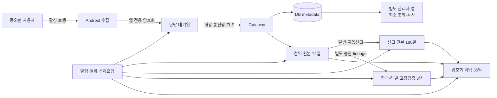

# WalkSafe 보안·운영 설계

이 문서는 WalkSafe 설계를 사람이 검토하기 위한 **독립적인 Draft**입니다. 승인된 정책을 설계 언어로 옮겼지만, 이 문서 자체는 아직 승인되지 않았고 현재 코드가 이 설계를 따른다는 판정이나 시험 완료를 뜻하지 않습니다.

| 통제 항목 | 값 |
|---|---|
| 문서 ID | `WS-DES-SECOPS-DRAFT-20260721-001` |
| 포함 산출물 | `DES-19`, `DES-20`, `DES-21`, `DES-22`, `DES-23`, `DES-24`, `DES-25`, `DES-27` |
| 버전·기준일 | `0.2.0` · `2026-07-22` |
| 문서 생명주기 | `DRAFT` |
| 문서 승인 | `NOT_APPROVED` |
| 설계·구현 적합성 | `NOT_ASSESSED` |
| 시험 | `NOT_RUN` |
| 출시 | `NOT_ELIGIBLE` |
| 남은 게이트 | `5개 NOT_RUN`, 면제 없음 |
| 요구사항 연결 상태 | `DRAFT_REFERENCE_PRESENT_NOT_BASELINED` |
| 기계 추적 | `docs/deliverables/04-design/design-traceability-register.json` |

## 먼저 읽을 핵심 경계

- 정식 사용자 제품은 **Android 사용자 앱**이다.
- 정식 관리 제품은 사용자 앱과 앱 ID·서명·배포·로그인을 분리한 **별도 Android 관리자 앱**이다. 현재 저장소에서는 이 독립 앱 경계를 확인하지 못했으므로 구현 공백으로 둔다.
- Web/PWA는 과거 구현을 이해하기 위한 `LEGACY_REFERENCE_ONLY`이며 정식 사용자·관리자 제품으로 채택하지 않는다.
- `contracts/walksafe.openapi.json`, Android·backend 코드, ORM·migration은 현재 상태를 보여 주는 후보 사실이다. 파일 경로와 SHA-256으로 묶지만 승인된 설계나 적합 증거로 승격하지 않는다.
- 정책 기준선은 승인·기준선화됐지만 이 설계 Draft, 구현, 시험, 배포는 별도 검토 대상이다.
- current effective baseline은 `PB-WALKSAFE-FEATURE-POLICY-1.0.1`이며 exact FP-035 correction overlay는 `APPROVED / EFFECTIVE / COMMITTED`이다. `WS-FEATURE-POLICY-FP035-CORRECTION-CANDIDATE-20260722-001` / `DEC-FP035-NETWORK-NORMALIZATION-20260722`의 `NOT_APPROVED / NOT_EFFECTIVE`는 역사 1.0.0에 대한 `HISTORICAL_PRE_ACTIVATION_ONLY` 상태다. 보행 중에는 전송하지 않고, 정지 뒤 Wi-Fi 또는 사용자가 명시적으로 허용한 이동통신망만 사용한다. 이 정책 효력은 구현 적합성·phone queue·network 분기 시험이나 gate 완료를 주장하지 않는다.

## 입력 기준과 읽는 법

| 구분 | 기준 |
|---|---|
| 승인 정책 입력 | `PB-WALKSAFE-FEATURE-POLICY-1.0.1` · exact FP-035 overlay `APPROVED / EFFECTIVE / COMMITTED` |
| 정책 manifest | `docs/control/baselines/walksafe-feature-policy-baseline-1.0.1-manifest-20260722-r001.json` |
| 기존 답변 정규화 근거 | `docs/control/decision-interview/source-records/walksafe-feature-policy-comprehensive-review-20260719-answers.json`의 `SP-13`, `FP-035` |
| FP-035 overlay provenance | current `docs/control/decision-interview/walksafe-effective-decision-register-current-20260726-r001.json`; candidate 파일의 `NOT_APPROVED / NOT_EFFECTIVE`는 `HISTORICAL_PRE_ACTIVATION_ONLY`이고 별도 재승인 불필요 |
| 현재 유효 결정 | `docs/control/decision-interview/walksafe-effective-decision-register-current-20260726-r001.json` · `EFFECTIVE_BY_VALID_COMMITTED_RECEIPT` |
| 요구예정 | REQ 유형과 `RQ-FP-*`, `RQ-NPC-*`, `RQ-GATE-*` Draft ID; 요구사항 기준선 승인 전까지 계획 연결 |
| 구현 후보 | 아래 후보 근거 표의 경로·SHA-256; 적합성 `NOT_ASSESSED` |
| 상태 해석 | “설계한다”는 목표 구조, “현재 후보”는 저장소 관찰 사실, “남은 일”은 승인·구현·시험 전 차단 항목 |

각 DES 절의 관리표에는 왜 만드는지, 무엇을 채우는지, 누가 작성·검토·승인하는지, 언제 고치고 어떻게 대체·폐기하는지를 함께 적는다.

## 자주 나오는 기술용어를 쉽게 읽기

| 용어 | 쉬운 뜻 |
|---|---|
| gateway | 앱의 요청이 서버로 들어오는 한 개의 확인된 입구 |
| worker | 사용자 화면 없이 서버 뒤에서 접수·삭제·검사 같은 일을 처리하는 프로그램 |
| resource | 계정, 신고, 원본처럼 권한검사의 대상이 되는 자료 |
| object storage | 영상·음성 같은 큰 파일을 두는 서버 저장소 |
| digest·SHA-256 | 파일이 바뀌었는지 비교하는 긴 지문값 |
| TTL | 받은 상태나 자료를 다시 확인해야 하는 유효시간 |
| backoff·backpressure | 실패나 과부하 때 재시도·유입 속도를 늦추는 방법 |
| provenance | 파일·빌드·모델이 어떤 입력과 과정에서 만들어졌는지 남긴 이력 |
| idempotency | 같은 요청을 다시 보내도 한 번 처리한 것과 같은 결과가 되게 하는 성질 |
| lease | 한 기기나 작업자에게 일정 시간만 주는 임시 독점 권한 |
| session | 로그인이나 한 번의 보행처럼 시작과 끝이 있는 사용 단위 |
| token | 비밀번호를 매번 보내지 않고 로그인·권한을 증명하는 짧은 전자표 |
| MFA·passkey | 비밀번호 하나에만 의존하지 않는 추가 로그인 확인수단 |
| attestation | 등록된 진짜 앱·기기·보안수단인지 확인하는 절차 |
| KMS·HSM | 암호화·서명 열쇠를 일반 파일과 분리해 보호하는 전용 관리수단 |
| break-glass | 평상시에는 막아 두고 사고 때만 승인·기록 후 여는 긴급 접근 |
| rate limit·timeout·circuit | 요청 횟수를 제한하고, 오래 걸리는 요청을 끝내며, 연속 실패한 외부 호출을 잠시 막는 보호장치 |
| audit·append-only | 누가 무엇을 했는지 남기고 과거 기록을 덮어쓰지 않는 감사기록 방식 |
| redaction | 로그에서 비밀값·정확 위치·원본 주소 같은 민감정보를 가리는 처리 |
| alert·on-call | 이상을 자동 통보하고 정해진 담당자가 대응하는 운영체계 |
| RTO·RPO·drill | 장애 뒤 복구 목표시간, 허용 가능한 자료 손실범위, 실제 복구 연습 |
| quota·5xx | 외부서비스 사용한도와 외부 서버 쪽 오류 응답 |
| subprocessor·region | 자료처리에 다시 참여하는 하위업체와 자료가 저장·처리되는 국가·지역 |
| SBOM·SCA | 사용한 소프트웨어 부품 목록과 그 부품의 알려진 취약점 검사 |
| TLS | 앱과 서버 사이 전송내용을 암호화하고 상대 서버를 확인하는 통신 보호 |
| sandbox | 앱이나 작업이 다른 자료에 함부로 접근하지 못하게 나눈 격리공간 |

## 현재 구현 후보 근거와 SHA-256

이 표는 현재 저장소를 재현하기 위한 근거다. `NOT_ASSESSED`이므로 설계 충족이나 시험 통과를 의미하지 않는다.

| 근거 ID | 분류 | 경로 | SHA-256 | 읽는 법 |
|---|---|---|---|---|
| `SRC-ANDROID-APP-BUILD` | `CANDIDATE_IMPLEMENTATION_FACT` | `apps/android/app/build.gradle.kts` | `22ce5a8b59c86718bf6c9d319b90beeed5473b63d9fbfc4f4ea461abe01c5e0f` | 사용자 앱 ID·SDK·의존성·release 입력 후보 |
| `SRC-ANDROID-MANIFEST` | `CANDIDATE_IMPLEMENTATION_FACT` | `apps/android/app/src/main/AndroidManifest.xml` | `30efe0264c2d27512e9b63b96a8838ae560809902e41a348975baaf07ff592c2` | 현재 권한·기기기능·activity 선언 후보 |
| `SRC-ANDROID-MAIN-ACTIVITY` | `CANDIDATE_IMPLEMENTATION_FACT_REVALIDATION_REQUIRED` | `apps/android/app/src/main/java/kr/co/hanium/dreamup/walksafe/MainActivity.kt` | `ed9c8df7e7402a6214871a099d9994b182a01030bb01fab7662f062025887803` | 현재 개발·디버그 중심 조합 화면; 정식 무버튼 보행 화면과 정합성 미확인 |
| `SRC-OPENAPI` | `CANDIDATE_IMPLEMENTATION_FACT_REVALIDATION_REQUIRED` | `contracts/walksafe.openapi.json` | `808c23492d7c942c4d30fee44f6c824af8d9f3aff541a9f361b85aa7fe963cdb` | 현재 API 계약 후보; 승인된 DES-09·10 기준선 아님 |
| `SRC-BACKEND-MAIN` | `CANDIDATE_IMPLEMENTATION_FACT` | `backend/app/main.py` | `c7953d9e7a3b046da0154baf0832dfc9b294d5760552dea19d31785794dada99` | 현재 FastAPI 조합 경계 후보 |
| `SRC-BACKEND-MODELS` | `CANDIDATE_IMPLEMENTATION_FACT_REVALIDATION_REQUIRED` | `backend/app/models.py` | `b337202f43beb99b506e11ca563c4479c32d2691e2a4857d698a490e3e801946` | 현재 DB ORM 후보; 목표 데이터 모델 전체가 아님 |
| `SRC-BACKEND-SCHEMAS` | `CANDIDATE_IMPLEMENTATION_FACT_REVALIDATION_REQUIRED` | `backend/app/schemas.py` | `f6bd1eeb57f578050f16e1673f84a729beeb502ee7c80fdcadbb7ffb72b62c3d` | 현재 request·response 데이터 구조 후보 |
| `SRC-BACKEND-TMAP` | `CANDIDATE_IMPLEMENTATION_FACT_REVALIDATION_REQUIRED` | `backend/app/services/tmap_pedestrian.py` | `369eaee6d42be77965e77734a5eb94572bbdd8d71836d90f6091cc402347cd06` | 현재 TMAP 보행 경로 중계 후보 |
| `SRC-BACKEND-REQUIREMENTS` | `CANDIDATE_IMPLEMENTATION_FACT` | `backend/requirements.txt` | `b961d7554e769c567c86b5430c13ec55d911bd5bfeba3eba68c4bb9e49802e69` | 현재 backend 기술 버전 후보 |
| `SRC-DOCKER-COMPOSE` | `CANDIDATE_IMPLEMENTATION_FACT_NOT_DEPLOYMENT_EVIDENCE` | `docker-compose.yml` | `d3ca3c4caf272919712ee21ce8ae59c14894bff8f3270596a06c8601a2df6de5` | 로컬 PostGIS 배치 후보; 외부 인프라 배포 증거 아님 |
| `SRC-QUALITY-WORKFLOW` | `CANDIDATE_IMPLEMENTATION_FACT_NOT_TEST_EVIDENCE` | `.github/workflows/quality.yml` | `3a2bee390d25c7ab354249d1b755b689288ec655246f6e50fb0893d25f5cf3bf` | 품질 자동화 후보; 이 설계의 시험 완료 증거 아님 |
| `SRC-BACKUP-SCRIPT` | `CANDIDATE_IMPLEMENTATION_FACT_REVALIDATION_REQUIRED` | `scripts/backup_walksafe_data_20260711.sh` | `f0b262f6e7d7c248905a127980202bd380937fa07db0a898a121a7ef94bca97c` | 현재 백업 절차 후보 |
| `SRC-RESTORE-SCRIPT` | `CANDIDATE_IMPLEMENTATION_FACT_NOT_CURRENT_DRILL_EVIDENCE` | `scripts/restore_walksafe_backup_drill_20260711.sh` | `a6014ef922caed329370a16113c65713eb6756f3450de944e5d59f7860b4b89b` | 복원훈련 도구 후보; 현재 복구훈련 완료 증거 아님 |

## Phase 1 current-source·review binding

| 항목 | 결속 값 |
|---|---|
| 대상 locators | `DLV-DES-19` → `docs/deliverables/04-design/security-and-operations-design.md#des-19`; `DLV-DES-20` → `docs/deliverables/04-design/security-and-operations-design.md#des-20` |
| 정책 authority | `PB-WALKSAFE-FEATURE-POLICY-1.0.1` · manifest SHA-256 `b6f5b850a3983b8059b85d93dd07864520219d31fa65a65d740b6bab78231308` · effective decision register SHA-256 `4a448f65280c2cd8cd850a749434f4e124769e47b7b84e31e2e14c58328d2faf` |
| 현재 source provenance | `DIRTY_WORKTREE_EXACT_CONTENT_SNAPSHOT` · `2026-07-26` · 2,960 stable files · `path_set_sha256=971cee4fbded63faf05e30b0dc7343a9eff41e4612edff307f3df5581c880eff` · `content_set_sha256=f7a05a1abd7b89053dd7d7d052508dfd43b19821174c8de5a82fe754ae90cade` · `source_commit=null` |
| 구현 inventory authority | `docs/deliverables/05-implementation/implementation-manifest-20260727-r002.json` · SHA-256 `f26709242bf7520ec9385feb70f5df859124700657d8fe2dc71c8d1d1df839c2` |
| no-op content 판정 | 인증·인가·관리자 복구와 threat/trust-boundary 본문은 이미 충분하다. 위 후보 SHA 표는 locator aid이며 current authority는 위 exact snapshot이다. |
| reviewer contract | 작성 `TECHNICAL_OWNER`; 검토 `PRODUCT_OWNER / SECURITY_AND_PRIVACY_OWNER / QA_OWNER / INDEPENDENT_TECHNICAL_REVIEWER`; 승인 `PROJECT_SCOPE_OWNER`; 현재 `NOT_PERFORMED / NOT_APPROVED` |
| 남은 검증 | 관리자 복구훈련, raw collection review, queue/capacity 계약과 formal conformance는 `NOT_RUN`; 설계 binding으로 완료 처리하지 않는다. |

## DES-19 인증·인가 설계

### 행위자와 신원 경계

| 행위자 | 앱·신원 | 기본 권한 | 금지 |
|---|---|---|---|
| 일반 사용자 | Android 사용자 앱, 사용자 계정, 기기별 session | 자기 동의·기기·보행·신고·자료권리 | 다른 사용자·관리 API, 원본 직접 URL |
| 지정 관리자 1명 | **별도 Android 관리자 앱**, 관리자 계정 | 목적 있는 신고 검토·상태변경·운영조회 | 공용 비밀번호, 사용자 앱 숨은 관리자 기능, 무감사 원본 export |
| backend service | service identity | 필요한 DB/object/TMAP 범위 | 장기 공유 비밀, 모든 저장소 전권 |
| worker | 기능별 service identity | ingest·보존·삭제·backup 등 좁은 범위 | interactive 관리자 권한 |
| 운영/감사자 | 승인된 관리 경로 | 필요한 기간·목적의 읽기 | 상시 원본 접근 |

### 사용자 로그인·session

- 짧은 access token과 회전하는 refresh token을 분리하고 Android 보호 저장소에 둔다.
- refresh token을 사용할 때 이전 값을 폐기하며 재사용되면 해당 token family·기기 session을 차단한다.
- 여러 기기 로그인은 허용하지만 활성 보행 lease는 계정당 하나다. 전환 전 기존·새 기기에 상태를 알리고 사용자가 선택한다.
- 로그아웃·앱삭제·원격폐기·계정잠금·보안사고의 범위를 구분한다. 로그아웃은 OS 권한·동의·서버 자료를 지우지 않는다.
- 비밀번호·보호자·삭제·기기폐기 같은 민감 변경은 최근 재인증을 요구한다.

### 관리자 인증·복구

- MFA 또는 패스키를 사용하고 숨은 공용·우회 비밀번호를 두지 않는다.
- 복구코드나 보안키는 관리자 휴대전화 밖에 보관한다.
- 휴대전화 분실 시 별도 경로에서 해당 기기 session을 폐기한다.
- 관리자 접근을 모두 잃으면 복구할 때까지 출시·권한변경·데이터삭제 같은 고위험 작업을 동결한다.
- 서버키·앱서명키·복구자료는 서로 분리해 암호화 백업한다.
- 실제 사용자시험·배포 전 분실 복구훈련을 한 번 실행하고 증거를 남겨야 한다. 현재 `NOT_RUN`이다.

각 API는 token 유효성만 보지 않고 앱 종류, 역할, resource 소유권, 요청 목적, 단계상승 시각을 확인한다. 현재 OpenAPI 후보에 top-level security가 없다는 사실은 이 목표 설계의 충족 증거가 아니다.

### 이 산출물의 작성·관리 기준

| 항목 | 현재 값 |
|---|---|
| 작성 목적 | 사용자·관리자·서비스 신원을 확인하고 역할별 최소 권한을 일관되게 적용한다. |
| 필수/조건 | `REQUIRED` · 요구사항 기준선 승인 후 구현·통합 전에 활성 |
| 들어갈 내용 | - 행위자·신원 원천 - 로그인·세션 생명주기 - RBAC·resource 권한 - 토큰·쿠키·CSRF - 권한 실패·잠금 - 감사·관리자 복구 |
| 작성 입력 | - 승인된 요구사항 기준선과 RTM - 현재 코드·OpenAPI·DB migration·배포 형상 - ADR 후보와 품질·보안·안전 제약 |
| 선행 → 후속 | `DES-02`, `REQ-09`, `REQ-10` → `DES-20`, `DES-21`, `DEV-01`, `DEV-08`, `REL-18`, `SEC-04`, `SEC-08`, `SEC-09` |
| 작성·검토·승인 | 기술책임자 · 제품책임자, 보안·개인정보책임자, QA책임자, 독립기술검토자 · 프로젝트책임자 |
| 형식·정본 위치 | `SECTION` · `docs/deliverables/04-design/security-and-operations-design.md#des-19` |
| 보조 파일 | `docs/deliverables/04-design/design-traceability-register.json` |
| 완료·승인 기준 | - 다음 핵심 내용이 근거·버전과 함께 구체적으로 작성되어 있다: 행위자·신원 원천, 로그인·세션 생명주기. - 필수 내용에 공란·암묵적 가정이 없고 미결정은 소유자·기한이 있는 차단 항목으로 표시되어 있다. - 상위 입력과 요구·설계·코드·시험·변경요청의 해당 추적 링크가 유효하다. - 지정 검토자가 사실·일관성·추적성을 확인하고 승인자가 명시적으로 승인했다. |
| 갱신 조건 | - 요구·아키텍처·API·DB·배포·보안 경계 변경 - 연결된 상위 기준선·사용자 승인 결정·외부 의무 변경 - 검토에서 사실 오류·누락·stale 판정 또는 유효기간 만료 |
| 검토 주기 | 초안의 필수내용을 채운 때, 상위 요구·정책·설계 경계가 바뀐 때, 설계 기준선 승인 전에 검토한다. |
| 변경·대체·폐기 | 승인본을 덮어쓰지 않는다. 변경요청과 영향분석을 남겨 새 버전을 만들고, 대체된 버전은 Superseded로 표시한 뒤 정해진 보존기간이 끝나면 Archived로 옮긴다. |

쉽게 말하면, 이 표는 이 설계 산출물을 왜 만들고 누가 언제까지 무엇을 확인하며, 바뀌면 어떻게 새 버전으로 관리할지를 정한 약속이다.

### 추적과 판정 경계

- 입력: 현재 승인 정책 [`PB-WALKSAFE-FEATURE-POLICY-1.0.1`](../../control/baselines/walksafe-feature-policy-baseline-1.0.1-manifest-20260722-r001.json), [현재 유효 결정 등록부](../../control/decision-interview/walksafe-effective-decision-register-current-20260726-r001.json), [기존 답변](../../control/decision-interview/source-records/walksafe-feature-policy-comprehensive-review-20260719-answers.json), [FP-035 역사 pre-activation snapshot](../../control/decision-interview/walksafe-feature-policy-fp035-correction-candidate-20260722-r001.json), 산출물 유형 작성계약.
- 정책 결정: 영역 `FA-01`, `FA-03`, `FA-04`, `FA-05`, `FA-14`, `FA-16`, `FA-17`; 기능 `FP-003`, `FP-008`, `FP-010`, `FP-011`, `FP-012`, `FP-013`, `FP-014`, `FP-015`, `FP-040`, `FP-047`, `FP-048`, `FP-051`; 공통정책 `NPC-PERMISSION-SESSION-LIFECYCLE`, `NPC-SINGLE-ADMIN-RECOVERY`; 흐름 `FLOW-03`, `FLOW-10`.
- 기존 답변 정규화: 없음; 적용 요구유형 없음. 해당 없는 산출물은 `없음`이다.
- 현재 정책 재승인 의존성: 없음. exact FP-035 overlay는 `APPROVED / EFFECTIVE / COMMITTED`이고 역사 pre-activation candidate는 현재 차단조건이 아니다. 향후 정책 변경은 별도 변경통제로 처리한다.

- 정렬 결정: 등록부의 49건(`DEC-PRODUCT-RELEASE`, `DEC-USER-AGE`, `DEC-APP-SEPARATION`, `DEC-IBQ-011`, `DEC-IBQ-016`, `DEC-IBQ-017`, `DEC-IBQ-019`, `DEC-SIGNUP-DATA`, `DEC-IDENTITY-VERIFY`, `DEC-LOGIN-PERSISTENCE`, `DEC-MULTI-DEVICE-KEEP`, `DEC-CONCURRENT-WALK` 외 37건). 전체 목록과 해시는 추적 등록부에 있다.
- 요구예정 유형: [`REQ-09`](../03-requirements/system-requirements.md#req-09) (DRAFT_FILE_PRESENT_NOT_BASELINED); [`REQ-10`](../03-requirements/system-requirements.md#req-10) (DRAFT_FILE_PRESENT_NOT_BASELINED).
- 요구예정 상세: 17건([`RQ-FP-003-001`](../03-requirements/system-requirements.md#RQ-FP-003-001), [`RQ-FP-008-001`](../03-requirements/system-requirements.md#RQ-FP-008-001), [`RQ-FP-010-001`](../03-requirements/system-requirements.md#RQ-FP-010-001), [`RQ-FP-011-001`](../03-requirements/system-requirements.md#RQ-FP-011-001), [`RQ-FP-012-001`](../03-requirements/system-requirements.md#RQ-FP-012-001), [`RQ-FP-013-001`](../03-requirements/system-requirements.md#RQ-FP-013-001), [`RQ-FP-014-001`](../03-requirements/system-requirements.md#RQ-FP-014-001), [`RQ-FP-015-001`](../03-requirements/system-requirements.md#RQ-FP-015-001), [`RQ-FP-040-001`](../03-requirements/system-requirements.md#RQ-FP-040-001), [`RQ-FP-047-001`](../03-requirements/system-requirements.md#RQ-FP-047-001), [`RQ-FP-048-001`](../03-requirements/system-requirements.md#RQ-FP-048-001), [`RQ-FP-051-001`](../03-requirements/system-requirements.md#RQ-FP-051-001) 외 5건); 상태 `DRAFT_REFERENCE_PRESENT_NOT_BASELINED`.
- 현재 후보 근거: `SRC-ANDROID-APP-BUILD`, `SRC-ANDROID-MANIFEST`, `SRC-ANDROID-MAIN-ACTIVITY`, `SRC-OPENAPI`, `SRC-BACKEND-MAIN`, `SRC-BACKEND-MODELS`, `SRC-BACKEND-SCHEMAS`, `SRC-BACKEND-TMAP`, `SRC-BACKEND-REQUIREMENTS`, `SRC-DOCKER-COMPOSE`, `SRC-QUALITY-WORKFLOW`, `SRC-BACKUP-SCRIPT`, `SRC-RESTORE-SCRIPT`; 구현 적합성 `NOT_ASSESSED`.
- 이 절의 문서 상태는 `DRAFT`, 승인 `NOT_APPROVED`, 검증 `NOT_RUN`이다.

## DES-20 위협 모델·신뢰 경계

### 보호할 자산과 신뢰 경계

최우선 자산은 무가림 영상·음성·정확 위치·센서·보행·신고 원본, 계정·동의·token, 관리자 복구수단, 앱서명·서버·KMS key, 모델·config·dataset lineage, 삭제·감사 증거다. 신뢰 경계는 Android 앱 sandbox↔OS/다른 앱, 기기↔gateway, gateway↔service, service↔DB/object/KMS, backend↔TMAP, 운영자↔관리경로, 운영↔backup/복원환경이다.

### 위협과 Draft 통제

| 위협 | 예 | 예방 | 탐지·복구 | 잔여 판단 |
|---|---|---|---|---|
| 신원 위조(Spoofing) | 훔친 token·가짜 관리자 앱 | 앱·기기 session, token 회전, 관리자 MFA/패스키, 앱 분리 | refresh 재사용·기기폐기 감사, 원격 session 폐기 | 인증·attestation 방식 미확정 |
| 자료 변조(Tampering) | 신고·원본·모델 파일 변조 | TLS, SHA-256 receipt, 서명 모델/config, DB 제약 | digest 불일치 격리, audit·rollback | 처음부터 끝까지 확인하는 서명 절차 미구현 |
| 전송 선택 변조(Tampering/Elevation) | 앱·악성코드가 `mobile_network_opt_in`을 거짓 참으로 만들거나 오래된 선택을 재사용 | current effective baseline `PB-WALKSAFE-FEATURE-POLICY-1.0.1`의 exact FP-035 correction overlay에 따라 현재 동의 version·계정·기기 session에 선택값을 묶고, 없음·불명은 거짓으로 처리 | 선택 변경과 이동통신망 전송 결정을 감사하고 비정상 전송을 차단·session 폐기 | exact overlay는 `APPROVED / EFFECTIVE / COMMITTED`; 과거 correction candidate의 `NOT_EFFECTIVE`는 역사 상태이며 구현 적합성 `NOT_ASSESSED`, phone queue·network 분기·동의 저장·API·단말 상태기계·계약시험 `NOT_RUN`, 관련 gate `OPEN` |
| 행동 부인(Repudiation) | 관리자가 조회·상태변경 부인 | 행위자·목적·요청 ID를 덮어쓰지 않는 감사기록에 저장 | 감사기록 무결성·이상 알림 | 독립 저장·서명 검토 필요 |
| 정보 노출(Information disclosure) | 원본 URL·정확 위치·token 로그 노출 | 비공개 원본 저장소, 최소 API, log redaction, key 분리, 원본 기본 차단 | 비밀값 검사·접근 감사·사고대응 | 무가림 원본 독립검토 `NOT_RUN` |
| 통신망 정보 노출(Information disclosure) | 보행 중 전송 또는 미선택 사용자의 모바일 데이터 전송 | `WALKING` 전송 차단, Wi-Fi 우선, 명시적 이동통신망 선택값의 safe default=false | 보행/망/선택/결과를 민감값 없이 상관 분석하고 위반 시 즉시 전송 중단 | 실제 기기 네트워크 분기시험 `NOT_RUN` |
| 서비스 마비(Denial of service) | TMAP quota, 원본 폭주, queue 고갈 | timeout, rate limit, backpressure, 유한 queue | 용량 상태·오류율 alert, 안전정지 | 주기·TTL·단말 byte gate 미정 |
| 권한 상승(Elevation of privilege) | 사용자 앱이 관리자 API 호출 | 앱·역할·resource 매 요청 검사, 단계상승 | 거부·이상행동 감사 | 별도 관리자 앱 구현 공백 |
| ML/안전 위협 | adversarial 장면·오탐·오래된 모델 | 탐지/위험 분리, signed model, 기능수준·safe stop | drift·오탐/미탐·기기 성능 관측 | 강건성·현장안전 시험 전 |
| 공급망 | 악성 dependency·CI artifact | lock, dependency verification, SBOM·provenance 계획 | SCA·signature·hash 검증 | 현재 workflow 존재는 PASS 증거 아님 |

### 위험도 평가 방법과 현재 경계

독립 위협검토자는 각 행을 가능성 `낮음/중간/높음`, 영향 `낮음/중간/높음`으로 평가하고, 둘 중 하나가 높거나 안전·무가림 원본·관리자 권한에 닿으면 출시 전 조치 또는 명시적 위험수용 대상으로 넘긴다. 현재는 공격 빈도·통제 효과·독립검토 증거가 없으므로 개별 점수를 꾸며내지 않고 모두 `PENDING_INDEPENDENT_REVIEW`로 둔다. 결과는 SEC 위험대장, `REQ-09`, `REQ-03·REQ-06`의 FP-035 인수조건과 test case로 연결한다. 이 표는 초기 threat enumeration이며 보안검증 완료가 아니다.

### 이 산출물의 작성·관리 기준

| 항목 | 현재 값 |
|---|---|
| 작성 목적 | 자산·공격자·진입점·데이터 흐름별 위협과 설계 통제를 체계적으로 식별한다. |
| 필수/조건 | `REQUIRED` · 요구사항 기준선 승인 후 구현·통합 전에 활성 |
| 들어갈 내용 | - 자산·공격자·가정 - DFD와 trust boundary - STRIDE 등 위협 - 가능성·영향·위험도 - 예방·탐지·복구 통제 - 잔여위험·검증 |
| 작성 입력 | - 승인된 요구사항 기준선과 RTM - 현재 코드·OpenAPI·DB migration·배포 형상 - ADR 후보와 품질·보안·안전 제약 |
| 선행 → 후속 | `DES-02`, `DES-19`, `REQ-09` → `DES-23`, `SEC-02`, `SEC-04` |
| 작성·검토·승인 | 기술책임자 · 제품책임자, 보안·개인정보책임자, QA책임자, 독립기술검토자 · 프로젝트책임자 |
| 형식·정본 위치 | `SECTION` · `docs/deliverables/04-design/security-and-operations-design.md#des-20` |
| 보조 파일 | `docs/deliverables/04-design/design-traceability-register.json` |
| 완료·승인 기준 | - 다음 핵심 내용이 근거·버전과 함께 구체적으로 작성되어 있다: 자산·공격자·가정, DFD와 trust boundary. - 필수 내용에 공란·암묵적 가정이 없고 미결정은 소유자·기한이 있는 차단 항목으로 표시되어 있다. - 상위 입력과 요구·설계·코드·시험·변경요청의 해당 추적 링크가 유효하다. - 지정 검토자가 사실·일관성·추적성을 확인하고 승인자가 명시적으로 승인했다. |
| 갱신 조건 | - 요구·아키텍처·API·DB·배포·보안 경계 변경 - 연결된 상위 기준선·사용자 승인 결정·외부 의무 변경 - 검토에서 사실 오류·누락·stale 판정 또는 유효기간 만료 |
| 검토 주기 | 초안의 필수내용을 채운 때, 상위 요구·정책·설계 경계가 바뀐 때, 설계 기준선 승인 전에 검토한다. |
| 변경·대체·폐기 | 승인본을 덮어쓰지 않는다. 변경요청과 영향분석을 남겨 새 버전을 만들고, 대체된 버전은 Superseded로 표시한 뒤 정해진 보존기간이 끝나면 Archived로 옮긴다. |

쉽게 말하면, 이 표는 이 설계 산출물을 왜 만들고 누가 언제까지 무엇을 확인하며, 바뀌면 어떻게 새 버전으로 관리할지를 정한 약속이다.

### 추적과 판정 경계

- 입력: 현재 승인 정책 [`PB-WALKSAFE-FEATURE-POLICY-1.0.1`](../../control/baselines/walksafe-feature-policy-baseline-1.0.1-manifest-20260722-r001.json), [현재 유효 결정 등록부](../../control/decision-interview/walksafe-effective-decision-register-current-20260726-r001.json), [기존 답변](../../control/decision-interview/source-records/walksafe-feature-policy-comprehensive-review-20260719-answers.json), [FP-035 역사 pre-activation snapshot](../../control/decision-interview/walksafe-feature-policy-fp035-correction-candidate-20260722-r001.json), 산출물 유형 작성계약.
- 정책 결정: 영역 `FA-01`, `FA-03`, `FA-05`, `FA-11`, `FA-12`, `FA-14`, `FA-15`, `FA-16`, `FA-17`, `FA-18`; 기능 `FP-002`, `FP-003`, `FP-008`, `FP-013`, `FP-015`, `FP-031`, `FP-034`, `FP-035`, `FP-036`, `FP-040`, `FP-041`, `FP-043`, `FP-044`, `FP-045`, `FP-046`, `FP-047`, `FP-048`, `FP-051`, `FP-053`, `FP-054`; 공통정책 `NPC-RAW-ORIGINAL-COLLECTION`, `NPC-DATA-LIFECYCLE`, `NPC-SINGLE-ADMIN-RECOVERY`; 흐름 `FLOW-03`, `FLOW-07`, `FLOW-08`, `FLOW-10`.
- 기존 답변 정규화: `DEC-FP035-NETWORK-NORMALIZATION-20260722`; 적용 요구유형 `REQ-03`, `REQ-06`. 해당 없는 산출물은 `없음`이다.
- 현재 정책 재승인 의존성: 없음. `WS-FEATURE-POLICY-FP035-CORRECTION-CANDIDATE-20260722-001`의 `NOT_APPROVED / NOT_EFFECTIVE`는 `HISTORICAL_PRE_ACTIVATION_ONLY`이고, exact FP-035 overlay는 `APPROVED / EFFECTIVE / COMMITTED`이다.

- FP-035 정책 상태: current baseline `PB-WALKSAFE-FEATURE-POLICY-1.0.1`의 exact overlay는 `APPROVED / EFFECTIVE / COMMITTED`이며 별도 정책 재승인은 요구하지 않는다. 작성·계획은 `ALLOWED`이지만 구현 적합성 `NOT_ASSESSED`, phone queue·network 분기·동의 저장·API·단말 상태기계·계약시험 `NOT_RUN`, 관련 gate `OPEN`이다.
- 정렬 결정: 등록부의 90건(`DEC-PRODUCT-RELEASE`, `DEC-USER-AGE`, `DEC-POOR-IMAGE-BEHAVIOR`, `DEC-EXCLUDED-FEATURES`, `DEC-APP-SEPARATION`, `DEC-IBQ-011`, `DEC-DEPTH-UNSUPPORTED`, `DEC-IBQ-016`, `DEC-IBQ-017`, `DEC-IBQ-019`, `DEC-SIGNUP-DATA`, `DEC-IDENTITY-VERIFY` 외 78건). 전체 목록과 해시는 추적 등록부에 있다.
- 요구예정 유형: [`REQ-03`](../03-requirements/system-requirements.md#req-03) (DRAFT_FILE_PRESENT_NOT_BASELINED); [`REQ-06`](../03-requirements/acceptance-specification.md#req-06) (DRAFT_FILE_PRESENT_NOT_BASELINED); [`REQ-09`](../03-requirements/system-requirements.md#req-09) (DRAFT_FILE_PRESENT_NOT_BASELINED).
- 요구예정 상세: 28건([`RQ-FP-002-001`](../03-requirements/system-requirements.md#RQ-FP-002-001), [`RQ-FP-003-001`](../03-requirements/system-requirements.md#RQ-FP-003-001), [`RQ-FP-008-001`](../03-requirements/system-requirements.md#RQ-FP-008-001), [`RQ-FP-013-001`](../03-requirements/system-requirements.md#RQ-FP-013-001), [`RQ-FP-015-001`](../03-requirements/system-requirements.md#RQ-FP-015-001), [`RQ-FP-031-001`](../03-requirements/system-requirements.md#RQ-FP-031-001), [`RQ-FP-034-001`](../03-requirements/system-requirements.md#RQ-FP-034-001), [`RQ-FP-035-001`](../03-requirements/system-requirements.md#RQ-FP-035-001), [`RQ-FP-036-001`](../03-requirements/system-requirements.md#RQ-FP-036-001), [`RQ-FP-040-001`](../03-requirements/system-requirements.md#RQ-FP-040-001), [`RQ-FP-041-001`](../03-requirements/system-requirements.md#RQ-FP-041-001), [`RQ-FP-043-001`](../03-requirements/system-requirements.md#RQ-FP-043-001) 외 16건); 상태 `DRAFT_REFERENCE_PRESENT_NOT_BASELINED`.
- 현재 후보 근거: `SRC-ANDROID-APP-BUILD`, `SRC-ANDROID-MANIFEST`, `SRC-ANDROID-MAIN-ACTIVITY`, `SRC-OPENAPI`, `SRC-BACKEND-MAIN`, `SRC-BACKEND-MODELS`, `SRC-BACKEND-SCHEMAS`, `SRC-BACKEND-TMAP`, `SRC-BACKEND-REQUIREMENTS`, `SRC-DOCKER-COMPOSE`, `SRC-QUALITY-WORKFLOW`, `SRC-BACKUP-SCRIPT`, `SRC-RESTORE-SCRIPT`; 구현 적합성 `NOT_ASSESSED`.
- 이 절의 문서 상태는 `DRAFT`, 승인 `NOT_APPROVED`, 검증 `NOT_RUN`이다.

## DES-21 개인정보 데이터 흐름

### 한이음 제출·시연 현재 판정

| 판정 항목 | 현재 값 | 경계 |
|---|---|---|
| 적용 정책 | `PB-WALKSAFE-FEATURE-POLICY-1.0.1` | 역사 1.0.0 기준선에 exact FP-035 correction overlay를 적용한 현재 정책 |
| 산출물 범위 | `HANIUM_SUBMISSION_AND_DEMO` | 설계·시연 계획이며 production 처리 완료 주장이 아님 |
| 흐름 성격 | `DESIGN_PROJECTION` | 아래 노드는 승인 정책과 현재 설계의 목표 흐름이다. 실제 배포·전송·저장 실행은 `NOT_RUN` |
| TMAP·Google Cloud 공개정보 | `PUBLIC_TERMS_INVENTORY_ONLY` | 처리위탁·국외이전·계약 적용성에 관한 법률 의견은 `NOT_OBTAINED` |
| 법적 근거·고지 적합성 | `NOT_OBTAINED` | 한이음 문서 작성은 가능하나 정식 외부 공개 전 `GATE-RAW-COLLECTION-RELEASE-REVIEW`에서 별도 판정 |
| 실제 개인정보 원본 수집 | `NOT_RUN` | 이 절은 사용자·주변인의 실제 데이터 수집 증거가 아님 |

현재 흐름에서 사용자는 위치·영상·음성·센서·계정·신고 데이터의 주체이고, 주변인은 영상·음성에 우연히 포함될 수 있는 별도 주체다. Android 앱은 수집·단말 대기열 노드, gateway는 전송·수신 경계, DB와 object storage는 metadata·원본 저장 후보, 관리자 앱은 최소 조회 노드다. TMAP에는 목적지 검색과 경로 계산에 필요한 위치·검색어만 보내는 설계이며 Google Cloud는 원본 저장 후보이다. 실제 SDK 요청 필드, 리전, subprocessor, 계약 당사자는 배포 기준선을 정할 때 재확인한다.

동의·철회·삭제는 `FP-013`, `FP-015`, `FP-046`의 제품 정책을 설계 입력으로 사용한다. 접근은 사용자 기능, 지정 관리자 검토, 모델개선 승인 역할로 분리하고 원본 export·학습 승격·삭제는 감사 가능한 사건으로 남긴다. 이 통제는 목표 설계이며 구현 적합성과 실제 보존·삭제 실행은 별도 시험 결과가 있을 때만 완료로 판정한다.

### 원본·신고·학습 흐름

### 목적과 최소 접근

| 처리 | 항목 | 목적 | 접근·제3자 |
|---|---|---|---|
| 보행안내 | 영상·센서·위치·모델결과·경로 | 단말 위험·경로 안내 | 단말 우선; TMAP에는 경로에 필요한 검색·위치만 gateway 중계 |
| 신고 | 손상 점자블록 후보·원본·위치 | 중복확인·관리 검토·기관 전달 후보 | 지정 관리자 최소 조회; export는 목적·재인증·감사 |
| 모델개선 | 승인 원본·라벨·dataset lineage | 학습·평가·동등성 | 승인 연구/개발 범위; 별도 목적 동의 |
| 운영·보안 | 오류·성능·전송·감사 | 장애·오용·복구 | 원본·token·불필요한 정확 위치 redaction |
| 권리행사 | 요청범위·위치별 결과·proof digest | 열람·철회·삭제 처리와 증명 | 앱 밖 경로 포함; 원본 없는 proof만 3년 |

주변인의 얼굴·번호판·목소리를 가리지 않은 원본 수집은 승인 정책에 포함되지만, 출시 전 독립 검토 gate가 면제된 것은 아니다. 법적 근거·고지·동의·권리행사 검토가 수집범위 변경을 요구하면 변경요청과 제품책임자 재승인을 거쳐야 한다.

대용량 원본 저장 목표는 기존 FP-037 답변에 따라 **Google Cloud Storage 서울 단일 리전(`asia-northeast3`)**이다. 주 원본은 Standard, 35일 순환 백업은 Nearline 후보로 분리하고 실제 cloud 생성·배포는 별도 승인 전 수행하지 않는다. TMAP·Google Cloud의 계약상 subprocessor, 처리위탁 고지, 국외 이전 여부와 법적 근거는 SEC·REQ 법률 검토와 계약으로 확인하며 확인 전에는 완료로 표시하지 않는다.

### 이 산출물의 작성·관리 기준

| 항목 | 현재 값 |
|---|---|
| 작성 목적 | 위치·영상·음성·신고 데이터가 각 구성요소와 제3자를 지나는 경로를 투명하게 만든다. |
| 필수/조건 | `REQUIRED` · 요구사항 기준선 승인 후 구현·통합 전에 활성 |
| 들어갈 내용 | - 처리 활동·목적 - 데이터 항목·주체 - 수집·전송·저장 노드 - 제3자·국외 이전 - 동의·법적 근거 - 보존·삭제·접근 통제 |
| 작성 입력 | - 승인된 요구사항 기준선과 RTM - 현재 코드·OpenAPI·DB migration·배포 형상 - ADR 후보와 품질·보안·안전 제약 |
| 선행 → 후속 | `DES-02`, `DES-12`, `DES-13`, `DES-19`, `REQ-10`, `WS-04` → `SEC-04`, `SEC-05` |
| 작성·검토·승인 | 기술책임자 · 제품책임자, 보안·개인정보책임자, QA책임자, 독립기술검토자 · 프로젝트책임자 |
| 형식·정본 위치 | `SECTION` · `docs/deliverables/04-design/security-and-operations-design.md#des-21` |
| 보조 파일 | `docs/deliverables/04-design/design-traceability-register.json` |
| 완료·승인 기준 | - 다음 핵심 내용이 근거·버전과 함께 구체적으로 작성되어 있다: 처리 활동·목적, 데이터 항목·주체. - 필수 내용에 공란·암묵적 가정이 없고 미결정은 소유자·기한이 있는 차단 항목으로 표시되어 있다. - 상위 입력과 요구·설계·코드·시험·변경요청의 해당 추적 링크가 유효하다. - 지정 검토자가 사실·일관성·추적성을 확인하고 승인자가 명시적으로 승인했다. |
| 갱신 조건 | - 요구·아키텍처·API·DB·배포·보안 경계 변경 - 연결된 상위 기준선·사용자 승인 결정·외부 의무 변경 - 검토에서 사실 오류·누락·stale 판정 또는 유효기간 만료 |
| 검토 주기 | 초안의 필수내용을 채운 때, 상위 요구·정책·설계 경계가 바뀐 때, 설계 기준선 승인 전에 검토한다. |
| 변경·대체·폐기 | 승인본을 덮어쓰지 않는다. 변경요청과 영향분석을 남겨 새 버전을 만들고, 대체된 버전은 Superseded로 표시한 뒤 정해진 보존기간이 끝나면 Archived로 옮긴다. |

쉽게 말하면, 이 표는 이 설계 산출물을 왜 만들고 누가 언제까지 무엇을 확인하며, 바뀌면 어떻게 새 버전으로 관리할지를 정한 약속이다.

### 추적과 판정 경계

- 입력: 승인 정책 [`PB-WALKSAFE-FEATURE-POLICY-1.0.1`](../../control/baselines/walksafe-feature-policy-baseline-1.0.1-manifest-20260722-r001.json), [현재 유효 결정 등록부](../../control/decision-interview/walksafe-effective-decision-register-current-20260726-r001.json), [기존 답변](../../control/decision-interview/source-records/walksafe-feature-policy-comprehensive-review-20260719-answers.json), 산출물 유형 작성계약.
- 정책 결정: 영역 `FA-04`, `FA-05`, `FA-06`, `FA-07`, `FA-08`, `FA-09`, `FA-11`, `FA-12`, `FA-13`, `FA-14`, `FA-16`, `FA-18`; 기능 `FP-010`, `FP-011`, `FP-012`, `FP-013`, `FP-014`, `FP-015`, `FP-017`, `FP-018`, `FP-019`, `FP-020`, `FP-021`, `FP-022`, `FP-023`, `FP-025`, `FP-031`, `FP-034`, `FP-035`, `FP-036`, `FP-038`, `FP-041`, `FP-046`, `FP-048`, `FP-053`, `FP-054`; 공통정책 `NPC-RAW-ORIGINAL-COLLECTION`, `NPC-DATA-LIFECYCLE`, `NPC-AUTO-REPORT`; 흐름 `FLOW-03`, `FLOW-07`, `FLOW-08`, `FLOW-10`.
- 기존 답변 정규화: 없음; 적용 요구유형 없음. 해당 없는 산출물은 `없음`이다.
- 현재 정책 재승인 의존성: 없음. exact FP-035 overlay는 `APPROVED / EFFECTIVE / COMMITTED`이고 역사 pre-activation candidate는 현재 차단조건이 아니다. 향후 정책 변경은 별도 변경통제로 처리한다.

- 정렬 결정: 등록부의 106건(`DEC-USER-AGE`, `DEC-POOR-IMAGE-BEHAVIOR`, `DEC-LANGUAGE-SCOPE`, `DEC-DEPTH-UNSUPPORTED`, `DEC-IBQ-015`, `DEC-IBQ-016`, `DEC-IBQ-019`, `DEC-SIGNUP-DATA`, `DEC-IDENTITY-VERIFY`, `DEC-LOGIN-PERSISTENCE`, `DEC-MULTI-DEVICE-KEEP`, `DEC-CONCURRENT-WALK` 외 94건). 전체 목록과 해시는 추적 등록부에 있다.
- 요구예정 유형: [`REQ-10`](../03-requirements/system-requirements.md#req-10) (DRAFT_FILE_PRESENT_NOT_BASELINED); [`REQ-15`](../03-requirements/system-requirements.md#req-15) (DRAFT_FILE_PRESENT_NOT_BASELINED).
- 요구예정 상세: 32건([`RQ-FP-010-001`](../03-requirements/system-requirements.md#RQ-FP-010-001), [`RQ-FP-011-001`](../03-requirements/system-requirements.md#RQ-FP-011-001), [`RQ-FP-012-001`](../03-requirements/system-requirements.md#RQ-FP-012-001), [`RQ-FP-013-001`](../03-requirements/system-requirements.md#RQ-FP-013-001), [`RQ-FP-014-001`](../03-requirements/system-requirements.md#RQ-FP-014-001), [`RQ-FP-015-001`](../03-requirements/system-requirements.md#RQ-FP-015-001), [`RQ-FP-017-001`](../03-requirements/system-requirements.md#RQ-FP-017-001), [`RQ-FP-018-001`](../03-requirements/system-requirements.md#RQ-FP-018-001), [`RQ-FP-019-001`](../03-requirements/system-requirements.md#RQ-FP-019-001), [`RQ-FP-020-001`](../03-requirements/system-requirements.md#RQ-FP-020-001), [`RQ-FP-021-001`](../03-requirements/system-requirements.md#RQ-FP-021-001), [`RQ-FP-022-001`](../03-requirements/system-requirements.md#RQ-FP-022-001) 외 20건); 상태 `DRAFT_REFERENCE_PRESENT_NOT_BASELINED`.
- 현재 후보 근거: `SRC-ANDROID-APP-BUILD`, `SRC-ANDROID-MANIFEST`, `SRC-ANDROID-MAIN-ACTIVITY`, `SRC-OPENAPI`, `SRC-BACKEND-MAIN`, `SRC-BACKEND-MODELS`, `SRC-BACKEND-SCHEMAS`, `SRC-BACKEND-TMAP`, `SRC-BACKEND-REQUIREMENTS`, `SRC-DOCKER-COMPOSE`, `SRC-QUALITY-WORKFLOW`, `SRC-BACKUP-SCRIPT`, `SRC-RESTORE-SCRIPT`; 구현 적합성 `NOT_ASSESSED`.
- 이 절의 문서 상태는 `DRAFT`, 승인 `NOT_APPROVED`, 검증 `NOT_RUN`이다.

## DES-22 오류·예외 처리 설계

### 오류 분류와 사용자 행동

| 분류 | 예 | 시스템 행동 | 사용자 안내 |
|---|---|---|---|
| 기능 한정 | 마이크 철회, TTS 일시 실패 | 의존 기능만 중지, 다른 기능 신뢰도 재평가 | 무엇이 멈췄고 가능한 대안 |
| 안전 핵심 | 카메라/모델 불가, 상태 불일치 | 전체 보행기능 `SAFE_STOP` | 이유, 멈출/도움/다시확인 행동 |
| 위치·경로 | GPS 부정확, route stale, TMAP timeout | 회전안내 중지; 보폭으로 대체 금지 | 위치 확인 중·길안내 종료/재요청 선택 |
| 외부 서비스 | TMAP quota·5xx | 제한된 retry 후 circuit open | 추정 경로 없이 잠시 중지 |
| 전송·부분성공 | object 저장 후 응답 손실 | 같은 ID 상태조회, digest receipt 확인 | 자동신고 후보별 알림 없음; 관리자 지표 |
| 용량 | phone/server 새 자료 불가 | 정책 순서 정리 후 새 수집·후보만 보류 | 안전기능 신뢰 시 사용자 알림 없음; 운영 alert |
| 인증 | access 만료, refresh 재사용 | 안전하게 재인증, 의심 session 폐기 | 보행 상태 중지와 로그인 행동 |
| 개인정보 삭제 | 한 저장소 실패 | 성공으로 종결하지 않고 위치별 retry | 완료·진행·예외·문의방법 |

### retry·timeout·중복

- 읽기와 idempotent 상태조회만 제한된 exponential backoff+jitter를 사용한다.
- 신고·원본·삭제·상태변경은 고정 ID/idempotency key와 서버 현재상태 확인 뒤 재시도한다.
- TMAP 실패 때 과거 경로를 새 경로처럼 쓰거나 직선 방향을 추정하지 않는다.
- server capacity 상태가 없거나 TTL이 지났으면 단말 자체 대기열 상한을 사용하고 원본을 암호화 보관한다.
- 원인·request ID·상태전이·retry 결과를 민감값 없이 기록한다.

실제 timeout, retry 횟수, circuit threshold, 용량 상태 주기·TTL은 부하·offline 측정 뒤 확정한다. 현재 수치가 없음을 구현 기본값으로 조용히 채우지 않는다.

### 이 산출물의 작성·관리 기준

| 항목 | 현재 값 |
|---|---|
| 작성 목적 | 기술 오류를 사용자 안전을 해치지 않는 메시지·재시도·축소 동작으로 변환한다. |
| 필수/조건 | `REQUIRED` · 요구사항 기준선 승인 후 구현·통합 전에 활성 |
| 들어갈 내용 | - 오류 분류·코드 - 사용자 메시지·행동 - retry·timeout·circuit breaker - fallback·degraded mode - 중복·부분 성공 - 로그·상관 ID |
| 작성 입력 | - 승인된 요구사항 기준선과 RTM - 현재 코드·OpenAPI·DB migration·배포 형상 - ADR 후보와 품질·보안·안전 제약 |
| 선행 → 후속 | `DES-04`, `DES-09`, `REQ-13`, `WS-03` → `OPS-08`, `TST-16` |
| 작성·검토·승인 | 기술책임자 · 제품책임자, 보안·개인정보책임자, QA책임자, 독립기술검토자 · 프로젝트책임자 |
| 형식·정본 위치 | `SECTION` · `docs/deliverables/04-design/security-and-operations-design.md#des-22` |
| 보조 파일 | `docs/deliverables/04-design/design-traceability-register.json` |
| 완료·승인 기준 | - 다음 핵심 내용이 근거·버전과 함께 구체적으로 작성되어 있다: 오류 분류·코드, 사용자 메시지·행동. - 필수 내용에 공란·암묵적 가정이 없고 미결정은 소유자·기한이 있는 차단 항목으로 표시되어 있다. - 상위 입력과 요구·설계·코드·시험·변경요청의 해당 추적 링크가 유효하다. - 지정 검토자가 사실·일관성·추적성을 확인하고 승인자가 명시적으로 승인했다. |
| 갱신 조건 | - 요구·아키텍처·API·DB·배포·보안 경계 변경 - 연결된 상위 기준선·사용자 승인 결정·외부 의무 변경 - 검토에서 사실 오류·누락·stale 판정 또는 유효기간 만료 |
| 검토 주기 | 초안의 필수내용을 채운 때, 상위 요구·정책·설계 경계가 바뀐 때, 설계 기준선 승인 전에 검토한다. |
| 변경·대체·폐기 | 승인본을 덮어쓰지 않는다. 변경요청과 영향분석을 남겨 새 버전을 만들고, 대체된 버전은 Superseded로 표시한 뒤 정해진 보존기간이 끝나면 Archived로 옮긴다. |

쉽게 말하면, 이 표는 이 설계 산출물을 왜 만들고 누가 언제까지 무엇을 확인하며, 바뀌면 어떻게 새 버전으로 관리할지를 정한 약속이다.

### 추적과 판정 경계

- 입력: 현재 승인 정책 [`PB-WALKSAFE-FEATURE-POLICY-1.0.1`](../../control/baselines/walksafe-feature-policy-baseline-1.0.1-manifest-20260722-r001.json), [현재 유효 결정 등록부](../../control/decision-interview/walksafe-effective-decision-register-current-20260726-r001.json), [기존 답변](../../control/decision-interview/source-records/walksafe-feature-policy-comprehensive-review-20260719-answers.json), [FP-035 역사 pre-activation snapshot](../../control/decision-interview/walksafe-feature-policy-fp035-correction-candidate-20260722-r001.json), 산출물 유형 작성계약.
- 정책 결정: 영역 `FA-05`, `FA-06`, `FA-07`, `FA-08`, `FA-09`, `FA-11`, `FA-12`, `FA-14`, `FA-15`, `FA-18`; 기능 `FP-014`, `FP-017`, `FP-018`, `FP-021`, `FP-023`, `FP-024`, `FP-027`, `FP-031`, `FP-032`, `FP-035`, `FP-040`, `FP-042`, `FP-043`, `FP-044`, `FP-045`, `FP-054`; 공통정책 `NPC-PERMISSION-SESSION-LIFECYCLE`, `NPC-NAVIGATION-ROUTE-DIRECTION`, `NPC-SERVER-CAPACITY-STATE-SYNC`; 흐름 `FLOW-03`, `FLOW-04`, `FLOW-05`, `FLOW-06`, `FLOW-07`, `FLOW-08`, `FLOW-10`.
- 기존 답변 정규화: 없음; 적용 요구유형 없음. 해당 없는 산출물은 `없음`이다.
- 현재 정책 재승인 의존성: 없음. exact FP-035 overlay는 `APPROVED / EFFECTIVE / COMMITTED`이고 역사 pre-activation candidate는 현재 차단조건이 아니다. 향후 정책 변경은 별도 변경통제로 처리한다.

- 정렬 결정: 등록부의 75건(`DEC-POOR-IMAGE-BEHAVIOR`, `DEC-LANGUAGE-SCOPE`, `DEC-APP-SEPARATION`, `DEC-DEPTH-UNSUPPORTED`, `DEC-IBQ-015`, `DEC-IBQ-019`, `DEC-CONCURRENT-WALK`, `DEC-IBQ-028`, `DEC-IBQ-029`, `DEC-IBQ-030`, `DEC-IBQ-031`, `DEC-REQUIRED-DENIAL-EXIT` 외 63건). 전체 목록과 해시는 추적 등록부에 있다.
- 요구예정 유형: [`REQ-07`](../03-requirements/system-requirements.md#req-07) (DRAFT_FILE_PRESENT_NOT_BASELINED); [`REQ-13`](../03-requirements/system-requirements.md#req-13) (DRAFT_FILE_PRESENT_NOT_BASELINED).
- 요구예정 상세: 22건([`RQ-FP-014-001`](../03-requirements/system-requirements.md#RQ-FP-014-001), [`RQ-FP-017-001`](../03-requirements/system-requirements.md#RQ-FP-017-001), [`RQ-FP-018-001`](../03-requirements/system-requirements.md#RQ-FP-018-001), [`RQ-FP-021-001`](../03-requirements/system-requirements.md#RQ-FP-021-001), [`RQ-FP-023-001`](../03-requirements/system-requirements.md#RQ-FP-023-001), [`RQ-FP-024-001`](../03-requirements/system-requirements.md#RQ-FP-024-001), [`RQ-FP-027-001`](../03-requirements/system-requirements.md#RQ-FP-027-001), [`RQ-FP-031-001`](../03-requirements/system-requirements.md#RQ-FP-031-001), [`RQ-FP-032-001`](../03-requirements/system-requirements.md#RQ-FP-032-001), [`RQ-FP-035-001`](../03-requirements/system-requirements.md#RQ-FP-035-001), [`RQ-FP-040-001`](../03-requirements/system-requirements.md#RQ-FP-040-001), [`RQ-FP-042-001`](../03-requirements/system-requirements.md#RQ-FP-042-001) 외 10건); 상태 `DRAFT_REFERENCE_PRESENT_NOT_BASELINED`.
- 현재 후보 근거: `SRC-ANDROID-APP-BUILD`, `SRC-ANDROID-MANIFEST`, `SRC-ANDROID-MAIN-ACTIVITY`, `SRC-OPENAPI`, `SRC-BACKEND-MAIN`, `SRC-BACKEND-MODELS`, `SRC-BACKEND-SCHEMAS`, `SRC-BACKEND-TMAP`, `SRC-BACKEND-REQUIREMENTS`, `SRC-DOCKER-COMPOSE`, `SRC-QUALITY-WORKFLOW`, `SRC-BACKUP-SCRIPT`, `SRC-RESTORE-SCRIPT`; 구현 적합성 `NOT_ASSESSED`.
- 이 절의 문서 상태는 `DRAFT`, 승인 `NOT_APPROVED`, 검증 `NOT_RUN`이다.

## DES-23 로깅·모니터링 설계

### 공통 관측 식별자

`request_id`, pseudonymous account/device ID, walking session ID, report/object ID, app/build/model/config/API version, event name, occurred/observed time, 상태 전이 from/to, 결과·error code를 사용한다. 원본 내용·token·비밀번호·복구코드·정확 위치·음성문장·얼굴/번호판·서명키는 log에 남기지 않는다.

| 관측영역 | metric/event | 목적·alert 후보 |
|---|---|---|
| 단말 안전 | frame/추론 지연, drop, 기능수준, safe-stop, TTS queue | 지연·고장·제한모드 장기화 |
| 길안내 | GPS accuracy, route age, deviation suspect/confirmed, TMAP latency/error | 오래된 회전안내·quota 장애 |
| 신고·원본 | queue bytes/age/count, retry, receipt digest mismatch, 30일 만료 | 조용한 보류가 고장으로 방치되지 않게 관리자 alert |
| server capacity | primary GiB/%, backup GiB, cost estimate, state version/age | 70/85/95/100% 단계·stale sync |
| 인증·관리 | login/MFA failure, refresh reuse, session revoke, sensitive action/read/export | 계정 탈취·과도한 원본 접근 |
| 삭제·보존 | deadline approaching/breached, store result, backup replay | 권리행사·보존 worker 실패 |
| 모델 | model/config adoption, inference distribution, class별 오탐/미탐 후보 | drift·rollback 검토 |
| backup/restore | bundle completeness, digest, restore duration, deletion replay | 복구 가능성과 RTO/RPO 측정 |

### 보존·sampling·dashboard 계약 Draft

| 관측자료 | sampling | 보존·접근 원칙 | dashboard·대응자 |
|---|---|---|---|
| 보안·관리·원본 열람/export 감사 | sampling 금지 | append-only 별도 저장, 보안·개인정보책임자 최소 접근; 정확 기간은 법률·SEC 검토 뒤 확정 | 인증 이상·대량조회·무감사 실패를 보안 dashboard와 지정 대응자에게 전달 |
| 삭제·보존 결과 | sampling 금지 | 원본 없는 삭제확인 기록은 정책상 3년, 실패·기한초과도 덮어쓰지 않음 | 저장소별 deadline·실패·재시도 상태를 개인정보 운영 dashboard에 표시 |
| 서버 용량·비용 | 70/85/95/100% 상태전이는 sampling 금지 | version·observed_at·reason을 남기되 원본 내용은 기록하지 않음 | 관리자에게만 단계 경고, 상태 stale·worker 중단도 별도 alert |
| 안전 기능 상태·오류 | session 단위 집계 우선, 원본 payload 금지 | 필요한 최소 진단필드만 유한 보존; 기간은 목적·실측 뒤 승인 | safe-stop·지연·기능수준을 품질 dashboard, 사용자 안전 영향 시 즉시 대응 |
| 일반 application 진단 | 환경별 sampling 허용 | production debug frame·token·정확 위치·음성문장 금지 | 오류율·지연 추세를 기술 운영 dashboard에 표시 |

alert에는 사건 ID, 심각도, 최초·최근 시각, 영향 기능, runbook, 확인·종결 책임역할을 포함한다. 숫자 threshold, 일반 로그 보존기간, on-call 이름·응답시간은 OPS 문서와 부하·보안 검토로 확정하며 지금 임의값을 만들지 않는다. 따라서 현재 운영관측 완료를 주장하지 않는다.

### 이 산출물의 작성·관리 기준

| 항목 | 현재 값 |
|---|---|
| 작성 목적 | 장애·성능·보안·사용 흐름을 관찰하되 민감정보를 노출하지 않도록 telemetry를 정한다. |
| 필수/조건 | `REQUIRED` · 요구사항 기준선 승인 후 구현·통합 전에 활성 |
| 들어갈 내용 | - 로그·메트릭·트레이스 항목 - 이벤트·상관 ID - 민감정보 redaction - 수집·보존·샘플링 - 대시보드·알림 연결 - 환경별 수준 |
| 작성 입력 | - 승인된 요구사항 기준선과 RTM - 현재 코드·OpenAPI·DB migration·배포 형상 - ADR 후보와 품질·보안·안전 제약 |
| 선행 → 후속 | `DES-03`, `DES-20`, `REQ-13` → `AIML-25`, `OPS-05`, `SEC-17`, `SEC-19` |
| 작성·검토·승인 | 기술책임자 · 제품책임자, 보안·개인정보책임자, QA책임자, 독립기술검토자, 운영책임자 · 프로젝트책임자 |
| 형식·정본 위치 | `SECTION` · `docs/deliverables/04-design/security-and-operations-design.md#des-23` |
| 보조 파일 | `docs/deliverables/04-design/design-traceability-register.json` |
| 완료·승인 기준 | - 다음 핵심 내용이 근거·버전과 함께 구체적으로 작성되어 있다: 로그·메트릭·트레이스 항목, 이벤트·상관 ID. - 필수 내용에 공란·암묵적 가정이 없고 미결정은 소유자·기한이 있는 차단 항목으로 표시되어 있다. - 상위 입력과 요구·설계·코드·시험·변경요청의 해당 추적 링크가 유효하다. - 지정 검토자가 사실·일관성·추적성을 확인하고 승인자가 명시적으로 승인했다. |
| 갱신 조건 | - 요구·아키텍처·API·DB·배포·보안 경계 변경 - 연결된 상위 기준선·사용자 승인 결정·외부 의무 변경 - 검토에서 사실 오류·누락·stale 판정 또는 유효기간 만료 |
| 검토 주기 | 초안의 필수내용을 채운 때, 상위 요구·정책·설계 경계가 바뀐 때, 설계 기준선 승인 전에 검토한다. |
| 변경·대체·폐기 | 승인본을 덮어쓰지 않는다. 변경요청과 영향분석을 남겨 새 버전을 만들고, 대체된 버전은 Superseded로 표시한 뒤 정해진 보존기간이 끝나면 Archived로 옮긴다. |

쉽게 말하면, 이 표는 이 설계 산출물을 왜 만들고 누가 언제까지 무엇을 확인하며, 바뀌면 어떻게 새 버전으로 관리할지를 정한 약속이다.

### 추적과 판정 경계

- 입력: 현재 승인 정책 [`PB-WALKSAFE-FEATURE-POLICY-1.0.1`](../../control/baselines/walksafe-feature-policy-baseline-1.0.1-manifest-20260722-r001.json), [현재 유효 결정 등록부](../../control/decision-interview/walksafe-effective-decision-register-current-20260726-r001.json), [기존 답변](../../control/decision-interview/source-records/walksafe-feature-policy-comprehensive-review-20260719-answers.json), [FP-035 역사 pre-activation snapshot](../../control/decision-interview/walksafe-feature-policy-fp035-correction-candidate-20260722-r001.json), 산출물 유형 작성계약.
- 정책 결정: 영역 `FA-01`, `FA-03`, `FA-04`, `FA-05`, `FA-06`, `FA-11`, `FA-12`, `FA-13`, `FA-14`, `FA-15`, `FA-16`, `FA-17`, `FA-18`; 기능 `FP-003`, `FP-008`, `FP-012`, `FP-015`, `FP-018`, `FP-031`, `FP-032`, `FP-035`, `FP-039`, `FP-040`, `FP-041`, `FP-044`, `FP-045`, `FP-047`, `FP-048`, `FP-051`, `FP-052`, `FP-053`, `FP-054`; 공통정책 `NPC-DATA-LIFECYCLE`, `NPC-SINGLE-ADMIN-RECOVERY`, `NPC-SERVER-CAPACITY-STATE-SYNC`; 흐름 `FLOW-08`, `FLOW-09`, `FLOW-10`.
- 기존 답변 정규화: 없음; 적용 요구유형 없음. 해당 없는 산출물은 `없음`이다.
- 현재 정책 재승인 의존성: 없음. exact FP-035 overlay는 `APPROVED / EFFECTIVE / COMMITTED`이고 역사 pre-activation candidate는 현재 차단조건이 아니다. 향후 정책 변경은 별도 변경통제로 처리한다.

- 정렬 결정: 등록부의 87건(`DEC-PRODUCT-RELEASE`, `DEC-USER-AGE`, `DEC-POOR-IMAGE-BEHAVIOR`, `DEC-APP-SEPARATION`, `DEC-IBQ-011`, `DEC-DEPTH-UNSUPPORTED`, `DEC-IBQ-016`, `DEC-IBQ-017`, `DEC-SIGNUP-DATA`, `DEC-IDENTITY-VERIFY`, `DEC-LOGIN-PERSISTENCE`, `DEC-MULTI-DEVICE-KEEP` 외 75건). 전체 목록과 해시는 추적 등록부에 있다.
- 요구예정 유형: [`REQ-09`](../03-requirements/system-requirements.md#req-09) (DRAFT_FILE_PRESENT_NOT_BASELINED); [`REQ-10`](../03-requirements/system-requirements.md#req-10) (DRAFT_FILE_PRESENT_NOT_BASELINED); [`REQ-13`](../03-requirements/system-requirements.md#req-13) (DRAFT_FILE_PRESENT_NOT_BASELINED).
- 요구예정 상세: 27건([`RQ-FP-003-001`](../03-requirements/system-requirements.md#RQ-FP-003-001), [`RQ-FP-008-001`](../03-requirements/system-requirements.md#RQ-FP-008-001), [`RQ-FP-012-001`](../03-requirements/system-requirements.md#RQ-FP-012-001), [`RQ-FP-015-001`](../03-requirements/system-requirements.md#RQ-FP-015-001), [`RQ-FP-018-001`](../03-requirements/system-requirements.md#RQ-FP-018-001), [`RQ-FP-031-001`](../03-requirements/system-requirements.md#RQ-FP-031-001), [`RQ-FP-032-001`](../03-requirements/system-requirements.md#RQ-FP-032-001), [`RQ-FP-035-001`](../03-requirements/system-requirements.md#RQ-FP-035-001), [`RQ-FP-039-001`](../03-requirements/system-requirements.md#RQ-FP-039-001), [`RQ-FP-040-001`](../03-requirements/system-requirements.md#RQ-FP-040-001), [`RQ-FP-041-001`](../03-requirements/system-requirements.md#RQ-FP-041-001), [`RQ-FP-044-001`](../03-requirements/system-requirements.md#RQ-FP-044-001) 외 15건); 상태 `DRAFT_REFERENCE_PRESENT_NOT_BASELINED`.
- 현재 후보 근거: `SRC-ANDROID-APP-BUILD`, `SRC-ANDROID-MANIFEST`, `SRC-ANDROID-MAIN-ACTIVITY`, `SRC-OPENAPI`, `SRC-BACKEND-MAIN`, `SRC-BACKEND-MODELS`, `SRC-BACKEND-SCHEMAS`, `SRC-BACKEND-TMAP`, `SRC-BACKEND-REQUIREMENTS`, `SRC-DOCKER-COMPOSE`, `SRC-QUALITY-WORKFLOW`, `SRC-BACKUP-SCRIPT`, `SRC-RESTORE-SCRIPT`; 구현 적합성 `NOT_ASSESSED`.
- 이 절의 문서 상태는 `DRAFT`, 승인 `NOT_APPROVED`, 검증 `NOT_RUN`이다.

## DES-24 성능·확장성 설계

### 성능 budget은 측정 전 Draft

안전 안내의 end-to-end budget은 camera capture, preprocessing, LiteRT inference, 거리 후보, 위험판단, TTS/진동 queue로 나눈다. 목적지·경로 budget은 앱→gateway→TMAP→검증→앱 저장으로 나눈다. 신고는 보행 중 즉시 전송이 아니라 암호화 queue와 보행 종료 뒤 전송을 사용해 안전 경로와 자원 경쟁을 줄인다.

| 병목 | 설계 대응 | 측정·확정 전 상태 |
|---|---|---|
| 단말 추론·발열·배터리 | 기기 기능 tier, frame rate/backpressure, 모델/config 교체, 거리 제한모드 | 기기별 지연·지속시간·배터리 `NOT_RUN` |
| TTS/STT 경쟁 | 위험>경로>일반 상태 우선순위, 반복 억제, 취소 규칙 | 소음·중첩 시험 `NOT_RUN` |
| GPS·경로 | accuracy·연속관측·route age, 오래된 안내 중지 | 음영·현장 이탈 시험 `NOT_RUN` |
| 원본 upload | chunk·압축·resume·idempotency, 별도 worker | 이동통신/Wi-Fi·장기 offline 시험 `NOT_RUN` |
| API/DB | pagination, bounded query, spatial/index 후보, rate limit | 동시사용자·부하 기준 미확정 |
| object storage | 300 GiB primary+300 GiB backup, lifecycle·backpressure | 비용·실제 저장량 gate `NOT_RUN` |

### backpressure와 확장

- 실시간 탐지·길안내 자원을 원본 압축·전송·학습자료 생성보다 우선한다.
- 단말 queue의 실제 byte 상한은 지원기기 실측 뒤 확정한다. 서버 70/85/95/100%를 단말에 복사하지 않는다.
- server stateless API는 수평 확장 후보지만 활성 보행 lease, idempotency, outbox, rate limit은 공유 상태의 일관성을 가져야 한다.
- DB는 index·connection pool·slow query, object worker는 bounded concurrency·queue age로 확장한다.
- 100%에서도 만료되지 않은 기존 원본을 비용 때문에 삭제하지 않고 새 학습자료·자동신고 후보만 보류한다.

목표 latency·throughput·동시사용자·RTO/RPO는 REQ-12·13과 실제 측정으로 확정하며 이 Draft에서 임의 숫자를 합격 기준으로 만들지 않는다.

### 이 산출물의 작성·관리 기준

| 항목 | 현재 값 |
|---|---|
| 작성 목적 | 응답시간·추론·업로드·동시성 목표를 만족할 자원·캐시·병목 대응을 설계한다. |
| 필수/조건 | `REQUIRED` · 요구사항 기준선 승인 후 구현·통합 전에 활성 |
| 들어갈 내용 | - 성능 budget - 요청·추론 병목 - 캐시·배치·압축 - 동시성·queue·backpressure - 수평·수직 확장 - 측정·용량 임계값 |
| 작성 입력 | - 승인된 요구사항 기준선과 RTM - 현재 코드·OpenAPI·DB migration·배포 형상 - ADR 후보와 품질·보안·안전 제약 |
| 선행 → 후속 | `DES-03`, `DES-05`, `REQ-12` → `TST-12` |
| 작성·검토·승인 | 기술책임자 · 제품책임자, 보안·개인정보책임자, QA책임자, 독립기술검토자 · 프로젝트책임자 |
| 형식·정본 위치 | `SECTION` · `docs/deliverables/04-design/security-and-operations-design.md#des-24` |
| 보조 파일 | `docs/deliverables/04-design/design-traceability-register.json` |
| 완료·승인 기준 | - 다음 핵심 내용이 근거·버전과 함께 구체적으로 작성되어 있다: 성능 budget, 요청·추론 병목. - 필수 내용에 공란·암묵적 가정이 없고 미결정은 소유자·기한이 있는 차단 항목으로 표시되어 있다. - 상위 입력과 요구·설계·코드·시험·변경요청의 해당 추적 링크가 유효하다. - 지정 검토자가 사실·일관성·추적성을 확인하고 승인자가 명시적으로 승인했다. |
| 갱신 조건 | - 요구·아키텍처·API·DB·배포·보안 경계 변경 - 연결된 상위 기준선·사용자 승인 결정·외부 의무 변경 - 검토에서 사실 오류·누락·stale 판정 또는 유효기간 만료 |
| 검토 주기 | 초안의 필수내용을 채운 때, 상위 요구·정책·설계 경계가 바뀐 때, 설계 기준선 승인 전에 검토한다. |
| 변경·대체·폐기 | 승인본을 덮어쓰지 않는다. 변경요청과 영향분석을 남겨 새 버전을 만들고, 대체된 버전은 Superseded로 표시한 뒤 정해진 보존기간이 끝나면 Archived로 옮긴다. |

쉽게 말하면, 이 표는 이 설계 산출물을 왜 만들고 누가 언제까지 무엇을 확인하며, 바뀌면 어떻게 새 버전으로 관리할지를 정한 약속이다.

### 추적과 판정 경계

- 입력: 현재 승인 정책 [`PB-WALKSAFE-FEATURE-POLICY-1.0.1`](../../control/baselines/walksafe-feature-policy-baseline-1.0.1-manifest-20260722-r001.json), [현재 유효 결정 등록부](../../control/decision-interview/walksafe-effective-decision-register-current-20260726-r001.json), [기존 답변](../../control/decision-interview/source-records/walksafe-feature-policy-comprehensive-review-20260719-answers.json), [FP-035 역사 pre-activation snapshot](../../control/decision-interview/walksafe-feature-policy-fp035-correction-candidate-20260722-r001.json), 산출물 유형 작성계약.
- 정책 결정: 영역 `FA-07`, `FA-08`, `FA-09`, `FA-11`, `FA-12`, `FA-13`, `FA-14`, `FA-15`, `FA-17`, `FA-18`; 기능 `FP-019`, `FP-020`, `FP-021`, `FP-022`, `FP-025`, `FP-031`, `FP-032`, `FP-035`, `FP-037`, `FP-038`, `FP-039`, `FP-040`, `FP-041`, `FP-043`, `FP-044`, `FP-045`, `FP-049`, `FP-050`, `FP-052`, `FP-053`; 공통정책 `NPC-SERVER-STORAGE-CAPACITY`, `NPC-PHONE-QUEUE-CAPACITY`, `NPC-SERVER-CAPACITY-STATE-SYNC`; 흐름 `FLOW-04`, `FLOW-05`, `FLOW-07`, `FLOW-08`, `FLOW-09`, `FLOW-10`.
- 기존 답변 정규화: 없음; 적용 요구유형 없음. 해당 없는 산출물은 `없음`이다.
- 현재 정책 재승인 의존성: 없음. exact FP-035 overlay는 `APPROVED / EFFECTIVE / COMMITTED`이고 역사 pre-activation candidate는 현재 차단조건이 아니다. 향후 정책 변경은 별도 변경통제로 처리한다.

- 정렬 결정: 등록부의 87건(`DEC-PRODUCT-RELEASE`, `DEC-POOR-IMAGE-BEHAVIOR`, `DEC-LANGUAGE-SCOPE`, `DEC-APP-SEPARATION`, `DEC-IBQ-013`, `DEC-DEPTH-UNSUPPORTED`, `DEC-IBQ-015`, `DEC-IBQ-028`, `DEC-IBQ-043`, `DEC-IBQ-045`, `DEC-STARTUP-DETECTION`, `DEC-IBQ-048` 외 75건). 전체 목록과 해시는 추적 등록부에 있다.
- 요구예정 유형: [`REQ-12`](../03-requirements/system-requirements.md#req-12) (DRAFT_FILE_PRESENT_NOT_BASELINED); [`REQ-13`](../03-requirements/system-requirements.md#req-13) (DRAFT_FILE_PRESENT_NOT_BASELINED).
- 요구예정 상세: 28건([`RQ-FP-019-001`](../03-requirements/system-requirements.md#RQ-FP-019-001), [`RQ-FP-020-001`](../03-requirements/system-requirements.md#RQ-FP-020-001), [`RQ-FP-021-001`](../03-requirements/system-requirements.md#RQ-FP-021-001), [`RQ-FP-022-001`](../03-requirements/system-requirements.md#RQ-FP-022-001), [`RQ-FP-025-001`](../03-requirements/system-requirements.md#RQ-FP-025-001), [`RQ-FP-031-001`](../03-requirements/system-requirements.md#RQ-FP-031-001), [`RQ-FP-032-001`](../03-requirements/system-requirements.md#RQ-FP-032-001), [`RQ-FP-035-001`](../03-requirements/system-requirements.md#RQ-FP-035-001), [`RQ-FP-037-001`](../03-requirements/system-requirements.md#RQ-FP-037-001), [`RQ-FP-038-001`](../03-requirements/system-requirements.md#RQ-FP-038-001), [`RQ-FP-039-001`](../03-requirements/system-requirements.md#RQ-FP-039-001), [`RQ-FP-040-001`](../03-requirements/system-requirements.md#RQ-FP-040-001) 외 16건); 상태 `DRAFT_REFERENCE_PRESENT_NOT_BASELINED`.
- 현재 후보 근거: `SRC-ANDROID-APP-BUILD`, `SRC-ANDROID-MANIFEST`, `SRC-ANDROID-MAIN-ACTIVITY`, `SRC-OPENAPI`, `SRC-BACKEND-MAIN`, `SRC-BACKEND-MODELS`, `SRC-BACKEND-SCHEMAS`, `SRC-BACKEND-TMAP`, `SRC-BACKEND-REQUIREMENTS`, `SRC-DOCKER-COMPOSE`, `SRC-QUALITY-WORKFLOW`, `SRC-BACKUP-SCRIPT`, `SRC-RESTORE-SCRIPT`; 구현 적합성 `NOT_ASSESSED`.
- 이 절의 문서 상태는 `DRAFT`, 승인 `NOT_APPROVED`, 검증 `NOT_RUN`이다.

## DES-25 백업·복구·재해복구 설계

### 백업 단위와 격리

계정·동의·신고·승인설정 DB, 원본 object, model/config registry, 삭제목록을 같은 시각의 `backup_bundle_id`와 manifest로 묶는다. 각 구성의 version, object count/bytes, SHA-256/Merkle 후보, 시작·완료 시각, encryption key version을 기록한다. backup은 운영서비스와 다른 권한·저장경계에 두고 35일 순환한다.

### 복원 순서

1. 사고 범위와 복원시점을 승인하고 신규 고위험 쓰기·새 보행 시작 여부를 통제한다.
2. 분리된 시험/대체환경에 key·설정·schema version을 준비한다.
3. DB schema와 metadata를 복원하고 무결성·공간 SRID·row count를 확인한다.
4. object를 복원하고 DB 연결 ID·digest·byte length를 대조한다.
5. **삭제 완료 목록을 먼저 재적용**해 삭제된 원본이 되살아나지 않게 한다.
6. 모델/config 서명·digest와 API 호환성을 확인한다.
7. synthetic smoke와 제한된 읽기 검증 뒤 별도 승인으로 traffic을 전환한다.
8. 실제 RTO/RPO, 손실, 불일치, 수동조치를 기록한다.

관리자 휴대전화 분실복구는 data restore와 별도다. 외부 복구수단으로 session을 폐기하고 고위험 작업 동결·복구를 증명해야 한다. 현재 backup/restore script는 도구 후보일 뿐 이 기준선의 복구 성공 증거가 아니다. RTO·RPO 수치도 아직 요구사항과 drill로 확정되지 않았다.

### 이 산출물의 작성·관리 기준

| 항목 | 현재 값 |
|---|---|
| 작성 목적 | DB·업로드·설정·모델을 손실·오염·재해에서 목표 시간 내 복구하도록 설계한다. |
| 필수/조건 | `REQUIRED` · 요구사항 기준선 승인 후 구현·통합 전에 활성 |
| 들어갈 내용 | - 백업 대상·주기·보존 - 암호화·격리·접근 - 일관성·무결성 검증 - 복원 순서·의존성 - RTO·RPO 매핑 - 재해 시 대체 환경 |
| 작성 입력 | - 승인된 요구사항 기준선과 RTM - 현재 코드·OpenAPI·DB migration·배포 형상 - ADR 후보와 품질·보안·안전 제약 |
| 선행 → 후속 | `DES-05`, `DES-11`, `DES-13`, `REQ-13` → `OPS-10`, `OPS-11`, `OPS-13`, `TST-16` |
| 작성·검토·승인 | 기술책임자 · 제품책임자, 보안·개인정보책임자, QA책임자, 독립기술검토자, 운영책임자 · 프로젝트책임자 |
| 형식·정본 위치 | `CANONICAL_DOCUMENT` · `docs/deliverables/04-design/security-and-operations-design.md#des-25` |
| 보조 파일 | `docs/deliverables/04-design/design-traceability-register.json` |
| 완료·승인 기준 | - 다음 핵심 내용이 근거·버전과 함께 구체적으로 작성되어 있다: 백업 대상·주기·보존, 암호화·격리·접근. - 필수 내용에 공란·암묵적 가정이 없고 미결정은 소유자·기한이 있는 차단 항목으로 표시되어 있다. - 상위 입력과 요구·설계·코드·시험·변경요청의 해당 추적 링크가 유효하다. - 지정 검토자가 사실·일관성·추적성을 확인하고 승인자가 명시적으로 승인했다. |
| 갱신 조건 | - 요구·아키텍처·API·DB·배포·보안 경계 변경 - 연결된 상위 기준선·사용자 승인 결정·외부 의무 변경 - 검토에서 사실 오류·누락·stale 판정 또는 유효기간 만료 |
| 검토 주기 | 초안의 필수내용을 채운 때, 상위 요구·정책·설계 경계가 바뀐 때, 설계 기준선 승인 전에 검토한다. |
| 변경·대체·폐기 | 승인본을 덮어쓰지 않는다. 변경요청과 영향분석을 남겨 새 버전을 만들고, 대체된 버전은 Superseded로 표시한 뒤 정해진 보존기간이 끝나면 Archived로 옮긴다. |

쉽게 말하면, 이 표는 이 설계 산출물을 왜 만들고 누가 언제까지 무엇을 확인하며, 바뀌면 어떻게 새 버전으로 관리할지를 정한 약속이다.

### 추적과 판정 경계

- 입력: 현재 승인 정책 [`PB-WALKSAFE-FEATURE-POLICY-1.0.1`](../../control/baselines/walksafe-feature-policy-baseline-1.0.1-manifest-20260722-r001.json), [현재 유효 결정 등록부](../../control/decision-interview/walksafe-effective-decision-register-current-20260726-r001.json), [기존 답변](../../control/decision-interview/source-records/walksafe-feature-policy-comprehensive-review-20260719-answers.json), [FP-035 역사 pre-activation snapshot](../../control/decision-interview/walksafe-feature-policy-fp035-correction-candidate-20260722-r001.json), 산출물 유형 작성계약.
- 정책 결정: 영역 `FA-01`, `FA-03`, `FA-05`, `FA-11`, `FA-12`, `FA-13`, `FA-14`, `FA-16`, `FA-17`, `FA-18`; 기능 `FP-003`, `FP-008`, `FP-015`, `FP-031`, `FP-034`, `FP-035`, `FP-036`, `FP-039`, `FP-041`, `FP-046`, `FP-047`, `FP-048`, `FP-051`, `FP-052`, `FP-053`, `FP-054`; 공통정책 `NPC-DATA-LIFECYCLE`, `NPC-SERVER-STORAGE-CAPACITY`, `NPC-SINGLE-ADMIN-RECOVERY`; 흐름 `FLOW-08`, `FLOW-09`, `FLOW-10`.
- 기존 답변 정규화: 없음; 적용 요구유형 없음. 해당 없는 산출물은 `없음`이다.
- 현재 정책 재승인 의존성: 없음. exact FP-035 overlay는 `APPROVED / EFFECTIVE / COMMITTED`이고 역사 pre-activation candidate는 현재 차단조건이 아니다. 향후 정책 변경은 별도 변경통제로 처리한다.

- 정렬 결정: 등록부의 72건(`DEC-PRODUCT-RELEASE`, `DEC-USER-AGE`, `DEC-APP-SEPARATION`, `DEC-IBQ-011`, `DEC-IBQ-016`, `DEC-IBQ-017`, `DEC-SIGNUP-DATA`, `DEC-IDENTITY-VERIFY`, `DEC-LOGIN-PERSISTENCE`, `DEC-MULTI-DEVICE-KEEP`, `DEC-REMOTE-LOGOUT`, `DEC-IBQ-027` 외 60건). 전체 목록과 해시는 추적 등록부에 있다.
- 요구예정 유형: [`REQ-13`](../03-requirements/system-requirements.md#req-13) (DRAFT_FILE_PRESENT_NOT_BASELINED).
- 요구예정 상세: 24건([`RQ-FP-003-001`](../03-requirements/system-requirements.md#RQ-FP-003-001), [`RQ-FP-008-001`](../03-requirements/system-requirements.md#RQ-FP-008-001), [`RQ-FP-015-001`](../03-requirements/system-requirements.md#RQ-FP-015-001), [`RQ-FP-031-001`](../03-requirements/system-requirements.md#RQ-FP-031-001), [`RQ-FP-034-001`](../03-requirements/system-requirements.md#RQ-FP-034-001), [`RQ-FP-035-001`](../03-requirements/system-requirements.md#RQ-FP-035-001), [`RQ-FP-036-001`](../03-requirements/system-requirements.md#RQ-FP-036-001), [`RQ-FP-039-001`](../03-requirements/system-requirements.md#RQ-FP-039-001), [`RQ-FP-041-001`](../03-requirements/system-requirements.md#RQ-FP-041-001), [`RQ-FP-046-001`](../03-requirements/system-requirements.md#RQ-FP-046-001), [`RQ-FP-047-001`](../03-requirements/system-requirements.md#RQ-FP-047-001), [`RQ-FP-048-001`](../03-requirements/system-requirements.md#RQ-FP-048-001) 외 12건); 상태 `DRAFT_REFERENCE_PRESENT_NOT_BASELINED`.
- 현재 후보 근거: `SRC-ANDROID-APP-BUILD`, `SRC-ANDROID-MANIFEST`, `SRC-ANDROID-MAIN-ACTIVITY`, `SRC-OPENAPI`, `SRC-BACKEND-MAIN`, `SRC-BACKEND-MODELS`, `SRC-BACKEND-SCHEMAS`, `SRC-BACKEND-TMAP`, `SRC-BACKEND-REQUIREMENTS`, `SRC-DOCKER-COMPOSE`, `SRC-QUALITY-WORKFLOW`, `SRC-BACKUP-SCRIPT`, `SRC-RESTORE-SCRIPT`; 구현 적합성 `NOT_ASSESSED`.
- 이 절의 문서 상태는 `DRAFT`, 승인 `NOT_APPROVED`, 검증 `NOT_RUN`이다.

## DES-27 외부 서비스 장애·대체 경로 설계

| 외부 의존성 | 장애·쿼터 감지 | 허용 대체 | 금지 동작 | 복구·재동기화 |
|---|---|---|---|---|
| TMAP 검색·경로 | timeout, status, quota, schema/경로 sanity | 기존 **현재 보행에 유효한 저장 경로**의 제한된 유지 또는 길안내 일시중지 | 새 경로 추정, 직선 방향, 이탈 후 자동 재호출 | 사용자 새 경로 선택 때만 재호출, 새 route version 저장 |
| GPS/Android 위치 | accuracy, age, provider 상태, 연속관측 | 위치 재확인·길안내 중지; 객체 위험기능 독립 평가 | 보폭으로 위치·방향 대체 | 신뢰 기준 회복+사용자 확인 뒤 경로 기능 재개 |
| Android STT/TTS | engine availability, timeout, audio focus | TalkBack 조작, 반복/도움, 진동·화면 보조 | 무음 실패를 성공 처리 | engine 재확인 후 명시적 재개 |
| Google Play/업데이트 | 설치·서명·version 확인 | 승인된 현재 version 유지 | 호환되지 않는 강제 update, 활성 보행 중 무고지 배포 | 신규 session 차단·안전 종료 후 단계적 update |
| gateway/backend | readiness, TLS, 5xx, latency | 단말 탐지·위험·TTS 유지; 암호화 queue | 안전핵심을 서버 왕복에 의존 | 연결 시 상태·capacity version 갱신, ID 기반 재전송 |
| object storage | receipt/digest, capacity, permission error | 단말 최대 30일 queue, 새 자료 보류 | DB metadata만으로 전송 완료 처리 | object 전체저장+digest receipt 뒤 완료 |
| 인증 제공 경로 | token/MFA/passkey 실패 | 안전정지·기존자료 보호·복구경로 | 우회 공용 비밀번호 | session 폐기·복구훈련 절차 |

external SLA·quota·timeout·cache TTL은 공급자 계약과 실제 장애시험으로 채운다. 장애가 회복돼도 이전 보행·경로를 자동 재개하지 않고 현재 권한·동의·기능·경로 상태와 사용자 확인을 다시 거친다.

### 이 산출물의 작성·관리 기준

| 항목 | 현재 값 |
|---|---|
| 작성 목적 | TMAP·STT·TTS·모델·네트워크 장애 때 탐지·안내·신고가 안전하게 축소되도록 한다. |
| 필수/조건 | `REQUIRED` · 요구사항 기준선 승인 후 구현·통합 전에 활성 |
| 들어갈 내용 | - 외부 의존성과 SLA·쿼터 - 장애 감지·timeout - fallback·cache·queue - 사용자 고지·금지 동작 - 복구·재동기화 - 장애·대체 경로 시험 |
| 작성 입력 | - 승인된 요구사항 기준선과 RTM - 현재 코드·OpenAPI·DB migration·배포 형상 - ADR 후보와 품질·보안·안전 제약 |
| 선행 → 후속 | `DES-02`, `DES-05`, `REQ-13`, `WS-18` → `OPS-08`, `OPS-24`, `TST-16` |
| 작성·검토·승인 | 기술책임자 · 제품책임자, 보안·개인정보책임자, QA책임자, 접근성·안전책임자, 독립기술검토자, 운영책임자 · 프로젝트책임자 |
| 형식·정본 위치 | `SECTION` · `docs/deliverables/04-design/security-and-operations-design.md#des-27` |
| 보조 파일 | `docs/deliverables/04-design/design-traceability-register.json` |
| 완료·승인 기준 | - 다음 핵심 내용이 근거·버전과 함께 구체적으로 작성되어 있다: 외부 의존성과 SLA·쿼터, 장애 감지·timeout. - 필수 내용에 공란·암묵적 가정이 없고 미결정은 소유자·기한이 있는 차단 항목으로 표시되어 있다. - 상위 입력과 요구·설계·코드·시험·변경요청의 해당 추적 링크가 유효하다. - 지정 검토자가 사실·일관성·추적성을 확인하고 승인자가 명시적으로 승인했다. |
| 갱신 조건 | - 요구·아키텍처·API·DB·배포·보안 경계 변경 - 연결된 상위 기준선·사용자 승인 결정·외부 의무 변경 - 검토에서 사실 오류·누락·stale 판정 또는 유효기간 만료 |
| 검토 주기 | 초안의 필수내용을 채운 때, 상위 요구·정책·설계 경계가 바뀐 때, 설계 기준선 승인 전에 검토한다. |
| 변경·대체·폐기 | 승인본을 덮어쓰지 않는다. 변경요청과 영향분석을 남겨 새 버전을 만들고, 대체된 버전은 Superseded로 표시한 뒤 정해진 보존기간이 끝나면 Archived로 옮긴다. |

쉽게 말하면, 이 표는 이 설계 산출물을 왜 만들고 누가 언제까지 무엇을 확인하며, 바뀌면 어떻게 새 버전으로 관리할지를 정한 약속이다.

### 추적과 판정 경계

- 입력: 현재 승인 정책 [`PB-WALKSAFE-FEATURE-POLICY-1.0.1`](../../control/baselines/walksafe-feature-policy-baseline-1.0.1-manifest-20260722-r001.json), [현재 유효 결정 등록부](../../control/decision-interview/walksafe-effective-decision-register-current-20260726-r001.json), [기존 답변](../../control/decision-interview/source-records/walksafe-feature-policy-comprehensive-review-20260719-answers.json), [FP-035 역사 pre-activation snapshot](../../control/decision-interview/walksafe-feature-policy-fp035-correction-candidate-20260722-r001.json), 산출물 유형 작성계약.
- 정책 결정: 영역 `FA-06`, `FA-08`, `FA-11`, `FA-12`, `FA-14`, `FA-15`, `FA-18`; 기능 `FP-017`, `FP-018`, `FP-022`, `FP-023`, `FP-024`, `FP-031`, `FP-032`, `FP-035`, `FP-040`, `FP-042`, `FP-043`, `FP-044`, `FP-045`, `FP-052`, `FP-053`, `FP-054`; 공통정책 `NPC-AUTO-REPORT`, `NPC-NAVIGATION-ROUTE-DIRECTION`, `NPC-SERVER-CAPACITY-STATE-SYNC`; 흐름 `FLOW-05`, `FLOW-07`, `FLOW-08`, `FLOW-10`.
- 기존 답변 정규화: 없음; 적용 요구유형 없음. 해당 없는 산출물은 `없음`이다.
- 현재 정책 재승인 의존성: 없음. exact FP-035 overlay는 `APPROVED / EFFECTIVE / COMMITTED`이고 역사 pre-activation candidate는 현재 차단조건이 아니다. 향후 정책 변경은 별도 변경통제로 처리한다.

- 정렬 결정: 등록부의 76건(`DEC-POOR-IMAGE-BEHAVIOR`, `DEC-APP-SEPARATION`, `DEC-DEPTH-UNSUPPORTED`, `DEC-IBQ-019`, `DEC-CONCURRENT-WALK`, `DEC-IBQ-028`, `DEC-REQUIRED-DENIAL-EXIT`, `DEC-IBQ-040`, `DEC-BACKGROUND-LOCK`, `DEC-IBQ-043`, `DEC-IBQ-045`, `DEC-STARTUP-DETECTION` 외 64건). 전체 목록과 해시는 추적 등록부에 있다.
- 요구예정 유형: [`REQ-07`](../03-requirements/system-requirements.md#req-07) (DRAFT_FILE_PRESENT_NOT_BASELINED); [`REQ-13`](../03-requirements/system-requirements.md#req-13) (DRAFT_FILE_PRESENT_NOT_BASELINED).
- 요구예정 상세: 24건([`RQ-FP-017-001`](../03-requirements/system-requirements.md#RQ-FP-017-001), [`RQ-FP-018-001`](../03-requirements/system-requirements.md#RQ-FP-018-001), [`RQ-FP-022-001`](../03-requirements/system-requirements.md#RQ-FP-022-001), [`RQ-FP-023-001`](../03-requirements/system-requirements.md#RQ-FP-023-001), [`RQ-FP-024-001`](../03-requirements/system-requirements.md#RQ-FP-024-001), [`RQ-FP-031-001`](../03-requirements/system-requirements.md#RQ-FP-031-001), [`RQ-FP-032-001`](../03-requirements/system-requirements.md#RQ-FP-032-001), [`RQ-FP-035-001`](../03-requirements/system-requirements.md#RQ-FP-035-001), [`RQ-FP-040-001`](../03-requirements/system-requirements.md#RQ-FP-040-001), [`RQ-FP-042-001`](../03-requirements/system-requirements.md#RQ-FP-042-001), [`RQ-FP-043-001`](../03-requirements/system-requirements.md#RQ-FP-043-001), [`RQ-FP-044-001`](../03-requirements/system-requirements.md#RQ-FP-044-001) 외 12건); 상태 `DRAFT_REFERENCE_PRESENT_NOT_BASELINED`.
- 현재 후보 근거: `SRC-ANDROID-APP-BUILD`, `SRC-ANDROID-MANIFEST`, `SRC-ANDROID-MAIN-ACTIVITY`, `SRC-OPENAPI`, `SRC-BACKEND-MAIN`, `SRC-BACKEND-MODELS`, `SRC-BACKEND-SCHEMAS`, `SRC-BACKEND-TMAP`, `SRC-BACKEND-REQUIREMENTS`, `SRC-DOCKER-COMPOSE`, `SRC-QUALITY-WORKFLOW`, `SRC-BACKUP-SCRIPT`, `SRC-RESTORE-SCRIPT`; 구현 적합성 `NOT_ASSESSED`.
- 이 절의 문서 상태는 `DRAFT`, 승인 `NOT_APPROVED`, 검증 `NOT_RUN`이다.

## 후속 산출물에서 근거로 확정할 기술값

아래는 제품책임자에게 새 정책 질문을 하는 목록이 아니다. 이미 확정된 정책 안에서 보안·운영 담당자가 계약·측정·독립검토 증거로 채워야 하는 기술값이다.

| 기술값 | 현재 안전한 Draft 원칙 | 확정 책임·근거 |
|---|---|---|
| 인증 제공자·token·passkey attestation·잠금값 | MFA/패스키, 기기별 session, 재사용 탐지, 우회 공용 비밀번호 금지 | 보안책임자; 인증 위협검토·통합시험 |
| KMS/HSM·앱서명·key rotation·break-glass | 원본·서명·복구 key 분리, 최소권한, 모든 긴급접근 감사 | 보안책임자; key ceremony·복구훈련 |
| rate limit·timeout·retry·circuit·capacity TTL | 추정 성공 금지, bounded retry, stale 상태에서 보수적 보류 | 기술책임자·QA; 공급자 계약·부하/offline 시험 |
| 로그 보존·sampling·dashboard·alert·on-call | 원본·token·정확 위치 redaction, 중요 감사·상태전이 sampling 금지 | 운영·개인정보책임자; 목적·법률 검토·운영훈련 |
| RTO·RPO·백업·복원 drill | 운영과 분리된 복원, DB·object·설정·삭제목록 일관성 우선 | 운영·QA책임자; 실제 복원 시간·손실 측정 |
| TMAP·Google Cloud quota·subprocessor·region 계약 | TMAP 중계, GCS `asia-northeast3`, 국외이전·재위탁 미확인 상태 공개 | 제품·개인정보책임자; 계약·법률검토 |

근거가 생기기 전에는 개발자가 임의 기본값을 승인값처럼 확정하지 않는다. 측정값이 비어 있다는 이유로 제품책임자에게 이미 답한 방향을 다시 묻지 않는다.
