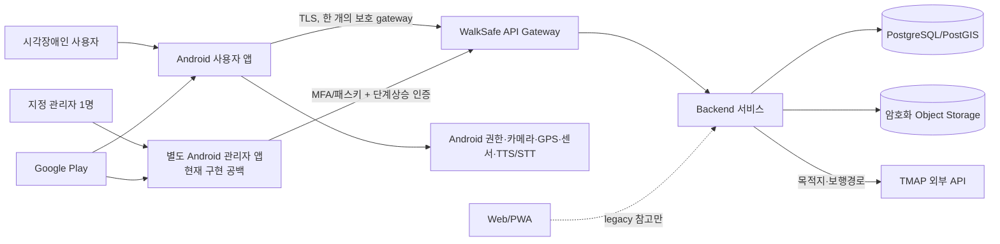
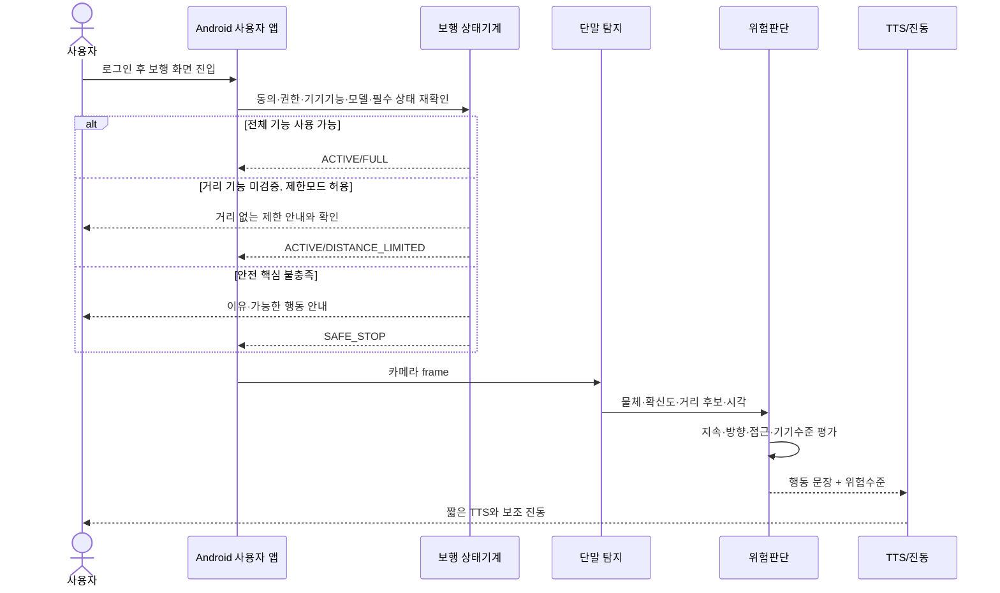
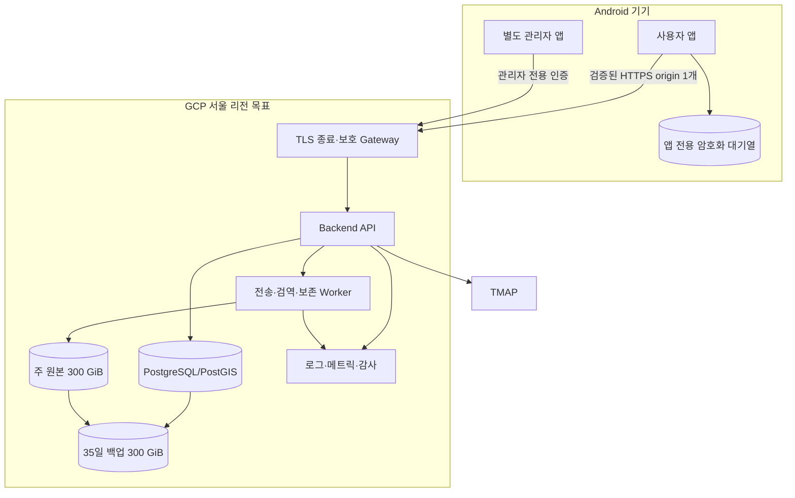

# WalkSafe 소프트웨어 아키텍처 설계

이 문서는 WalkSafe 설계를 사람이 검토하기 위한 **독립적인 Draft**입니다. 승인된 정책을 설계 언어로 옮겼지만, 이 문서 자체는 아직 승인되지 않았고 현재 코드가 이 설계를 따른다는 판정이나 시험 완료를 뜻하지 않습니다.

| 통제 항목 | 값 |
|---|---|
| 문서 ID | `WS-DES-ARCH-DRAFT-20260721-001` |
| 포함 산출물 | `DES-01`, `DES-02`, `DES-03`, `DES-04`, `DES-05`, `DES-06`, `DES-07`, `DES-08` |
| 버전·기준일 | `0.2.0` · `2026-07-22` |
| 문서 생명주기 | `DRAFT` |
| 문서 승인 | `NOT_APPROVED` |
| 설계·구현 적합성 | `NOT_ASSESSED` |
| 시험 | `NOT_RUN` |
| 출시 | `NOT_ELIGIBLE` |
| 남은 게이트 | `5개 NOT_RUN`, 면제 없음 |
| 요구사항 연결 상태 | `DRAFT_REFERENCE_PRESENT_NOT_BASELINED` |
| 기계 추적 | `docs/deliverables/04-design/design-traceability-register.json` |

## 먼저 읽을 핵심 경계

- 정식 사용자 제품은 **Android 사용자 앱**이다.
- 정식 관리 제품은 사용자 앱과 앱 ID·서명·배포·로그인을 분리한 **별도 Android 관리자 앱**이다. 현재 저장소에서는 이 독립 앱 경계를 확인하지 못했으므로 구현 공백으로 둔다.
- Web/PWA는 과거 구현을 이해하기 위한 `LEGACY_REFERENCE_ONLY`이며 정식 사용자·관리자 제품으로 채택하지 않는다.
- `contracts/walksafe.openapi.json`, Android·backend 코드, ORM·migration은 현재 상태를 보여 주는 후보 사실이다. 파일 경로와 SHA-256으로 묶지만 승인된 설계나 적합 증거로 승격하지 않는다.
- 정책 기준선은 승인·기준선화됐지만 이 설계 Draft, 구현, 시험, 배포는 별도 검토 대상이다.
- `WS-FEATURE-POLICY-FP035-CORRECTION-CANDIDATE-20260722-001` / `DEC-FP035-NETWORK-NORMALIZATION-20260722`는 새 질문이 아니라 기존 SP-13·FP-035 답변을 한 Draft 규칙으로 정리한 정정 후보다. 보행 중에는 전송하지 않고, 정지 뒤 Wi-Fi 또는 사용자가 명시적으로 허용한 이동통신망만 사용한다. 상태는 `NOT_APPROVED / NOT_EFFECTIVE`이며 정책 1.0.0 원본, 구현·시험 완료를 바꾸거나 주장하지 않는다.

## 입력 기준과 읽는 법

| 구분 | 기준 |
|---|---|
| 승인 정책 입력 | `PB-WALKSAFE-FEATURE-POLICY-1.0.0` |
| 정책 파일 | `docs/control/decision-interview/walksafe-feature-policy-comprehensive-draft.json` |
| 기존 답변 정규화 근거 | `docs/control/decision-interview/source-records/walksafe-feature-policy-comprehensive-review-20260719-answers.json`의 `SP-13`, `FP-035` |
| FP-035 정정 후보 | `docs/control/decision-interview/walksafe-feature-policy-fp035-correction-candidate-20260722-r001.json` · `NOT_APPROVED / NOT_EFFECTIVE` · 영향 산출물과 새 묶음 승인 필요 |
| 정렬 결정 | `docs/control/decision-interview/walksafe-effective-decision-register-aligned-20260721-r001.json`의 135건 |
| 요구예정 | REQ 유형과 `RQ-FP-*`, `RQ-NPC-*`, `RQ-GATE-*` Draft ID; 요구사항 기준선 승인 전까지 계획 연결 |
| 구현 후보 | 아래 후보 근거 표의 경로·SHA-256; 적합성 `NOT_ASSESSED` |
| 상태 해석 | “설계한다”는 목표 구조, “현재 후보”는 저장소 관찰 사실, “남은 일”은 승인·구현·시험 전 차단 항목 |

각 DES 절의 관리표에는 왜 만드는지, 무엇을 채우는지, 누가 작성·검토·승인하는지, 언제 고치고 어떻게 대체·폐기하는지를 함께 적는다.

## 자주 나오는 기술용어를 쉽게 읽기

| 용어 | 쉬운 뜻 |
|---|---|
| gateway | 앱의 요청이 서버로 들어오는 한 개의 확인된 입구 |
| worker | 사용자 화면 없이 서버 뒤에서 접수·삭제·검사 같은 일을 처리하는 프로그램 |
| resource | 계정, 신고, 원본처럼 권한검사의 대상이 되는 자료 |
| object storage | 영상·음성 같은 큰 파일을 두는 서버 저장소 |
| digest·SHA-256 | 파일이 바뀌었는지 비교하는 긴 지문값 |
| TTL | 받은 상태나 자료를 다시 확인해야 하는 유효시간 |
| backoff·backpressure | 실패나 과부하 때 재시도·유입 속도를 늦추는 방법 |
| provenance | 파일·빌드·모델이 어떤 입력과 과정에서 만들어졌는지 남긴 이력 |
| idempotency | 같은 요청을 다시 보내도 한 번 처리한 것과 같은 결과가 되게 하는 성질 |
| lease | 한 기기나 작업자에게 일정 시간만 주는 임시 독점 권한 |
| session | 로그인이나 한 번의 보행처럼 시작과 끝이 있는 사용 단위 |
| token | 비밀번호를 매번 보내지 않고 로그인·권한을 증명하는 짧은 전자표 |
| MFA·passkey | 비밀번호 하나에만 의존하지 않는 추가 로그인 확인수단 |
| attestation | 등록된 진짜 앱·기기·보안수단인지 확인하는 절차 |
| KMS·HSM | 암호화·서명 열쇠를 일반 파일과 분리해 보호하는 전용 관리수단 |
| break-glass | 평상시에는 막아 두고 사고 때만 승인·기록 후 여는 긴급 접근 |
| rate limit·timeout·circuit | 요청 횟수를 제한하고, 오래 걸리는 요청을 끝내며, 연속 실패한 외부 호출을 잠시 막는 보호장치 |
| audit·append-only | 누가 무엇을 했는지 남기고 과거 기록을 덮어쓰지 않는 감사기록 방식 |
| redaction | 로그에서 비밀값·정확 위치·원본 주소 같은 민감정보를 가리는 처리 |
| alert·on-call | 이상을 자동 통보하고 정해진 담당자가 대응하는 운영체계 |
| RTO·RPO·drill | 장애 뒤 복구 목표시간, 허용 가능한 자료 손실범위, 실제 복구 연습 |
| quota·5xx | 외부서비스 사용한도와 외부 서버 쪽 오류 응답 |
| subprocessor·region | 자료처리에 다시 참여하는 하위업체와 자료가 저장·처리되는 국가·지역 |
| SBOM·SCA | 사용한 소프트웨어 부품 목록과 그 부품의 알려진 취약점 검사 |
| TLS | 앱과 서버 사이 전송내용을 암호화하고 상대 서버를 확인하는 통신 보호 |
| sandbox | 앱이나 작업이 다른 자료에 함부로 접근하지 못하게 나눈 격리공간 |

## 현재 구현 후보 근거와 SHA-256

이 표는 현재 저장소를 재현하기 위한 근거다. `NOT_ASSESSED`이므로 설계 충족이나 시험 통과를 의미하지 않는다.

| 근거 ID | 분류 | 경로 | SHA-256 | 읽는 법 |
|---|---|---|---|---|
| `SRC-ANDROID-ROOT-BUILD` | `CANDIDATE_IMPLEMENTATION_FACT` | `apps/android/build.gradle.kts` | `20485875f2123b6dfa69bdb228a06890f440c46c5443bf68b936531fa2b0df28` | Android Gradle Plugin 후보 버전 |
| `SRC-ANDROID-APP-BUILD` | `CANDIDATE_IMPLEMENTATION_FACT` | `apps/android/app/build.gradle.kts` | `22ce5a8b59c86718bf6c9d319b90beeed5473b63d9fbfc4f4ea461abe01c5e0f` | 사용자 앱 ID·SDK·의존성·release 입력 후보 |
| `SRC-ANDROID-SETTINGS` | `CANDIDATE_IMPLEMENTATION_FACT` | `apps/android/settings.gradle.kts` | `f306583522c0183077907c34bfd30b09fc5de3465aa459b4c76d5d76015b867d` | 현재 Android 모듈 경계 후보 |
| `SRC-ANDROID-MANIFEST` | `CANDIDATE_IMPLEMENTATION_FACT` | `apps/android/app/src/main/AndroidManifest.xml` | `30efe0264c2d27512e9b63b96a8838ae560809902e41a348975baaf07ff592c2` | 현재 권한·기기기능·activity 선언 후보 |
| `SRC-ANDROID-MAIN-ACTIVITY` | `CANDIDATE_IMPLEMENTATION_FACT_REVALIDATION_REQUIRED` | `apps/android/app/src/main/java/kr/co/hanium/dreamup/walksafe/MainActivity.kt` | `ed9c8df7e7402a6214871a099d9994b182a01030bb01fab7662f062025887803` | 현재 개발·디버그 중심 조합 화면; 정식 무버튼 보행 화면과 정합성 미확인 |
| `SRC-ANDROID-MODEL-CONFIG` | `CANDIDATE_IMPLEMENTATION_FACT_REVALIDATION_REQUIRED` | `apps/android/app/src/main/assets/model-config/two_model_runtime.json` | `756acb36b1af081ae5a3e484e4f07a158600c9707c058005969b98c91d9add73` | 현재 단말 모델 조합 설정 후보 |
| `SRC-OPENAPI` | `CANDIDATE_IMPLEMENTATION_FACT_REVALIDATION_REQUIRED` | `contracts/walksafe.openapi.json` | `808c23492d7c942c4d30fee44f6c824af8d9f3aff541a9f361b85aa7fe963cdb` | 현재 API 계약 후보; 승인된 DES-09·10 기준선 아님 |
| `SRC-BACKEND-MAIN` | `CANDIDATE_IMPLEMENTATION_FACT` | `backend/app/main.py` | `c7953d9e7a3b046da0154baf0832dfc9b294d5760552dea19d31785794dada99` | 현재 FastAPI 조합 경계 후보 |
| `SRC-BACKEND-MODELS` | `CANDIDATE_IMPLEMENTATION_FACT_REVALIDATION_REQUIRED` | `backend/app/models.py` | `b337202f43beb99b506e11ca563c4479c32d2691e2a4857d698a490e3e801946` | 현재 DB ORM 후보; 목표 데이터 모델 전체가 아님 |
| `SRC-BACKEND-REQUIREMENTS` | `CANDIDATE_IMPLEMENTATION_FACT` | `backend/requirements.txt` | `b961d7554e769c567c86b5430c13ec55d911bd5bfeba3eba68c4bb9e49802e69` | 현재 backend 기술 버전 후보 |
| `SRC-DOCKER-COMPOSE` | `CANDIDATE_IMPLEMENTATION_FACT_NOT_DEPLOYMENT_EVIDENCE` | `docker-compose.yml` | `d3ca3c4caf272919712ee21ce8ae59c14894bff8f3270596a06c8601a2df6de5` | 로컬 PostGIS 배치 후보; 외부 인프라 배포 증거 아님 |
| `SRC-QUALITY-WORKFLOW` | `CANDIDATE_IMPLEMENTATION_FACT_NOT_TEST_EVIDENCE` | `.github/workflows/quality.yml` | `3a2bee390d25c7ab354249d1b755b689288ec655246f6e50fb0893d25f5cf3bf` | 품질 자동화 후보; 이 설계의 시험 완료 증거 아님 |
| `SRC-WEB-PACKAGE` | `LEGACY_REFERENCE_ONLY` | `apps/web/package.json` | `16caa5d7c305b90b74daa6e6c8ffe175da8c9991a459993b7b4a61164c45aa54` | Web/PWA 과거 구현 버전; 정식 제품 설계가 아님 |

## DES-01 SDD(Software Design Description)

### 설계 목표

WalkSafe는 시각장애인의 일반 도심 보행에서 세 가지 일을 돕는다. 첫째, 휴대전화 카메라와 단말 모델로 가까운 물체를 찾고 별도 위험판단으로 안내한다. 둘째, TMAP 보행 경로와 GPS로 큰 이동 방향을 안내한다. 셋째, 손상된 점자블록의 수동·동의 기반 자동신고를 돕는다. 안전시험이 끝나기 전에는 흰지팡이나 안내견을 대신한다고 설명하지 않는다.

### 설계 원칙

1. **안전 판단은 단말 우선**: 카메라 탐지·거리 후보·위험판단·TTS·진동은 네트워크 왕복에 의존하지 않게 설계한다.
2. **탐지와 위험을 분리**: 모델이 물체를 찾았다는 사실만으로 위험이라 하지 않는다. 거리·방향·접근·지속시간·기기 기능 수준을 별도 규칙으로 판단한다.
3. **현재 위치·가야 할 방향·카메라 방향·보폭을 분리**: GPS, 저장 경로, 회전센서, 보폭은 서로 다른 책임을 가지며 보폭이 위치나 방향을 대신하지 않는다.
4. **명시적 상태기계**: 로그인, 권한, 원본 동의, 자동신고, 이동통신망 선택, 보행 상태, 거리 기능 수준을 서로 다른 상태로 둔다.
5. **실패 시 안전정지**: 필요한 정보가 오래되거나 믿을 수 없으면 추정 안내를 계속하지 않고 해당 기능을 멈추며, 안전 핵심 전체가 신뢰되지 않을 때 이유와 행동을 안내한다.
6. **원본과 운영자료의 유한 생명주기**: 위치마다 보존·삭제 시점을 기록하고, 비용 때문에 만료 전 원본을 임의 삭제하지 않는다.

### 범위와 제외 범위

| 포함 | 이 Draft에서 완료로 주장하지 않는 것 |
|---|---|
| Android 사용자 앱, 별도 Android 관리자 앱, 보호된 API gateway, backend, PostGIS, 암호화 object storage, TMAP 연동, 모델·음성 처리 | 관리자 앱 구현, 최종 OpenAPI, 최종 ERD·migration, 외부 클라우드 생성, 설계 적합 판정, 실제 기기·현장·복구 시험, 출시 승인 |

전체 정책 범위는 부록 A~D의 18개 영역·54개 기능·11개 흐름·9개 공통정책·5개 게이트로 확인한다.

### 이 산출물의 작성·관리 기준

| 항목 | 현재 값 |
|---|---|
| 작성 목적 | 승인 요구를 구현 구조와 책임으로 변환한 전체 소프트웨어 설계 기준을 제공한다. |
| 필수/조건 | `REQUIRED` · 요구사항 기준선 승인 후 구현·통합 전에 활성 |
| 들어갈 내용 | - 설계 목표·범위·제약 - 아키텍처 개요 - 구성요소 책임·인터페이스 - 주요 런타임 흐름 - 데이터·보안·오류 설계 참조 - 요구·ADR 추적 |
| 작성 입력 | - 승인된 요구사항 기준선과 RTM - 현재 코드·OpenAPI·DB migration·배포 형상 - ADR 후보와 품질·보안·안전 제약 |
| 선행 → 후속 | `REQ-16`, `REQ-17` → `DES-02`, `DEV-01`, `DEV-02` |
| 작성·검토·승인 | 기술책임자 · 제품책임자, 보안·개인정보책임자, QA책임자, 독립기술검토자 · 프로젝트책임자 |
| 형식·정본 위치 | `CANONICAL_DOCUMENT` · `docs/deliverables/04-design/software-architecture.md#des-01` |
| 보조 파일 | `docs/deliverables/04-design/design-traceability-register.json` |
| 완료·승인 기준 | - 다음 핵심 내용이 근거·버전과 함께 구체적으로 작성되어 있다: 설계 목표·범위·제약, 아키텍처 개요. - 필수 내용에 공란·암묵적 가정이 없고 미결정은 소유자·기한이 있는 차단 항목으로 표시되어 있다. - 상위 입력과 요구·설계·코드·시험·변경요청의 해당 추적 링크가 유효하다. - 지정 검토자가 사실·일관성·추적성을 확인하고 승인자가 명시적으로 승인했다. |
| 갱신 조건 | - 요구·아키텍처·API·DB·배포·보안 경계 변경 - 연결된 상위 기준선·사용자 승인 결정·외부 의무 변경 - 검토에서 사실 오류·누락·stale 판정 또는 유효기간 만료 |
| 검토 주기 | 초안의 필수내용을 채운 때, 상위 요구·정책·설계 경계가 바뀐 때, 설계 기준선 승인 전에 검토한다. |
| 변경·대체·폐기 | 승인본을 덮어쓰지 않는다. 변경요청과 영향분석을 남겨 새 버전을 만들고, 대체된 버전은 Superseded로 표시한 뒤 정해진 보존기간이 끝나면 Archived로 옮긴다. |

쉽게 말하면, 이 표는 이 설계 산출물을 왜 만들고 누가 언제까지 무엇을 확인하며, 바뀌면 어떻게 새 버전으로 관리할지를 정한 약속이다.

### 추적과 판정 경계

- 입력: 승인 정책 [`PB-WALKSAFE-FEATURE-POLICY-1.0.0`](../../control/baselines/walksafe-feature-policy-baseline-1.0.0-manifest-20260721-r001.json), [정렬 결정 등록부](../../control/decision-interview/walksafe-effective-decision-register-aligned-20260721-r001.json), [기존 답변](../../control/decision-interview/source-records/walksafe-feature-policy-comprehensive-review-20260719-answers.json), [FP-035 정정 후보](../../control/decision-interview/walksafe-feature-policy-fp035-correction-candidate-20260722-r001.json), 산출물 유형 작성계약.
- 정책 결정: 영역 `FA-01`, `FA-02`, `FA-03`, `FA-04`, `FA-05`, `FA-06`, `FA-07`, `FA-08`, `FA-09`, `FA-10`, `FA-11`, `FA-12`, `FA-13`, `FA-14`, `FA-15`, `FA-16`, `FA-17`, `FA-18`; 기능 `FP-001`, `FP-002`, `FP-003`, `FP-004`, `FP-005`, `FP-006`, `FP-007`, `FP-008`, `FP-009`, `FP-010`, `FP-011`, `FP-012`, `FP-013`, `FP-014`, `FP-015`, `FP-016`, `FP-017`, `FP-018`, `FP-019`, `FP-020`, `FP-021`, `FP-022`, `FP-023`, `FP-024`, `FP-025`, `FP-026`, `FP-027`, `FP-028`, `FP-029`, `FP-030`, `FP-031`, `FP-032`, `FP-033`, `FP-034`, `FP-035`, `FP-036`, `FP-037`, `FP-038`, `FP-039`, `FP-040`, `FP-041`, `FP-042`, `FP-043`, `FP-044`, `FP-045`, `FP-046`, `FP-047`, `FP-048`, `FP-049`, `FP-050`, `FP-051`, `FP-052`, `FP-053`, `FP-054`; 공통정책 `NPC-RAW-ORIGINAL-COLLECTION`, `NPC-DATA-LIFECYCLE`, `NPC-SERVER-STORAGE-CAPACITY`, `NPC-PHONE-QUEUE-CAPACITY`, `NPC-AUTO-REPORT`, `NPC-PERMISSION-SESSION-LIFECYCLE`, `NPC-NAVIGATION-ROUTE-DIRECTION`, `NPC-SINGLE-ADMIN-RECOVERY`, `NPC-SERVER-CAPACITY-STATE-SYNC`; 흐름 `FLOW-01`, `FLOW-02`, `FLOW-03`, `FLOW-04`, `FLOW-05`, `FLOW-06`, `FLOW-07`, `FLOW-08`, `FLOW-09`, `FLOW-10`, `FLOW-11`.
- 기존 답변 정규화: 없음; 적용 요구유형 없음. 해당 없는 산출물은 `없음`이다.
- 정정 후보·묶음 승인 의존성: 없음. 값이 있으면 `NOT_APPROVED / NOT_EFFECTIVE`이며 이 산출물과 함께 새 묶음 승인이 필요하다.

- 정렬 결정: 등록부의 135건(`DEC-PRODUCT-RELEASE`, `DEC-SAFETY-POSITION`, `DEC-USER-AGE`, `DEC-USE-ENVIRONMENT`, `DEC-CROSSWALK-SCOPE`, `DEC-POOR-IMAGE-BEHAVIOR`, `DEC-PHONE-MOUNT`, `DEC-LANGUAGE-SCOPE`, `DEC-EXCLUDED-FEATURES`, `DEC-APP-SEPARATION`, `DEC-IBQ-011`, `DEC-IBQ-012` 외 123건). 전체 목록과 해시는 추적 등록부에 있다.
- 요구예정 유형: [`REQ-01`](../03-requirements/system-requirements.md#req-01) (DRAFT_FILE_PRESENT_NOT_BASELINED); [`REQ-02`](../03-requirements/system-requirements.md#req-02) (DRAFT_FILE_PRESENT_NOT_BASELINED); [`REQ-03`](../03-requirements/system-requirements.md#req-03) (DRAFT_FILE_PRESENT_NOT_BASELINED); [`REQ-04`](../03-requirements/system-requirements.md#req-04) (DRAFT_FILE_PRESENT_NOT_BASELINED); [`REQ-16`](../03-requirements/requirements-traceability.md#req-16) (DRAFT_FILE_PRESENT_NOT_BASELINED); [`REQ-17`](../03-requirements/requirements-traceability.md#req-17) (DRAFT_FILE_PRESENT_NOT_BASELINED).
- 요구예정 상세: 68건([`RQ-FP-001-001`](../03-requirements/system-requirements.md#RQ-FP-001-001), [`RQ-FP-002-001`](../03-requirements/system-requirements.md#RQ-FP-002-001), [`RQ-FP-003-001`](../03-requirements/system-requirements.md#RQ-FP-003-001), [`RQ-FP-004-001`](../03-requirements/system-requirements.md#RQ-FP-004-001), [`RQ-FP-005-001`](../03-requirements/system-requirements.md#RQ-FP-005-001), [`RQ-FP-006-001`](../03-requirements/system-requirements.md#RQ-FP-006-001), [`RQ-FP-007-001`](../03-requirements/system-requirements.md#RQ-FP-007-001), [`RQ-FP-008-001`](../03-requirements/system-requirements.md#RQ-FP-008-001), [`RQ-FP-009-001`](../03-requirements/system-requirements.md#RQ-FP-009-001), [`RQ-FP-010-001`](../03-requirements/system-requirements.md#RQ-FP-010-001), [`RQ-FP-011-001`](../03-requirements/system-requirements.md#RQ-FP-011-001), [`RQ-FP-012-001`](../03-requirements/system-requirements.md#RQ-FP-012-001) 외 56건); 상태 `DRAFT_REFERENCE_PRESENT_NOT_BASELINED`.
- 현재 후보 근거: `SRC-ANDROID-ROOT-BUILD`, `SRC-ANDROID-APP-BUILD`, `SRC-ANDROID-SETTINGS`, `SRC-ANDROID-MANIFEST`, `SRC-ANDROID-MAIN-ACTIVITY`, `SRC-ANDROID-MODEL-CONFIG`, `SRC-OPENAPI`, `SRC-BACKEND-MAIN`, `SRC-BACKEND-MODELS`, `SRC-BACKEND-REQUIREMENTS`, `SRC-DOCKER-COMPOSE`, `SRC-QUALITY-WORKFLOW`, `SRC-WEB-PACKAGE`; 구현 적합성 `NOT_ASSESSED`.
- 이 절의 문서 상태는 `DRAFT`, 승인 `NOT_APPROVED`, 검증 `NOT_RUN`이다.

## DES-02 시스템 컨텍스트 다이어그램

WalkSafe 경계 안에는 두 Android 앱과 서버 구성요소가 있다. 사용자는 사용자 앱만, 지정 관리자 한 명은 별도 관리자 앱만 사용한다. TMAP과 Google Play·Android OS는 외부 책임 경계다.

| 경계 | 오가는 정보 | 책임 |
|---|---|---|
| 사용자↔사용자 앱 | 목적지·음성 명령·권한·동의, 위험·경로·오류 안내 | 화면을 보지 않아도 조작·이해 가능해야 함 |
| 관리자↔관리자 앱 | 신고 검토·상태 변경·감사 조회 | 최소 권한, 민감 작업 재인증, 원본 기본 차단 |
| 앱↔gateway | 계정·상태·경로·신고·원본 전송 | TLS, 앱·계정·역할 확인, 중복 방지 ID |
| backend↔TMAP | 검색어·위치·경로 요청과 응답 | timeout·쿼터·오래된 경로 금지 |
| backend↔저장소 | 메타데이터·원본·학습자료·감사자료 | DB와 object를 분리하고 동일 식별자로 연결 |

개발·시험·운영 환경의 실제 도메인, 인증서, 네트워크 ACL은 아직 승인된 배포 기준선이 아니다.

### 이 산출물의 작성·관리 기준

| 항목 | 현재 값 |
|---|---|
| 작성 목적 | WalkSafe 경계 밖의 사용자·기기·TMAP·운영자·외부 시스템과 데이터 흐름을 한눈에 보인다. |
| 필수/조건 | `REQUIRED` · 요구사항 기준선 승인 후 구현·통합 전에 활성 |
| 들어갈 내용 | - 시스템 경계 - 외부 행위자·시스템 - 입출력 데이터·프로토콜 - 신뢰·책임 경계 - 환경별 차이 - 다이어그램 범례·버전 |
| 작성 입력 | - 승인된 요구사항 기준선과 RTM - 현재 코드·OpenAPI·DB migration·배포 형상 - ADR 후보와 품질·보안·안전 제약 |
| 선행 → 후속 | `DES-01`, `REQ-07` → `DES-03`, `DES-19`, `DES-20`, `DES-21`, `DES-27` |
| 작성·검토·승인 | 기술책임자 · 제품책임자, 보안·개인정보책임자, QA책임자, 독립기술검토자 · 프로젝트책임자 |
| 형식·정본 위치 | `SECTION` · `docs/deliverables/04-design/software-architecture.md#des-02` |
| 보조 파일 | `docs/deliverables/04-design/design-traceability-register.json` |
| 완료·승인 기준 | - 다음 핵심 내용이 근거·버전과 함께 구체적으로 작성되어 있다: 시스템 경계, 외부 행위자·시스템. - 필수 내용에 공란·암묵적 가정이 없고 미결정은 소유자·기한이 있는 차단 항목으로 표시되어 있다. - 상위 입력과 요구·설계·코드·시험·변경요청의 해당 추적 링크가 유효하다. - 지정 검토자가 사실·일관성·추적성을 확인하고 승인자가 명시적으로 승인했다. |
| 갱신 조건 | - 요구·아키텍처·API·DB·배포·보안 경계 변경 - 연결된 상위 기준선·사용자 승인 결정·외부 의무 변경 - 검토에서 사실 오류·누락·stale 판정 또는 유효기간 만료 |
| 검토 주기 | 초안의 필수내용을 채운 때, 상위 요구·정책·설계 경계가 바뀐 때, 설계 기준선 승인 전에 검토한다. |
| 변경·대체·폐기 | 승인본을 덮어쓰지 않는다. 변경요청과 영향분석을 남겨 새 버전을 만들고, 대체된 버전은 Superseded로 표시한 뒤 정해진 보존기간이 끝나면 Archived로 옮긴다. |

쉽게 말하면, 이 표는 이 설계 산출물을 왜 만들고 누가 언제까지 무엇을 확인하며, 바뀌면 어떻게 새 버전으로 관리할지를 정한 약속이다.

### 추적과 판정 경계

- 입력: 승인 정책 [`PB-WALKSAFE-FEATURE-POLICY-1.0.0`](../../control/baselines/walksafe-feature-policy-baseline-1.0.0-manifest-20260721-r001.json), [정렬 결정 등록부](../../control/decision-interview/walksafe-effective-decision-register-aligned-20260721-r001.json), [기존 답변](../../control/decision-interview/source-records/walksafe-feature-policy-comprehensive-review-20260719-answers.json), [FP-035 정정 후보](../../control/decision-interview/walksafe-feature-policy-fp035-correction-candidate-20260722-r001.json), 산출물 유형 작성계약.
- 정책 결정: 영역 `FA-01`, `FA-03`, `FA-14`, `FA-16`, `FA-18`; 기능 `FP-001`, `FP-002`, `FP-003`, `FP-007`, `FP-008`, `FP-009`, `FP-040`, `FP-041`, `FP-042`, `FP-047`, `FP-048`, `FP-054`; 공통정책 없음; 흐름 `FLOW-01`, `FLOW-02`, `FLOW-03`, `FLOW-05`, `FLOW-08`, `FLOW-10`.
- 기존 답변 정규화: 없음; 적용 요구유형 없음. 해당 없는 산출물은 `없음`이다.
- 정정 후보·묶음 승인 의존성: 없음. 값이 있으면 `NOT_APPROVED / NOT_EFFECTIVE`이며 이 산출물과 함께 새 묶음 승인이 필요하다.

- 정렬 결정: 등록부의 49건(`DEC-PRODUCT-RELEASE`, `DEC-SAFETY-POSITION`, `DEC-EXCLUDED-FEATURES`, `DEC-APP-SEPARATION`, `DEC-IBQ-011`, `DEC-IBQ-012`, `DEC-IBQ-013`, `DEC-DEPTH-UNSUPPORTED`, `DEC-IBQ-015`, `DEC-IBQ-016`, `DEC-IBQ-017`, `DEC-IBQ-018` 외 37건). 전체 목록과 해시는 추적 등록부에 있다.
- 요구예정 유형: [`REQ-01`](../03-requirements/system-requirements.md#req-01) (DRAFT_FILE_PRESENT_NOT_BASELINED); [`REQ-07`](../03-requirements/system-requirements.md#req-07) (DRAFT_FILE_PRESENT_NOT_BASELINED); [`REQ-09`](../03-requirements/system-requirements.md#req-09) (DRAFT_FILE_PRESENT_NOT_BASELINED); [`REQ-10`](../03-requirements/system-requirements.md#req-10) (DRAFT_FILE_PRESENT_NOT_BASELINED).
- 요구예정 상세: 16건([`RQ-FP-001-001`](../03-requirements/system-requirements.md#RQ-FP-001-001), [`RQ-FP-002-001`](../03-requirements/system-requirements.md#RQ-FP-002-001), [`RQ-FP-003-001`](../03-requirements/system-requirements.md#RQ-FP-003-001), [`RQ-FP-007-001`](../03-requirements/system-requirements.md#RQ-FP-007-001), [`RQ-FP-008-001`](../03-requirements/system-requirements.md#RQ-FP-008-001), [`RQ-FP-009-001`](../03-requirements/system-requirements.md#RQ-FP-009-001), [`RQ-FP-040-001`](../03-requirements/system-requirements.md#RQ-FP-040-001), [`RQ-FP-041-001`](../03-requirements/system-requirements.md#RQ-FP-041-001), [`RQ-FP-042-001`](../03-requirements/system-requirements.md#RQ-FP-042-001), [`RQ-FP-047-001`](../03-requirements/system-requirements.md#RQ-FP-047-001), [`RQ-FP-048-001`](../03-requirements/system-requirements.md#RQ-FP-048-001), [`RQ-FP-054-001`](../03-requirements/system-requirements.md#RQ-FP-054-001) 외 4건); 상태 `DRAFT_REFERENCE_PRESENT_NOT_BASELINED`.
- 현재 후보 근거: `SRC-ANDROID-ROOT-BUILD`, `SRC-ANDROID-APP-BUILD`, `SRC-ANDROID-SETTINGS`, `SRC-ANDROID-MANIFEST`, `SRC-ANDROID-MAIN-ACTIVITY`, `SRC-ANDROID-MODEL-CONFIG`, `SRC-OPENAPI`, `SRC-BACKEND-MAIN`, `SRC-BACKEND-MODELS`, `SRC-BACKEND-REQUIREMENTS`, `SRC-DOCKER-COMPOSE`, `SRC-QUALITY-WORKFLOW`, `SRC-WEB-PACKAGE`; 구현 적합성 `NOT_ASSESSED`.
- 이 절의 문서 상태는 `DRAFT`, 승인 `NOT_APPROVED`, 검증 `NOT_RUN`이다.

## DES-03 구성요소·모듈 구조

| 구성요소 | 맡는 일 | 제공 인터페이스 | 필요한 인터페이스 | 실패 격리·현재 판단 |
|---|---|---|---|---|
| Android 사용자 앱 | 온보딩, 권한·동의, 보행 상태, 카메라 추론, 위험판단, 경로·음성·진동, 신고 대기열 | 사용자 접근성 UI, 보행·신고·원본 상태 | Android OS, 단말 모듈, 보호 gateway | 서버 실패와 무관하게 신뢰 가능한 단말 안전기능 유지; 소스 후보 재검증 필요 |
| 별도 Android 관리자 앱 | 지정 관리자 로그인, 신고 조회·상태 변경, 감사·용량 상태 | 관리자 화면·재인증·감사 상관 ID | 관리자 전용 API, MFA/패스키 제공 경로 | 사용자 앱과 별도 앱 ID·서명·세션; **구현 경계 미확인** |
| 단말 탐지·위험 모듈 | 영상→탐지 후보→거리 후보→위험상태 | versioned 탐지·위험 결과 | CameraX, 승인 모델/config, 기기 기능수준 | 실패하면 위험안내 제한/정지, 길안내 상태와 직접 결합 금지; 동등성·안전성 미검증 |
| 단말 길안내 모듈 | GPS·저장 경로·보폭 보조·이탈 상태 | 남은 거리·도착 후보·이탈 상태 | 위치 센서, 저장 경로, 보폭 보조 | 위치 불신 시 회전안내만 중지하고 보폭 대체 금지; 후보 코드 적합성 미판정 |
| 단말 음성·촉각 모듈 | 호출어/STT 의도, TTS, 진동 패턴 | versioned 의도·우선순위 안내 | Android STT/TTS/진동, 보행 상태기계 | 실패한 채널만 격리하고 대체채널을 검토; 실제 소음·TalkBack 시험 전 |
| 보호 gateway | 모바일 앱의 유일한 서버 진입점 | versioned API, 공통 오류·상태조회 | 인증·속도제한·상관 ID·service API | backend/TMAP 오류를 안전 오류로 변환; endpoint 정합성 미확인 |
| Backend | 계정·동의·기기세션·경로 중계·신고·원본 메타·관리·감사 | domain service·worker 계약 | DB, object storage, TMAP | 외부 장애별 circuit/queue로 격리; FastAPI 후보 존재 |
| PostgreSQL/PostGIS | 관계·공간·상태·감사 메타데이터 | transaction·공간 query | migration과 제한된 service identity | object 일부성공은 완료로 표시 금지; 현재 4 ORM table은 목표 전체가 아님 |
| 암호화 object storage | 영상·음성·대용량 원본·학습자료·백업 | digest receipt·수명주기 상태 | 비공개 GCS API, KMS, metadata ID | DB와 reconciliation하며 실패 시 단말/ingest queue 보존; 실제 cloud 미생성 |
| Web/PWA | 과거 동작 참고 | 없음 | 없음 | 정식 경계에서 호출 금지; `LEGACY_REFERENCE_ONLY` |

금지 결합은 세 가지다. 사용자 앱이 DB·object storage·TMAP 비밀값에 직접 접근하지 않는다. 관리자 기능을 사용자 앱이나 Web/PWA에 숨은 화면으로 넣지 않는다. 탐지 모델 결과가 위험 안내를 직접 발행하지 않는다.

### 이 산출물의 작성·관리 기준

| 항목 | 현재 값 |
|---|---|
| 작성 목적 | Android 사용자 앱·비공개 관리자 앱·게이트웨이·백엔드·음성·모델·DB 모듈의 책임과 의존 방향을 정한다. |
| 필수/조건 | `REQUIRED` · 요구사항 기준선 승인 후 구현·통합 전에 활성 |
| 들어갈 내용 | - 컨테이너·모듈 목록 - 책임·소유자 - 제공·사용 인터페이스 - 의존성 방향·금지 결합 - 배포 단위 - 요구·소스 경로 연결 |
| 작성 입력 | - 승인된 요구사항 기준선과 RTM - 현재 코드·OpenAPI·DB migration·배포 형상 - ADR 후보와 품질·보안·안전 제약 |
| 선행 → 후속 | `DES-02`, `REQ-03` → `DES-04`, `DES-05`, `DES-08`, `DES-09`, `DES-11`, `DES-23`, `DES-24`, `DEV-18` |
| 작성·검토·승인 | 기술책임자 · 제품책임자, 보안·개인정보책임자, QA책임자, 독립기술검토자 · 프로젝트책임자 |
| 형식·정본 위치 | `SECTION` · `docs/deliverables/04-design/software-architecture.md#des-03` |
| 보조 파일 | `docs/deliverables/04-design/design-traceability-register.json` |
| 완료·승인 기준 | - 다음 핵심 내용이 근거·버전과 함께 구체적으로 작성되어 있다: 컨테이너·모듈 목록, 책임·소유자. - 필수 내용에 공란·암묵적 가정이 없고 미결정은 소유자·기한이 있는 차단 항목으로 표시되어 있다. - 상위 입력과 요구·설계·코드·시험·변경요청의 해당 추적 링크가 유효하다. - 지정 검토자가 사실·일관성·추적성을 확인하고 승인자가 명시적으로 승인했다. |
| 갱신 조건 | - 요구·아키텍처·API·DB·배포·보안 경계 변경 - 연결된 상위 기준선·사용자 승인 결정·외부 의무 변경 - 검토에서 사실 오류·누락·stale 판정 또는 유효기간 만료 |
| 검토 주기 | 초안의 필수내용을 채운 때, 상위 요구·정책·설계 경계가 바뀐 때, 설계 기준선 승인 전에 검토한다. |
| 변경·대체·폐기 | 승인본을 덮어쓰지 않는다. 변경요청과 영향분석을 남겨 새 버전을 만들고, 대체된 버전은 Superseded로 표시한 뒤 정해진 보존기간이 끝나면 Archived로 옮긴다. |

쉽게 말하면, 이 표는 이 설계 산출물을 왜 만들고 누가 언제까지 무엇을 확인하며, 바뀌면 어떻게 새 버전으로 관리할지를 정한 약속이다.

### 추적과 판정 경계

- 입력: 승인 정책 [`PB-WALKSAFE-FEATURE-POLICY-1.0.0`](../../control/baselines/walksafe-feature-policy-baseline-1.0.0-manifest-20260721-r001.json), [정렬 결정 등록부](../../control/decision-interview/walksafe-effective-decision-register-aligned-20260721-r001.json), [기존 답변](../../control/decision-interview/source-records/walksafe-feature-policy-comprehensive-review-20260719-answers.json), [FP-035 정정 후보](../../control/decision-interview/walksafe-feature-policy-fp035-correction-candidate-20260722-r001.json), 산출물 유형 작성계약.
- 정책 결정: 영역 `FA-03`, `FA-07`, `FA-08`, `FA-09`, `FA-11`, `FA-13`, `FA-14`; 기능 `FP-007`, `FP-008`, `FP-009`, `FP-019`, `FP-020`, `FP-021`, `FP-022`, `FP-025`, `FP-031`, `FP-037`, `FP-038`, `FP-039`, `FP-040`, `FP-041`; 공통정책 없음; 흐름 `FLOW-02`, `FLOW-03`, `FLOW-04`, `FLOW-05`, `FLOW-06`, `FLOW-07`, `FLOW-08`, `FLOW-09`, `FLOW-10`.
- 기존 답변 정규화: 없음; 적용 요구유형 없음. 해당 없는 산출물은 `없음`이다.
- 정정 후보·묶음 승인 의존성: 없음. 값이 있으면 `NOT_APPROVED / NOT_EFFECTIVE`이며 이 산출물과 함께 새 묶음 승인이 필요하다.

- 정렬 결정: 등록부의 72건(`DEC-POOR-IMAGE-BEHAVIOR`, `DEC-LANGUAGE-SCOPE`, `DEC-APP-SEPARATION`, `DEC-IBQ-011`, `DEC-IBQ-012`, `DEC-IBQ-013`, `DEC-DEPTH-UNSUPPORTED`, `DEC-IBQ-015`, `DEC-IBQ-016`, `DEC-IBQ-017`, `DEC-IBQ-018`, `DEC-IBQ-028` 외 60건). 전체 목록과 해시는 추적 등록부에 있다.
- 요구예정 유형: [`REQ-03`](../03-requirements/system-requirements.md#req-03) (DRAFT_FILE_PRESENT_NOT_BASELINED); [`REQ-07`](../03-requirements/system-requirements.md#req-07) (DRAFT_FILE_PRESENT_NOT_BASELINED).
- 요구예정 상세: 19건([`RQ-FP-007-001`](../03-requirements/system-requirements.md#RQ-FP-007-001), [`RQ-FP-008-001`](../03-requirements/system-requirements.md#RQ-FP-008-001), [`RQ-FP-009-001`](../03-requirements/system-requirements.md#RQ-FP-009-001), [`RQ-FP-019-001`](../03-requirements/system-requirements.md#RQ-FP-019-001), [`RQ-FP-020-001`](../03-requirements/system-requirements.md#RQ-FP-020-001), [`RQ-FP-021-001`](../03-requirements/system-requirements.md#RQ-FP-021-001), [`RQ-FP-022-001`](../03-requirements/system-requirements.md#RQ-FP-022-001), [`RQ-FP-025-001`](../03-requirements/system-requirements.md#RQ-FP-025-001), [`RQ-FP-031-001`](../03-requirements/system-requirements.md#RQ-FP-031-001), [`RQ-FP-037-001`](../03-requirements/system-requirements.md#RQ-FP-037-001), [`RQ-FP-038-001`](../03-requirements/system-requirements.md#RQ-FP-038-001), [`RQ-FP-039-001`](../03-requirements/system-requirements.md#RQ-FP-039-001) 외 7건); 상태 `DRAFT_REFERENCE_PRESENT_NOT_BASELINED`.
- 현재 후보 근거: `SRC-ANDROID-ROOT-BUILD`, `SRC-ANDROID-APP-BUILD`, `SRC-ANDROID-SETTINGS`, `SRC-ANDROID-MANIFEST`, `SRC-ANDROID-MAIN-ACTIVITY`, `SRC-ANDROID-MODEL-CONFIG`, `SRC-OPENAPI`, `SRC-BACKEND-MAIN`, `SRC-BACKEND-MODELS`, `SRC-BACKEND-REQUIREMENTS`, `SRC-DOCKER-COMPOSE`, `SRC-QUALITY-WORKFLOW`, `SRC-WEB-PACKAGE`; 구현 적합성 `NOT_ASSESSED`.
- 이 절의 문서 상태는 `DRAFT`, 승인 `NOT_APPROVED`, 검증 `NOT_RUN`이다.

## DES-04 런타임·시퀀스 흐름

### 보행 시작과 탐지 안내

### 목적지·경로·이탈

목적지 검색은 gateway가 TMAP을 중계한다. 앱은 받은 경로와 버전을 저장하고 GPS와 경로의 거리를 주 기준으로 남은 거리·도착·이탈을 판단한다. 보폭은 진행량 검증만 돕는다. 이탈 의심이면 오래된 회전안내를 멈추고, 이탈 확정 뒤 사용자에게 새 경로 요청·위치 재확인·길안내 종료를 고르게 한다. **새 경로를 선택한 때만** TMAP을 다시 호출한다.

### 자동신고와 원본 전송

동의한 자동신고 후보는 후보마다 알리지 않고 암호화 대기열에 둔다. 보행 종료 뒤 사용자가 허용한 통신망에서 고정 신고번호로 전송한다. 응답이 불분명하면 같은 ID의 서버 상태를 먼저 조회하고, 전체 파일 저장과 digest 일치 확인 뒤 완료한다. 자동신고를 끄면 새 후보 생성과 미전송 전송을 즉시 멈추고 미전송 후보는 24시간, 서버 원본은 삭제요청 전환 후 7일 안에 삭제한다.

일반 활동원본 전송 Draft는 `WS-FEATURE-POLICY-FP035-CORRECTION-CANDIDATE-20260722-001` / `DEC-FP035-NETWORK-NORMALIZATION-20260722`를 따른다. 정정 후보는 `NOT_APPROVED / NOT_EFFECTIVE`이며 영향 산출물과 새 묶음 승인 전에는 정책 효력이 없다. `REQ-03·REQ-06` 및 `DES-13·DES-20`도 같은 상태값을 사용한다.

| 보행 상태 | Wi-Fi | 이동통신망 전송 선택 | 전송 결과 | 쉬운 설명 |
|---|---:|---:|---|---|
| `WALKING` | 무관 | 무관 | `BLOCKED` | 걷는 동안에는 어느 망으로도 새 일반 활동원본을 보내지 않는다. |
| `STATIONARY` | 있음 | 무관 | `WIFI_ALLOWED` | 정지했고 Wi-Fi가 있으면 Wi-Fi로 보낸다. |
| `STATIONARY` | 없음 | 선택함 | `APPROVED_MOBILE_NETWORK_ALLOWED` | 정지했고 사용자가 미리 선택한 경우에만 허용된 이동통신망으로 보낸다. |
| `STATIONARY` | 없음 | 선택 안 함·상태 불명 | `QUEUED_UNTIL_WIFI` | Wi-Fi가 생길 때까지 최대 30일 암호화 보관한다. |

움직임이 다시 시작되면 새 조각 전송을 즉시 막고 진행 중 연결을 안전하게 끝낸다. 서버가 온전히 받은 마지막 조각 다음부터 다음 허용 시점에 이어 보내며, 선택 상태가 없거나 읽히지 않으면 `선택 안 함`으로 처리한다. 이 흐름의 구현·통합시험은 아직 `NOT_RUN`이다.

### 동시성·취소 원칙

- 앱 배경 전환·화면 잠금·사용자 일시중지 때 카메라·음성명령·길안내·새 신고 생성은 즉시 중지한다.
- 복귀·재부팅·비정상 종료 뒤 이전 보행이나 경로를 자동 재개하지 않는다.
- 모든 재시도는 idempotency key와 상태조회 우선 규칙을 사용한다.
- 민감 원본이 단말 대기열, gateway, 검역, object storage, 학습자료로 이동할 때 같은 원본 ID·digest·동의 버전을 유지한다.

### 이 산출물의 작성·관리 기준

| 항목 | 현재 값 |
|---|---|
| 작성 목적 | 핵심 사용자 흐름에서 호출 순서, 상태 전이, timeout과 실패 처리를 설명한다. |
| 필수/조건 | `REQUIRED` · 요구사항 기준선 승인 후 구현·통합 전에 활성 |
| 들어갈 내용 | - 카메라→탐지→안내 시퀀스 - 음성→의도→경로 시퀀스 - 신고→검증→관리 시퀀스 - 비동기·동시성 - 오류·retry·취소 - 민감데이터 통과 지점 |
| 작성 입력 | - 승인된 요구사항 기준선과 RTM - 현재 코드·OpenAPI·DB migration·배포 형상 - ADR 후보와 품질·보안·안전 제약 |
| 선행 → 후속 | `DES-03`, `REQ-05` → `DES-08`, `DES-09`, `DES-22` |
| 작성·검토·승인 | 기술책임자 · 제품책임자, 보안·개인정보책임자, QA책임자, 독립기술검토자 · 프로젝트책임자 |
| 형식·정본 위치 | `SECTION` · `docs/deliverables/04-design/software-architecture.md#des-04` |
| 보조 파일 | `docs/deliverables/04-design/design-traceability-register.json` |
| 완료·승인 기준 | - 다음 핵심 내용이 근거·버전과 함께 구체적으로 작성되어 있다: 카메라→탐지→안내 시퀀스, 음성→의도→경로 시퀀스. - 필수 내용에 공란·암묵적 가정이 없고 미결정은 소유자·기한이 있는 차단 항목으로 표시되어 있다. - 상위 입력과 요구·설계·코드·시험·변경요청의 해당 추적 링크가 유효하다. - 지정 검토자가 사실·일관성·추적성을 확인하고 승인자가 명시적으로 승인했다. |
| 갱신 조건 | - 요구·아키텍처·API·DB·배포·보안 경계 변경 - 연결된 상위 기준선·사용자 승인 결정·외부 의무 변경 - 검토에서 사실 오류·누락·stale 판정 또는 유효기간 만료 |
| 검토 주기 | 초안의 필수내용을 채운 때, 상위 요구·정책·설계 경계가 바뀐 때, 설계 기준선 승인 전에 검토한다. |
| 변경·대체·폐기 | 승인본을 덮어쓰지 않는다. 변경요청과 영향분석을 남겨 새 버전을 만들고, 대체된 버전은 Superseded로 표시한 뒤 정해진 보존기간이 끝나면 Archived로 옮긴다. |

쉽게 말하면, 이 표는 이 설계 산출물을 왜 만들고 누가 언제까지 무엇을 확인하며, 바뀌면 어떻게 새 버전으로 관리할지를 정한 약속이다.

### 추적과 판정 경계

- 입력: 승인 정책 [`PB-WALKSAFE-FEATURE-POLICY-1.0.0`](../../control/baselines/walksafe-feature-policy-baseline-1.0.0-manifest-20260721-r001.json), [정렬 결정 등록부](../../control/decision-interview/walksafe-effective-decision-register-aligned-20260721-r001.json), [기존 답변](../../control/decision-interview/source-records/walksafe-feature-policy-comprehensive-review-20260719-answers.json), [FP-035 정정 후보](../../control/decision-interview/walksafe-feature-policy-fp035-correction-candidate-20260722-r001.json), 산출물 유형 작성계약.
- 정책 결정: 영역 `FA-04`, `FA-05`, `FA-06`, `FA-07`, `FA-08`, `FA-09`, `FA-10`, `FA-11`, `FA-12`, `FA-13`, `FA-14`, `FA-15`, `FA-16`, `FA-17`, `FA-18`; 기능 `FP-010`, `FP-011`, `FP-012`, `FP-013`, `FP-014`, `FP-015`, `FP-016`, `FP-017`, `FP-018`, `FP-019`, `FP-020`, `FP-021`, `FP-022`, `FP-023`, `FP-024`, `FP-025`, `FP-026`, `FP-027`, `FP-028`, `FP-029`, `FP-030`, `FP-031`, `FP-032`, `FP-033`, `FP-034`, `FP-035`, `FP-036`, `FP-037`, `FP-038`, `FP-039`, `FP-040`, `FP-041`, `FP-042`, `FP-043`, `FP-044`, `FP-045`, `FP-046`, `FP-047`, `FP-048`, `FP-049`, `FP-050`, `FP-051`, `FP-052`, `FP-053`, `FP-054`; 공통정책 `NPC-AUTO-REPORT`, `NPC-PERMISSION-SESSION-LIFECYCLE`, `NPC-NAVIGATION-ROUTE-DIRECTION`; 흐름 `FLOW-03`, `FLOW-04`, `FLOW-05`, `FLOW-06`, `FLOW-07`, `FLOW-08`, `FLOW-09`, `FLOW-10`, `FLOW-11`.
- 기존 답변 정규화: `DEC-FP035-NETWORK-NORMALIZATION-20260722`; 적용 요구유형 `REQ-03`, `REQ-06`. 해당 없는 산출물은 `없음`이다.
- 정정 후보·묶음 승인 의존성: `WS-FEATURE-POLICY-FP035-CORRECTION-CANDIDATE-20260722-001`. 값이 있으면 `NOT_APPROVED / NOT_EFFECTIVE`이며 이 산출물과 함께 새 묶음 승인이 필요하다.

- FP-035 승인 차단: `WS-FEATURE-POLICY-FP035-CORRECTION-CANDIDATE-20260722-001`, `EXACT_NEW_BUNDLED_OWNER_APPROVAL_STATEMENT`; 효력 발생 사건 `EXACT_NEW_BUNDLED_OWNER_APPROVAL_STATEMENT`. 작성·계획은 `ALLOWED`이지만 이동통신망 분기 구현·정식시험은 `BLOCKED_PENDING_BUNDLED_APPROVAL`이다.
- 정렬 결정: 등록부의 128건(`DEC-PRODUCT-RELEASE`, `DEC-USER-AGE`, `DEC-POOR-IMAGE-BEHAVIOR`, `DEC-PHONE-MOUNT`, `DEC-LANGUAGE-SCOPE`, `DEC-APP-SEPARATION`, `DEC-IBQ-013`, `DEC-DEPTH-UNSUPPORTED`, `DEC-IBQ-015`, `DEC-IBQ-016`, `DEC-IBQ-017`, `DEC-IBQ-019` 외 116건). 전체 목록과 해시는 추적 등록부에 있다.
- 요구예정 유형: [`REQ-03`](../03-requirements/system-requirements.md#req-03) (DRAFT_FILE_PRESENT_NOT_BASELINED); [`REQ-05`](../03-requirements/acceptance-specification.md#req-05) (DRAFT_FILE_PRESENT_NOT_BASELINED); [`REQ-06`](../03-requirements/acceptance-specification.md#req-06) (DRAFT_FILE_PRESENT_NOT_BASELINED); [`REQ-07`](../03-requirements/system-requirements.md#req-07) (DRAFT_FILE_PRESENT_NOT_BASELINED); [`REQ-10`](../03-requirements/system-requirements.md#req-10) (DRAFT_FILE_PRESENT_NOT_BASELINED).
- 요구예정 상세: 53건([`RQ-FP-010-001`](../03-requirements/system-requirements.md#RQ-FP-010-001), [`RQ-FP-011-001`](../03-requirements/system-requirements.md#RQ-FP-011-001), [`RQ-FP-012-001`](../03-requirements/system-requirements.md#RQ-FP-012-001), [`RQ-FP-013-001`](../03-requirements/system-requirements.md#RQ-FP-013-001), [`RQ-FP-014-001`](../03-requirements/system-requirements.md#RQ-FP-014-001), [`RQ-FP-015-001`](../03-requirements/system-requirements.md#RQ-FP-015-001), [`RQ-FP-016-001`](../03-requirements/system-requirements.md#RQ-FP-016-001), [`RQ-FP-017-001`](../03-requirements/system-requirements.md#RQ-FP-017-001), [`RQ-FP-018-001`](../03-requirements/system-requirements.md#RQ-FP-018-001), [`RQ-FP-019-001`](../03-requirements/system-requirements.md#RQ-FP-019-001), [`RQ-FP-020-001`](../03-requirements/system-requirements.md#RQ-FP-020-001), [`RQ-FP-021-001`](../03-requirements/system-requirements.md#RQ-FP-021-001) 외 41건); 상태 `DRAFT_REFERENCE_PRESENT_NOT_BASELINED`.
- 현재 후보 근거: `SRC-ANDROID-ROOT-BUILD`, `SRC-ANDROID-APP-BUILD`, `SRC-ANDROID-SETTINGS`, `SRC-ANDROID-MANIFEST`, `SRC-ANDROID-MAIN-ACTIVITY`, `SRC-ANDROID-MODEL-CONFIG`, `SRC-OPENAPI`, `SRC-BACKEND-MAIN`, `SRC-BACKEND-MODELS`, `SRC-BACKEND-REQUIREMENTS`, `SRC-DOCKER-COMPOSE`, `SRC-QUALITY-WORKFLOW`, `SRC-WEB-PACKAGE`; 구현 적합성 `NOT_ASSESSED`.
- 이 절의 문서 상태는 `DRAFT`, 승인 `NOT_APPROVED`, 검증 `NOT_RUN`이다.

## DES-05 배포 아키텍처

이 절은 **목표 토폴로지 Draft**다. 외부 GCP 자원을 만들었거나 운영 배포했다고 주장하지 않는다.

| 환경 | 목적 | 데이터 원칙 | 승격 조건 |
|---|---|---|---|
| local | 개발·schema·mock 확인 | 실사용자 원본 금지, synthetic fixture | lint·contract·migration dry-run 계획 통과 |
| controlled test | 실제 기기·통합·현장시험 | 참여 동의·격리 계정·제한된 원본 | 보안·개인정보·안전 계획 승인 |
| production | 승인 사용자 서비스 | 서울 리전, 암호화, 보존 worker, 감사 | 5개 gate와 TST-22·REL-02 별도 승인 |

도메인·TLS 인증서·방화벽·service account·KMS key·autoscaling 값은 배포 전 DES-19~25 및 운영 문서에서 확정해야 한다.

### 이 산출물의 작성·관리 기준

| 항목 | 현재 값 |
|---|---|
| 작성 목적 | 개발·시험·운영 환경의 노드·네트워크·프로세스·데이터 위치와 연결을 정의한다. |
| 필수/조건 | `REQUIRED` · 요구사항 기준선 승인 후 구현·통합 전에 활성 |
| 들어갈 내용 | - 환경별 토폴로지 - 도메인·TLS·reverse proxy - 서비스·컨테이너·프로세스 - DB·모델·파일 저장소 - 네트워크·방화벽 - 확장·장애·관측 지점 |
| 작성 입력 | - 승인된 요구사항 기준선과 RTM - 현재 코드·OpenAPI·DB migration·배포 형상 - ADR 후보와 품질·보안·안전 제약 |
| 선행 → 후속 | `DES-03`, `REQ-13`, `REQ-14` → `DES-24`, `DES-25`, `DES-27`, `DEV-08`, `DEV-11`, `REL-11`, `SEC-09`, `TST-17` |
| 작성·검토·승인 | 기술책임자 · 제품책임자, 보안·개인정보책임자, QA책임자, 독립기술검토자 · 프로젝트책임자 |
| 형식·정본 위치 | `CANONICAL_DOCUMENT` · `docs/deliverables/04-design/software-architecture.md#des-05` |
| 보조 파일 | `docs/deliverables/04-design/design-traceability-register.json` |
| 완료·승인 기준 | - 다음 핵심 내용이 근거·버전과 함께 구체적으로 작성되어 있다: 환경별 토폴로지, 도메인·TLS·reverse proxy. - 필수 내용에 공란·암묵적 가정이 없고 미결정은 소유자·기한이 있는 차단 항목으로 표시되어 있다. - 상위 입력과 요구·설계·코드·시험·변경요청의 해당 추적 링크가 유효하다. - 지정 검토자가 사실·일관성·추적성을 확인하고 승인자가 명시적으로 승인했다. |
| 갱신 조건 | - 요구·아키텍처·API·DB·배포·보안 경계 변경 - 연결된 상위 기준선·사용자 승인 결정·외부 의무 변경 - 검토에서 사실 오류·누락·stale 판정 또는 유효기간 만료 |
| 검토 주기 | 초안의 필수내용을 채운 때, 상위 요구·정책·설계 경계가 바뀐 때, 설계 기준선 승인 전에 검토한다. |
| 변경·대체·폐기 | 승인본을 덮어쓰지 않는다. 변경요청과 영향분석을 남겨 새 버전을 만들고, 대체된 버전은 Superseded로 표시한 뒤 정해진 보존기간이 끝나면 Archived로 옮긴다. |

쉽게 말하면, 이 표는 이 설계 산출물을 왜 만들고 누가 언제까지 무엇을 확인하며, 바뀌면 어떻게 새 버전으로 관리할지를 정한 약속이다.

### 추적과 판정 경계

- 입력: 승인 정책 [`PB-WALKSAFE-FEATURE-POLICY-1.0.0`](../../control/baselines/walksafe-feature-policy-baseline-1.0.0-manifest-20260721-r001.json), [정렬 결정 등록부](../../control/decision-interview/walksafe-effective-decision-register-aligned-20260721-r001.json), [기존 답변](../../control/decision-interview/source-records/walksafe-feature-policy-comprehensive-review-20260719-answers.json), [FP-035 정정 후보](../../control/decision-interview/walksafe-feature-policy-fp035-correction-candidate-20260722-r001.json), 산출물 유형 작성계약.
- 정책 결정: 영역 `FA-03`, `FA-14`, `FA-15`, `FA-16`, `FA-18`; 기능 `FP-007`, `FP-008`, `FP-009`, `FP-040`, `FP-041`, `FP-042`, `FP-043`, `FP-044`, `FP-047`, `FP-048`, `FP-052`, `FP-053`, `FP-054`; 공통정책 `NPC-SERVER-STORAGE-CAPACITY`, `NPC-SINGLE-ADMIN-RECOVERY`; 흐름 `FLOW-05`, `FLOW-07`, `FLOW-08`, `FLOW-09`, `FLOW-10`.
- 기존 답변 정규화: 없음; 적용 요구유형 없음. 해당 없는 산출물은 `없음`이다.
- 정정 후보·묶음 승인 의존성: 없음. 값이 있으면 `NOT_APPROVED / NOT_EFFECTIVE`이며 이 산출물과 함께 새 묶음 승인이 필요하다.

- 정렬 결정: 등록부의 58건(`DEC-POOR-IMAGE-BEHAVIOR`, `DEC-APP-SEPARATION`, `DEC-IBQ-011`, `DEC-IBQ-012`, `DEC-IBQ-013`, `DEC-DEPTH-UNSUPPORTED`, `DEC-IBQ-015`, `DEC-IBQ-016`, `DEC-IBQ-017`, `DEC-IBQ-018`, `DEC-SIGNUP-DATA`, `DEC-IDENTITY-VERIFY` 외 46건). 전체 목록과 해시는 추적 등록부에 있다.
- 요구예정 유형: [`REQ-13`](../03-requirements/system-requirements.md#req-13) (DRAFT_FILE_PRESENT_NOT_BASELINED); [`REQ-14`](../03-requirements/system-requirements.md#req-14) (DRAFT_FILE_PRESENT_NOT_BASELINED).
- 요구예정 상세: 20건([`RQ-FP-007-001`](../03-requirements/system-requirements.md#RQ-FP-007-001), [`RQ-FP-008-001`](../03-requirements/system-requirements.md#RQ-FP-008-001), [`RQ-FP-009-001`](../03-requirements/system-requirements.md#RQ-FP-009-001), [`RQ-FP-040-001`](../03-requirements/system-requirements.md#RQ-FP-040-001), [`RQ-FP-041-001`](../03-requirements/system-requirements.md#RQ-FP-041-001), [`RQ-FP-042-001`](../03-requirements/system-requirements.md#RQ-FP-042-001), [`RQ-FP-043-001`](../03-requirements/system-requirements.md#RQ-FP-043-001), [`RQ-FP-044-001`](../03-requirements/system-requirements.md#RQ-FP-044-001), [`RQ-FP-047-001`](../03-requirements/system-requirements.md#RQ-FP-047-001), [`RQ-FP-048-001`](../03-requirements/system-requirements.md#RQ-FP-048-001), [`RQ-FP-052-001`](../03-requirements/system-requirements.md#RQ-FP-052-001), [`RQ-FP-053-001`](../03-requirements/system-requirements.md#RQ-FP-053-001) 외 8건); 상태 `DRAFT_REFERENCE_PRESENT_NOT_BASELINED`.
- 현재 후보 근거: `SRC-ANDROID-ROOT-BUILD`, `SRC-ANDROID-APP-BUILD`, `SRC-ANDROID-SETTINGS`, `SRC-ANDROID-MANIFEST`, `SRC-ANDROID-MAIN-ACTIVITY`, `SRC-ANDROID-MODEL-CONFIG`, `SRC-OPENAPI`, `SRC-BACKEND-MAIN`, `SRC-BACKEND-MODELS`, `SRC-BACKEND-REQUIREMENTS`, `SRC-DOCKER-COMPOSE`, `SRC-QUALITY-WORKFLOW`, `SRC-WEB-PACKAGE`; 구현 적합성 `NOT_ASSESSED`.
- 이 절의 문서 상태는 `DRAFT`, 승인 `NOT_APPROVED`, 검증 `NOT_RUN`이다.

## DES-06 ADR(Architecture Decision Record)

아래는 정책으로 고정된 방향을 설계 결정 단위로 관리하는 Draft ADR 등록부다. 상태가 `POLICY_BOUND`인 항목은 정책을 바꾸지 않는 한 설계가 따라야 하지만, 이 문서의 기술 상세가 승인됐다는 뜻은 아니다.

| ADR | 결정 | 선택과 근거 | 대안·부정 결과 | 책임자·결정 근거일 | 상태·재검토/대체 |
|---|---|---|---|---|---|
| ADR-DES-001 | 사용자·관리자 제품 분리 | Android 앱 2개, 앱 ID·서명·배포·로그인 분리 | 한 앱의 숨은 관리자 화면은 오용·권한혼합 위험 | 기술책임자 · 정책 승인일 2026-07-21 | `POLICY_BOUND`; 제품경계 변경요청 때 재검토, 대체 ADR 없음 |
| ADR-DES-002 | 안전 핵심 단말 우선 | 네트워크 단절에도 탐지·위험·TTS/진동 가능 | 서버 추론 중심은 지연·장애 의존 | 기술책임자 · 정책 승인일 2026-07-21 | `POLICY_BOUND`; 단말 성능시험 실패 시 후속 ADR로 제한모드 재설계 |
| ADR-DES-003 | 보호 gateway 한 개 | 앱이 backend·TMAP·저장소를 직접 호출하지 않음 | 직접 호출은 비밀값·권한·감사 분산 | 기술책임자 · 정책 승인일 2026-07-21 | `POLICY_BOUND`; 부하·가용성 검토 뒤 상세 후속 ADR |
| ADR-DES-004 | 관계/공간 DB와 대용량 object 분리 | PostGIS는 상태·공간·감사, object는 원본; ID+digest 연결 | DB blob 일체화는 비용·백업·삭제 영향 확대 | 기술책임자 · Draft 작성일 2026-07-22 | `DRAFT`; ERD·복원시험 뒤 승인 또는 대체 ADR 작성 |
| ADR-DES-005 | TMAP은 backend 중계 | API 비밀 보호, quota·timeout 통제 | 단말 직접 TMAP 호출 금지 | 기술책임자 · 정책 승인일 2026-07-21 | `POLICY_BOUND`; 공식 계약·쿼터 변경 시 재검토 |
| ADR-DES-006 | Web/PWA legacy | 현재 정책의 정식 제품은 Android만 | Web 병행은 접근성·보안·배포 기준 이중화 | 기술책임자 · 정책 승인일 2026-07-21 | `POLICY_BOUND`; 별도 제품변경 승인 전 승격 금지 |
| ADR-DES-007 | 원본 유한 보존·용량 backpressure | 만료 전 삭제 대신 새 수집·전송을 단계적으로 보류 | 무제한 저장·조용한 조기 삭제 금지 | 기술책임자 · 정책 승인일 2026-07-21 | `POLICY_BOUND`; 용량·비용 gate 결과로 수치 revision |
| ADR-DES-008 | 후보 구현은 경로+SHA로만 채택 검토 | 현재 사실 재현과 승인 설계를 분리 | 파일 존재를 적합·PASS로 오인하지 않음 | 기술책임자 · Draft 작성일 2026-07-22 | `CONTROL_RULE`; 적합 검토 뒤 상태 전환, 대체 ADR 없음 |

표의 날짜는 기술 구현을 승인한 날이 아니라 해당 방향의 출처가 된 정책 승인일 또는 이 Draft 작성일이다. 승인자·승인일은 실제 설계검토 뒤 별도 필드로 기록하며 현재 모두 `NOT_APPROVED`다.

### 이 산출물의 작성·관리 기준

| 항목 | 현재 값 |
|---|---|
| 작성 목적 | 중요 기술 선택의 맥락·대안·결과를 변경 가능한 독립 기록으로 보존한다. |
| 필수/조건 | `REQUIRED` · 요구사항 기준선 승인 후 구현·통합 전에 활성 |
| 들어갈 내용 | - 결정 질문·상태 - 맥락·제약·품질 목표 - 검토 대안·장단점 - 선택과 근거 - 긍정·부정 결과 - 대체 ADR·검증 항목 |
| 작성 입력 | - 승인된 요구사항 기준선과 RTM - 현재 코드·OpenAPI·DB migration·배포 형상 - ADR 후보와 품질·보안·안전 제약 |
| 선행 → 후속 | `REQ-17` → `DES-07` |
| 작성·검토·승인 | 기술책임자 · 제품책임자, 보안·개인정보책임자, QA책임자, 독립기술검토자 · 프로젝트책임자 |
| 형식·정본 위치 | `REGISTER` · `docs/deliverables/04-design/software-architecture.md#des-06` |
| 보조 파일 | `docs/deliverables/04-design/design-traceability-register.json` |
| 완료·승인 기준 | - 다음 핵심 내용이 근거·버전과 함께 구체적으로 작성되어 있다: 결정 질문·상태, 맥락·제약·품질 목표. - 필수 내용에 공란·암묵적 가정이 없고 미결정은 소유자·기한이 있는 차단 항목으로 표시되어 있다. - 상위 입력과 요구·설계·코드·시험·변경요청의 해당 추적 링크가 유효하다. - 지정 검토자가 사실·일관성·추적성을 확인하고 승인자가 명시적으로 승인했다. |
| 갱신 조건 | - 요구·아키텍처·API·DB·배포·보안 경계 변경 - 연결된 상위 기준선·사용자 승인 결정·외부 의무 변경 - 검토에서 사실 오류·누락·stale 판정 또는 유효기간 만료 |
| 검토 주기 | 초안의 필수내용을 채운 때, 상위 요구·정책·설계 경계가 바뀐 때, 설계 기준선 승인 전에 검토한다. |
| 변경·대체·폐기 | 승인본을 덮어쓰지 않는다. 변경요청과 영향분석을 남겨 새 버전을 만들고, 대체된 버전은 Superseded로 표시한 뒤 정해진 보존기간이 끝나면 Archived로 옮긴다. |

쉽게 말하면, 이 표는 이 설계 산출물을 왜 만들고 누가 언제까지 무엇을 확인하며, 바뀌면 어떻게 새 버전으로 관리할지를 정한 약속이다.

### 추적과 판정 경계

- 입력: 승인 정책 [`PB-WALKSAFE-FEATURE-POLICY-1.0.0`](../../control/baselines/walksafe-feature-policy-baseline-1.0.0-manifest-20260721-r001.json), [정렬 결정 등록부](../../control/decision-interview/walksafe-effective-decision-register-aligned-20260721-r001.json), [기존 답변](../../control/decision-interview/source-records/walksafe-feature-policy-comprehensive-review-20260719-answers.json), [FP-035 정정 후보](../../control/decision-interview/walksafe-feature-policy-fp035-correction-candidate-20260722-r001.json), 산출물 유형 작성계약.
- 정책 결정: 영역 `FA-01`, `FA-03`, `FA-14`, `FA-15`, `FA-16`, `FA-18`; 기능 `FP-001`, `FP-002`, `FP-003`, `FP-007`, `FP-008`, `FP-009`, `FP-040`, `FP-041`, `FP-043`, `FP-047`, `FP-048`, `FP-053`; 공통정책 없음; 흐름 없음.
- 기존 답변 정규화: 없음; 적용 요구유형 없음. 해당 없는 산출물은 `없음`이다.
- 정정 후보·묶음 승인 의존성: 없음. 값이 있으면 `NOT_APPROVED / NOT_EFFECTIVE`이며 이 산출물과 함께 새 묶음 승인이 필요하다.

- 정렬 결정: 등록부의 58건(`DEC-PRODUCT-RELEASE`, `DEC-SAFETY-POSITION`, `DEC-POOR-IMAGE-BEHAVIOR`, `DEC-EXCLUDED-FEATURES`, `DEC-APP-SEPARATION`, `DEC-IBQ-011`, `DEC-IBQ-012`, `DEC-IBQ-013`, `DEC-DEPTH-UNSUPPORTED`, `DEC-IBQ-015`, `DEC-IBQ-016`, `DEC-IBQ-017` 외 46건). 전체 목록과 해시는 추적 등록부에 있다.
- 요구예정 유형: [`REQ-04`](../03-requirements/system-requirements.md#req-04) (DRAFT_FILE_PRESENT_NOT_BASELINED); [`REQ-17`](../03-requirements/requirements-traceability.md#req-17) (DRAFT_FILE_PRESENT_NOT_BASELINED).
- 요구예정 상세: 16건([`RQ-FP-001-001`](../03-requirements/system-requirements.md#RQ-FP-001-001), [`RQ-FP-002-001`](../03-requirements/system-requirements.md#RQ-FP-002-001), [`RQ-FP-003-001`](../03-requirements/system-requirements.md#RQ-FP-003-001), [`RQ-FP-007-001`](../03-requirements/system-requirements.md#RQ-FP-007-001), [`RQ-FP-008-001`](../03-requirements/system-requirements.md#RQ-FP-008-001), [`RQ-FP-009-001`](../03-requirements/system-requirements.md#RQ-FP-009-001), [`RQ-FP-040-001`](../03-requirements/system-requirements.md#RQ-FP-040-001), [`RQ-FP-041-001`](../03-requirements/system-requirements.md#RQ-FP-041-001), [`RQ-FP-043-001`](../03-requirements/system-requirements.md#RQ-FP-043-001), [`RQ-FP-047-001`](../03-requirements/system-requirements.md#RQ-FP-047-001), [`RQ-FP-048-001`](../03-requirements/system-requirements.md#RQ-FP-048-001), [`RQ-FP-053-001`](../03-requirements/system-requirements.md#RQ-FP-053-001) 외 4건); 상태 `DRAFT_REFERENCE_PRESENT_NOT_BASELINED`.
- 현재 후보 근거: `SRC-ANDROID-ROOT-BUILD`, `SRC-ANDROID-APP-BUILD`, `SRC-ANDROID-SETTINGS`, `SRC-ANDROID-MANIFEST`, `SRC-ANDROID-MAIN-ACTIVITY`, `SRC-ANDROID-MODEL-CONFIG`, `SRC-OPENAPI`, `SRC-BACKEND-MAIN`, `SRC-BACKEND-MODELS`, `SRC-BACKEND-REQUIREMENTS`, `SRC-DOCKER-COMPOSE`, `SRC-QUALITY-WORKFLOW`, `SRC-WEB-PACKAGE`; 구현 적합성 `NOT_ASSESSED`.
- 이 절의 문서 상태는 `DRAFT`, 승인 `NOT_APPROVED`, 검증 `NOT_RUN`이다.

## DES-07 기술 스택·버전 선정 근거

| 영역 | 현재 후보 버전·사실 | 설계상 이유 | 위험·검증/철회 조건 |
|---|---|---|---|
| Android | application ID `kr.co.hanium.dreamup.walksafe`, min 26, target/compile 36, Java/Kotlin toolchain 21 | CameraX·ARCore·LiteRT·위치·센서 접근 | 지원 기기·Play 정책·배터리·TalkBack 시험 전 확정 아님 |
| Android build | AGP 9.1.0, Gradle wrapper 9.3.1 | 잠금·dependency verification 후보 | 재현 build·서명·SBOM 확인 필요 |
| 단말 ML | LiteRT 1.4.0, TFLite 자산 후보 | 네트워크 비의존 추론 | 학습↔배포 동등성, 지연·발열·오탐/미탐 gate 전 교체 가능 |
| Camera/공간 | CameraX 1.6.1, ARCore 1.54.0 | 카메라 수명주기와 선택적 depth | depth 없는 기기 제한모드가 필수 |
| Backend | Python, FastAPI 0.128.8, SQLAlchemy 2.0.49, Alembic 1.16.5 | API·schema·migration 분리 | 지원주기·취약점·부하·운영 배치 미검증 |
| 공간 DB | PostgreSQL/PostGIS 16-3.5 이미지 후보 | 신고 위치·경로·공간 query | 운영 topology·backup·migration lock 시험 필요 |
| 모델 도구 | Ultralytics 8.4.48, Pillow 12.2.0 | 학습·평가 후보 | 데이터 라이선스·재현 seed·모델 레지스트리 승인 필요 |
| Web/PWA | Next 16.2.6, React 19.2.6 | 과거 동작 참고에만 사용 | 정식 제품·배포 대상으로 사용 금지 |

버전은 후보 파일의 SHA-256과 lock 자료로 묶는다. 새 버전은 보안·호환성·모델 출력·접근성·배터리 영향분석 뒤 변경요청으로 갱신한다.

### 이 산출물의 작성·관리 기준

| 항목 | 현재 값 |
|---|---|
| 작성 목적 | 프레임워크·런타임·DB·모델·도구 버전을 요구·지원성·위험과 연결해 선택한다. |
| 필수/조건 | `REQUIRED` · 요구사항 기준선 승인 후 구현·통합 전에 활성 |
| 들어갈 내용 | - 기술·버전·용도 - 선정 기준과 대안 - 지원주기·호환성 - 보안·라이선스 위험 - lock·업데이트 정책 - 검증·철회 조건 |
| 작성 입력 | - 승인된 요구사항 기준선과 RTM - 현재 코드·OpenAPI·DB migration·배포 형상 - ADR 후보와 품질·보안·안전 제약 |
| 선행 → 후속 | `DES-06`, `REQ-14` → `AIML-11`, `DEV-03`, `DEV-06`, `DEV-07` |
| 작성·검토·승인 | 기술책임자 · 제품책임자, 보안·개인정보책임자, QA책임자, 독립기술검토자 · 프로젝트책임자 |
| 형식·정본 위치 | `SECTION` · `docs/deliverables/04-design/software-architecture.md#des-07` |
| 보조 파일 | `docs/deliverables/04-design/design-traceability-register.json` |
| 완료·승인 기준 | - 다음 핵심 내용이 근거·버전과 함께 구체적으로 작성되어 있다: 기술·버전·용도, 선정 기준과 대안. - 필수 내용에 공란·암묵적 가정이 없고 미결정은 소유자·기한이 있는 차단 항목으로 표시되어 있다. - 상위 입력과 요구·설계·코드·시험·변경요청의 해당 추적 링크가 유효하다. - 지정 검토자가 사실·일관성·추적성을 확인하고 승인자가 명시적으로 승인했다. |
| 갱신 조건 | - 요구·아키텍처·API·DB·배포·보안 경계 변경 - 연결된 상위 기준선·사용자 승인 결정·외부 의무 변경 - 검토에서 사실 오류·누락·stale 판정 또는 유효기간 만료 |
| 검토 주기 | 초안의 필수내용을 채운 때, 상위 요구·정책·설계 경계가 바뀐 때, 설계 기준선 승인 전에 검토한다. |
| 변경·대체·폐기 | 승인본을 덮어쓰지 않는다. 변경요청과 영향분석을 남겨 새 버전을 만들고, 대체된 버전은 Superseded로 표시한 뒤 정해진 보존기간이 끝나면 Archived로 옮긴다. |

쉽게 말하면, 이 표는 이 설계 산출물을 왜 만들고 누가 언제까지 무엇을 확인하며, 바뀌면 어떻게 새 버전으로 관리할지를 정한 약속이다.

### 추적과 판정 경계

- 입력: 승인 정책 [`PB-WALKSAFE-FEATURE-POLICY-1.0.0`](../../control/baselines/walksafe-feature-policy-baseline-1.0.0-manifest-20260721-r001.json), [정렬 결정 등록부](../../control/decision-interview/walksafe-effective-decision-register-aligned-20260721-r001.json), [기존 답변](../../control/decision-interview/source-records/walksafe-feature-policy-comprehensive-review-20260719-answers.json), [FP-035 정정 후보](../../control/decision-interview/walksafe-feature-policy-fp035-correction-candidate-20260722-r001.json), 산출물 유형 작성계약.
- 정책 결정: 영역 `FA-03`, `FA-07`, `FA-09`, `FA-13`, `FA-14`, `FA-17`; 기능 `FP-007`, `FP-008`, `FP-009`, `FP-019`, `FP-025`, `FP-037`, `FP-038`, `FP-039`, `FP-040`, `FP-041`, `FP-049`, `FP-050`, `FP-051`; 공통정책 없음; 흐름 없음.
- 기존 답변 정규화: 없음; 적용 요구유형 없음. 해당 없는 산출물은 `없음`이다.
- 정정 후보·묶음 승인 의존성: 없음. 값이 있으면 `NOT_APPROVED / NOT_EFFECTIVE`이며 이 산출물과 함께 새 묶음 승인이 필요하다.

- 정렬 결정: 등록부의 56건(`DEC-PRODUCT-RELEASE`, `DEC-LANGUAGE-SCOPE`, `DEC-APP-SEPARATION`, `DEC-IBQ-011`, `DEC-IBQ-012`, `DEC-IBQ-013`, `DEC-DEPTH-UNSUPPORTED`, `DEC-IBQ-015`, `DEC-IBQ-016`, `DEC-IBQ-017`, `DEC-IBQ-018`, `DEC-IBQ-045` 외 44건). 전체 목록과 해시는 추적 등록부에 있다.
- 요구예정 유형: [`REQ-14`](../03-requirements/system-requirements.md#req-14) (DRAFT_FILE_PRESENT_NOT_BASELINED); [`REQ-15`](../03-requirements/system-requirements.md#req-15) (DRAFT_FILE_PRESENT_NOT_BASELINED).
- 요구예정 상세: 17건([`RQ-FP-007-001`](../03-requirements/system-requirements.md#RQ-FP-007-001), [`RQ-FP-008-001`](../03-requirements/system-requirements.md#RQ-FP-008-001), [`RQ-FP-009-001`](../03-requirements/system-requirements.md#RQ-FP-009-001), [`RQ-FP-019-001`](../03-requirements/system-requirements.md#RQ-FP-019-001), [`RQ-FP-025-001`](../03-requirements/system-requirements.md#RQ-FP-025-001), [`RQ-FP-037-001`](../03-requirements/system-requirements.md#RQ-FP-037-001), [`RQ-FP-038-001`](../03-requirements/system-requirements.md#RQ-FP-038-001), [`RQ-FP-039-001`](../03-requirements/system-requirements.md#RQ-FP-039-001), [`RQ-FP-040-001`](../03-requirements/system-requirements.md#RQ-FP-040-001), [`RQ-FP-041-001`](../03-requirements/system-requirements.md#RQ-FP-041-001), [`RQ-FP-049-001`](../03-requirements/system-requirements.md#RQ-FP-049-001), [`RQ-FP-050-001`](../03-requirements/system-requirements.md#RQ-FP-050-001) 외 5건); 상태 `DRAFT_REFERENCE_PRESENT_NOT_BASELINED`.
- 현재 후보 근거: `SRC-ANDROID-ROOT-BUILD`, `SRC-ANDROID-APP-BUILD`, `SRC-ANDROID-SETTINGS`, `SRC-ANDROID-MANIFEST`, `SRC-ANDROID-MAIN-ACTIVITY`, `SRC-ANDROID-MODEL-CONFIG`, `SRC-OPENAPI`, `SRC-BACKEND-MAIN`, `SRC-BACKEND-MODELS`, `SRC-BACKEND-REQUIREMENTS`, `SRC-DOCKER-COMPOSE`, `SRC-QUALITY-WORKFLOW`, `SRC-WEB-PACKAGE`; 구현 적합성 `NOT_ASSESSED`.
- 이 절의 문서 상태는 `DRAFT`, 승인 `NOT_APPROVED`, 검증 `NOT_RUN`이다.

## DES-08 SIP(Software Integration Plan)

| 순서 | 통합 대상 | 처음에는 | live 전환 조건 | 실패 격리·되돌림 |
|---:|---|---|---|---|
| 1 | 보행 상태기계↔권한·동의 | fake permission/consent state | 모든 분기와 재부팅·배경전환 case 계획 통과 | 보행 시작 차단 |
| 2 | 카메라↔모델↔위험판단↔TTS/진동 | 녹화 fixture·고정 모델 | 기기별 성능, 오탐·미탐, 제한모드 기준 확보 | 모델/config 이전 후보로만 rollback |
| 3 | GPS·보폭↔저장 경로↔이탈 | 기록된 위치 trace·TMAP mock | 현장 경로·음영·도착·이탈·사용자 선택 시험 | 회전안내 중지, 위험 탐지는 독립 유지 |
| 4 | 신고 대기열↔API↔DB/object | fake object receipt | idempotency·digest·중단재개·삭제기한 시험 | 단말 암호화 queue 유지 |
| 5 | 사용자 앱↔backend↔TMAP | contract mock | quota·timeout·stale 응답·대체 행동 시험 | 경로 안내 일시중지, 추정 경로 금지 |
| 6 | 별도 관리자 앱↔관리 API | API fixture | 독립 앱 구현, MFA/패스키, 단계상승, 감사시험 | 고위험 작업 동결 |
| 7 | backup↔분리 복원환경 | synthetic bundle | DB·object·설정 일관복원과 삭제목록 재적용 | 운영환경 덮어쓰기 금지 |
| 8 | controlled field | 동의한 제한 참여자 | WS·TST 계획, 안전담당, 철회·사고 절차 승인 | 즉시 신규 session 차단·안전정지 |

통합 합격은 이 문서에서 선언하지 않는다. 각 단계는 requirement/AC/TC와 형상 해시를 받은 뒤 06-testing의 새 실행 증거로 판정해야 한다. Web/PWA는 정식 통합 경로에서 제외한다.

### 이 산출물의 작성·관리 기준

| 항목 | 현재 값 |
|---|---|
| 작성 목적 | 독립 구성요소를 위험이 낮은 순서로 결합하고 각 통합 gate와 rollback을 정한다. |
| 필수/조건 | `REQUIRED` · 요구사항 기준선 승인 후 구현·통합 전에 활성 |
| 들어갈 내용 | - 통합 대상·버전 - 통합 순서·의존성 - mock에서 live 전환 조건 - 환경·fixture·계정 - 통합 시험·합격 기준 - 실패 격리·rollback |
| 작성 입력 | - 승인된 요구사항 기준선과 RTM - 현재 코드·OpenAPI·DB migration·배포 형상 - ADR 후보와 품질·보안·안전 제약 |
| 선행 → 후속 | `DES-03`, `DES-04` → `DEV-21` |
| 작성·검토·승인 | 기술책임자 · 제품책임자, 보안·개인정보책임자, QA책임자, 독립기술검토자 · 프로젝트책임자 |
| 형식·정본 위치 | `CANONICAL_DOCUMENT` · `docs/deliverables/04-design/software-architecture.md#des-08` |
| 보조 파일 | `docs/deliverables/04-design/design-traceability-register.json` |
| 완료·승인 기준 | - 다음 핵심 내용이 근거·버전과 함께 구체적으로 작성되어 있다: 통합 대상·버전, 통합 순서·의존성. - 필수 내용에 공란·암묵적 가정이 없고 미결정은 소유자·기한이 있는 차단 항목으로 표시되어 있다. - 상위 입력과 요구·설계·코드·시험·변경요청의 해당 추적 링크가 유효하다. - 지정 검토자가 사실·일관성·추적성을 확인하고 승인자가 명시적으로 승인했다. |
| 갱신 조건 | - 요구·아키텍처·API·DB·배포·보안 경계 변경 - 연결된 상위 기준선·사용자 승인 결정·외부 의무 변경 - 검토에서 사실 오류·누락·stale 판정 또는 유효기간 만료 |
| 검토 주기 | 초안의 필수내용을 채운 때, 상위 요구·정책·설계 경계가 바뀐 때, 설계 기준선 승인 전에 검토한다. |
| 변경·대체·폐기 | 승인본을 덮어쓰지 않는다. 변경요청과 영향분석을 남겨 새 버전을 만들고, 대체된 버전은 Superseded로 표시한 뒤 정해진 보존기간이 끝나면 Archived로 옮긴다. |

쉽게 말하면, 이 표는 이 설계 산출물을 왜 만들고 누가 언제까지 무엇을 확인하며, 바뀌면 어떻게 새 버전으로 관리할지를 정한 약속이다.

### 추적과 판정 경계

- 입력: 승인 정책 [`PB-WALKSAFE-FEATURE-POLICY-1.0.0`](../../control/baselines/walksafe-feature-policy-baseline-1.0.0-manifest-20260721-r001.json), [정렬 결정 등록부](../../control/decision-interview/walksafe-effective-decision-register-aligned-20260721-r001.json), [기존 답변](../../control/decision-interview/source-records/walksafe-feature-policy-comprehensive-review-20260719-answers.json), [FP-035 정정 후보](../../control/decision-interview/walksafe-feature-policy-fp035-correction-candidate-20260722-r001.json), 산출물 유형 작성계약.
- 정책 결정: 영역 `FA-04`, `FA-05`, `FA-06`, `FA-07`, `FA-08`, `FA-09`, `FA-10`, `FA-11`, `FA-12`, `FA-13`, `FA-14`, `FA-15`, `FA-16`, `FA-17`, `FA-18`; 기능 `FP-010`, `FP-011`, `FP-012`, `FP-013`, `FP-014`, `FP-015`, `FP-016`, `FP-017`, `FP-018`, `FP-019`, `FP-020`, `FP-021`, `FP-022`, `FP-023`, `FP-024`, `FP-025`, `FP-026`, `FP-027`, `FP-028`, `FP-029`, `FP-030`, `FP-031`, `FP-032`, `FP-033`, `FP-034`, `FP-035`, `FP-036`, `FP-037`, `FP-038`, `FP-039`, `FP-040`, `FP-041`, `FP-042`, `FP-043`, `FP-044`, `FP-045`, `FP-046`, `FP-047`, `FP-048`, `FP-049`, `FP-050`, `FP-051`, `FP-052`, `FP-053`, `FP-054`; 공통정책 `NPC-AUTO-REPORT`, `NPC-SERVER-CAPACITY-STATE-SYNC`; 흐름 `FLOW-03`, `FLOW-04`, `FLOW-05`, `FLOW-06`, `FLOW-07`, `FLOW-08`, `FLOW-09`, `FLOW-10`, `FLOW-11`.
- 기존 답변 정규화: 없음; 적용 요구유형 없음. 해당 없는 산출물은 `없음`이다.
- 정정 후보·묶음 승인 의존성: 없음. 값이 있으면 `NOT_APPROVED / NOT_EFFECTIVE`이며 이 산출물과 함께 새 묶음 승인이 필요하다.

- 정렬 결정: 등록부의 128건(`DEC-PRODUCT-RELEASE`, `DEC-USER-AGE`, `DEC-POOR-IMAGE-BEHAVIOR`, `DEC-PHONE-MOUNT`, `DEC-LANGUAGE-SCOPE`, `DEC-APP-SEPARATION`, `DEC-IBQ-013`, `DEC-DEPTH-UNSUPPORTED`, `DEC-IBQ-015`, `DEC-IBQ-016`, `DEC-IBQ-017`, `DEC-IBQ-019` 외 116건). 전체 목록과 해시는 추적 등록부에 있다.
- 요구예정 유형: [`REQ-05`](../03-requirements/acceptance-specification.md#req-05) (DRAFT_FILE_PRESENT_NOT_BASELINED); [`REQ-06`](../03-requirements/acceptance-specification.md#req-06) (DRAFT_FILE_PRESENT_NOT_BASELINED); [`REQ-07`](../03-requirements/system-requirements.md#req-07) (DRAFT_FILE_PRESENT_NOT_BASELINED).
- 요구예정 상세: 52건([`RQ-FP-010-001`](../03-requirements/system-requirements.md#RQ-FP-010-001), [`RQ-FP-011-001`](../03-requirements/system-requirements.md#RQ-FP-011-001), [`RQ-FP-012-001`](../03-requirements/system-requirements.md#RQ-FP-012-001), [`RQ-FP-013-001`](../03-requirements/system-requirements.md#RQ-FP-013-001), [`RQ-FP-014-001`](../03-requirements/system-requirements.md#RQ-FP-014-001), [`RQ-FP-015-001`](../03-requirements/system-requirements.md#RQ-FP-015-001), [`RQ-FP-016-001`](../03-requirements/system-requirements.md#RQ-FP-016-001), [`RQ-FP-017-001`](../03-requirements/system-requirements.md#RQ-FP-017-001), [`RQ-FP-018-001`](../03-requirements/system-requirements.md#RQ-FP-018-001), [`RQ-FP-019-001`](../03-requirements/system-requirements.md#RQ-FP-019-001), [`RQ-FP-020-001`](../03-requirements/system-requirements.md#RQ-FP-020-001), [`RQ-FP-021-001`](../03-requirements/system-requirements.md#RQ-FP-021-001) 외 40건); 상태 `DRAFT_REFERENCE_PRESENT_NOT_BASELINED`.
- 현재 후보 근거: `SRC-ANDROID-ROOT-BUILD`, `SRC-ANDROID-APP-BUILD`, `SRC-ANDROID-SETTINGS`, `SRC-ANDROID-MANIFEST`, `SRC-ANDROID-MAIN-ACTIVITY`, `SRC-ANDROID-MODEL-CONFIG`, `SRC-OPENAPI`, `SRC-BACKEND-MAIN`, `SRC-BACKEND-MODELS`, `SRC-BACKEND-REQUIREMENTS`, `SRC-DOCKER-COMPOSE`, `SRC-QUALITY-WORKFLOW`, `SRC-WEB-PACKAGE`; 구현 적합성 `NOT_ASSESSED`.
- 이 절의 문서 상태는 `DRAFT`, 승인 `NOT_APPROVED`, 검증 `NOT_RUN`이다.

## 부록 A. 18개 영역·54개 기능 정책 지도

아래 문장은 승인된 기능 정책의 쉬운 설명이다. 구현 완료 목록이 아니라 설계가 빠뜨리면 안 되는 기준 목록이다.

### FA-01 제품 목표·의사결정

무엇을 만드는지, 지금 어떤 단계인지, 누가 최종 결정하는지 정리한다.

| 기능 | 쉬운 정책 설명 | 구현 정렬 |
|---|---|---|
| `FP-001` 제품 목적과 우선순위 | 워크세이프의 공식 목적은 시각장애인의 도심 보행을 돕는 것이다. 카메라로 가까운 위험을 찾고, 티맵으로 큰 이동 방향을 안내하며, 손상된 점자블록 신고를 돕는다. 안전시험이 끝나기 전에는 흰지팡이나 안내견을 대신한다고 설명하지 않는다. | `REVALIDATION_REQUIRED` |
| `FP-002` 현재 출시 단계와 완료 판정 | 워크세이프는 통합 시연, 제한된 사용자 시험, 정식 공개를 서로 다른 단계로 관리한다. 기능·안전·개인정보·접근성·모델 검증 자료가 모두 준비되고 프로젝트 책임자가 기록으로 승인한 단계까지만 배포한다. | `REVALIDATION_REQUIRED` |
| `FP-003` 단일 책임자 의사결정 | 최종 승인자와 관리자는 한 명으로 유지하고 두 명의 독립 확인자 조건은 제거한다. 관리자 계정은 공용 비밀번호가 아니라 MFA 또는 패스키를 사용한다. 복구코드나 보안키는 관리자 휴대전화와 별도로 보관하고 같은 휴대전화 안에만 두지 않는다. 휴대전화 분실 시 별도 관리 경로에서 해당 기기의 로그인 세션을 폐기한다. 서버키·서명키·관리자 복구자료는 암호화해 별도 백업한다. 관리자 접근을 잃으면 우회 운영하지 않고 복구할 때까지 출시·권한 변경·데이터 삭제 등 고위험 작업을 동결한다. 실제 사용자 시험이나 배포 전에 휴대전화 분실을 가정한 복구시험을 한 번 수행한다. | `REVALIDATION_REQUIRED` |

### FA-02 사용자·사용환경

누가 어디에서 어떤 전제로 앱을 쓰는지 정리한다.

| 기능 | 쉬운 정책 설명 | 구현 정렬 |
|---|---|---|
| `FP-004` 우선 사용자 | 전맹과 저시력 사용자를 같은 우선순위로 지원하고, 스마트폰 사용이 익숙하지 않은 사람도 혼자 핵심 기능을 이해할 수 있게 한다. 실제 보행을 시작하기 전에는 접근 가능한 짧은 사용교육과 연습을 완료하도록 한다. | `REVALIDATION_REQUIRED` |
| `FP-005` 공식 사용환경과 횡단보도 | 첫 공식 지원환경은 비나 눈이 오지 않는 밝은 시간의 일반 도심 보도로 제한한다. 횡단보도에서는 참고 정보만 제공하고, 야간·악천후·공사구간·매우 붐비는 곳은 환경별 현장시험을 통과하기 전까지 지원하지 않는다. | `REVALIDATION_REQUIRED` |
| `FP-006` 단독 보행 목표와 휴대전화 장착 | 휴대폰은 가슴 또는 목걸이형 거치대에 렌즈가 앞을 향하도록 고정한다. 허용 높이·각도·흔들림 범위는 여러 사용자와 기기의 현장 측정으로 정하며, 그 전에는 장착 품질을 통과하지 못하면 보행을 시작하지 않는다. 기존 보조수단을 대신한다는 주장은 하지 않는다. | `REVALIDATION_REQUIRED` |

### FA-03 Android 앱·플랫폼

사용자 앱, 관리자 앱, 지원 기기와 과거 Web/PWA의 위치를 정리한다.

| 기능 | 쉬운 정책 설명 | 구현 정렬 |
|---|---|---|
| `FP-007` 사용자용 안드로이드 전용 앱 | 일반 사용자용 정식 제품은 안드로이드 전용 앱으로 제공한다. 사용자 앱과 관리자 앱은 고유 식별자·서명·배포경로를 분리하고, 공식 지원 버전과 기기 검사를 통과한 사용자 앱만 구글 플레이를 통해 배포한다. | `NOT_ASSESSED_IN_THIS_STAGE` |
| `FP-008` 관리자용 안드로이드 앱 | 관리자 기능은 사용자 앱과 분리된 비공개 안드로이드 앱에서 한 명의 지정 관리자가 추가 인증을 거쳐 사용한다. 관리자는 신고 검수·기관 전달·상태 관리·장애 확인과 누가 언제 무엇을 보고 바꿨는지 남긴 기록 확인만 수행하고 모든 조회와 변경 이유를 서버에 남긴다. | `REVALIDATION_REQUIRED` |
| `FP-009` 지원 기기와 과거 웹 버전 | 과거 웹판은 개발 참고 기록으로만 보존하고 외부에서는 실행할 수 없게 한다. 안드로이드 기기는 시작할 때 카메라·음성·위치·거리 기능을 검사해 전체 기능, 거리 제한 기능, 사용 불가 중 하나로 분류한다. | `NOT_ASSESSED_IN_THIS_STAGE` |

### FA-04 가입·로그인·기기 세션

계정을 만들고 로그인 상태를 기기별로 유지하는 방법을 정리한다.

| 기능 | 쉬운 정책 설명 | 구현 정렬 |
|---|---|---|
| `FP-010` 첫 실행과 회원가입 | 첫 실행에서는 서비스 목적과 안전 제한 설명, 만 14세 이상 조건 확인, 동의, 회원가입과 휴대전화 확인, 필요한 보호자 확인·동의, 계정 활성화와 로그인, 기능을 처음 쓰기 직전의 필수 권한, 기기점검, 안전한 사용 연습 순서로 진행한다. 모든 실제 조작 화면은 톡백으로 사용할 수 있어야 하며 한 단계라도 실패하면 보행 화면으로 넘어가지 않는다. | `REVALIDATION_REQUIRED` |
| `FP-011` 장기 로그인 유지 | 로그인은 기기별로 유지하되 짧게 쓰는 접근 인증값과 사용할 때마다 바뀌는 연장 인증값을 나눠 안전한 안드로이드 저장소에 보관한다. 로그아웃·앱 삭제·원격 해제·계정 잠금·보안사고가 발생하면 해당 범위의 로그인을 즉시 끊는다. 로그인은 명시적 로그아웃·인증 만료·보안사고 전까지 유지한다. 로그아웃은 운영체제의 카메라·위치·마이크 권한을 자동 철회하지 않는다. | `REVALIDATION_REQUIRED` |
| `FP-012` 여러 기기 동시 로그인 | 한 계정은 여러 휴대폰에 로그인할 수 있지만 실제 보행은 한 번에 한 기기에서만 허용한다. 새 기기에서 보행하려면 기존 기기의 보행을 끊을지 음성으로 확인하고, 신고·경로·데이터에는 기기와 보행의 고유번호를 붙여 덮어쓰기와 중복을 막는다. | `REVALIDATION_REQUIRED` |

### FA-05 동의·권한·철회

첫 실행 동의, Android 권한, 거부·철회·삭제 동작을 정리한다.

| 기능 | 쉬운 정책 설명 | 구현 정렬 |
|---|---|---|
| `FP-013` 첫 실행 통합 동의 | 최초 동의 화면에서 활성 보행 중 수집할 전체 원본 항목, 이용 목적, 전송 시점, 보존기간, 삭제방법을 명확히 설명하고 동의를 받는다. 동의한 사용자의 영상·음성·정확 위치·센서·탐지·경로·신고·성능 원본과 주변인의 얼굴·번호판·목소리를 가리지 않은 원본을 수집한다. 동의하지 않으면 해당 원본 수집을 시작하지 않는다. | `REVALIDATION_REQUIRED` |
| `FP-014` 권한 거부·철회 시 기능별 처리 | 이미 허용한 권한에 대해 반복 확인창을 띄우지 않고 사용 직전에 운영체제의 실제 권한 상태를 확인한다. 권한이 철회되면 그 권한이 필요한 기능만 멈추고, 사용자가 해당 기능을 다시 쓰려 할 때 필요한 권한만 요청한다. | `REVALIDATION_REQUIRED` |
| `FP-015` 사용 중 철회·계정 삭제 | 로그아웃은 로그인 세션만 끝내며 운영체제 권한을 철회하지 않는다. 앱 삭제는 로컬 세션과 로컬 자료를 없애지만 서버 동의·서버 자료의 철회나 삭제로 자동 처리하지 않는다. 서버 자료는 앱 밖에서도 이용할 수 있는 별도 열람·철회·삭제 요청 경로로 처리한다. | `REVALIDATION_REQUIRED` |

### FA-06 보행 화면·세션 생명주기

로그인 뒤 보이는 화면과 보행 시작·중지·복구 흐름을 정리한다.

| 기능 | 쉬운 정책 설명 | 구현 정렬 |
|---|---|---|
| `FP-016` 로그인 뒤 카메라 중심 무버튼 화면 | 로그인과 필수 확인이 끝나면 보행 화면에는 조작 버튼 없이 카메라 영상과 최소한의 읽기 전용 상태만 표시한다. 조작은 음성으로 하고, 뒤로가기는 즉시 보행을 멈춘 뒤 종료 여부를 묻는다. 개발용 조작은 정식 배포 앱에 포함하지 않는다. | `REVALIDATION_REQUIRED` |
| `FP-017` 보행 자동 시작·다른 화면 전환 시 일시중지 | 로그인 뒤 동의·필수 권한·지원 기기와 선택된 기능 모드에 필요한 카메라·위치·음성·모델·필수 서버·기기 자원이 모두 준비되면 보행 안내를 자동 시작한다. 정확한 거리 기능이 없더라도 거리 제한모드 기준을 통과하면 제한을 먼저 알리고 물체 종류 경고만 시작할 수 있다. 앱이 뒤로 가거나 화면이 잠기면 즉시 일시중지하고, 돌아왔을 때 전체 상태를 다시 확인한 뒤 사용자의 분명한 확인을 받아야 재개한다. 재부팅·앱 오류 종료·운영체제 강제 종료 뒤에는 이전 보행이나 이전 경로를 자동 재개하지 않는다. 로그인 유지 여부와 필수 기능을 다시 확인한 뒤 사용자가 새 보행을 시작한다. | `REVALIDATION_REQUIRED` |
| `FP-018` 보행 상태·종료·복구 | 권한 상태는 기능별로 판단한다. 철회된 권한이 필요한 기능만 중지하며 다른 기능까지 자동으로 모두 종료하지 않는다. 다만 남은 기능만으로 보행안전을 신뢰할 수 없으면 일반 안전정지 정책에 따라 이유를 알리고 보행기능을 중지한다. 재부팅·비정상 종료 뒤 이전 보행·경로 자동재개는 금지한다. | `REVALIDATION_REQUIRED` |

### FA-07 카메라 탐지·위험 판단

카메라 영상에서 위험을 찾고 행동 안내를 정하는 과정을 정리한다.

| 기능 | 쉬운 정책 설명 | 구현 정렬 |
|---|---|---|
| `FP-019` 휴대전화 내부 물체 후보 탐지 | FP-019는 물체 후보와 관측 근거만 만들고 위험 단계와 행동은 FP-020이 결정한다. 활성 보행 중 카메라 영상·RGB·depth·confidence와 탐지 관측 원본은 가리거나 즉시 폐기하지 않고 FP-034의 원본 수집·보존정책에 따라 저장한다. | `REVALIDATION_REQUIRED` |
| `FP-020` 위험 등급·우선순위·행동 안내 | FP-020만 검증된 거리·움직임·경로를 합쳐 위험 단계와 행동을 정한다. 관측 입력, 위험판정 결과, 사용한 모델·설정·시각 원본은 FP-034의 원본 수집·보존정책에 따라 저장한다. 이동할 공간의 안전성이 별도로 검증되기 전에는 좌우 이동을 지시하지 않고 '멈추세요. 주변을 확인하세요.'로 제한한다. | `REVALIDATION_REQUIRED` |
| `FP-021` 탐지 대상 종류·카메라 품질·거리 근거 | 영상 품질·탐지 전후 검사 규칙은 유지하되, 활성 보행 중 영상·depth·검사결과와 주변인의 얼굴·번호판을 가리지 않은 원본은 FP-034의 원본 수집·보존정책에 따라 저장한다. | `REVALIDATION_REQUIRED` |

### FA-08 TMAP 길안내·점자블록 보조

큰 경로와 근거리 보행 보조가 어떻게 함께 작동하는지 정리한다.

| 기능 | 쉬운 정책 설명 | 구현 정렬 |
|---|---|---|
| `FP-022` 티맵 목적지 검색과 큰 경로 | 개인 보폭이 계산되기 전의 짧은 기간에는 일반 평균 보폭을 사용하고 신뢰할 수 있는 GPS 이동거리와 걸음 수가 쌓이면 개인 보폭으로 교체한다. 보폭은 남은 거리·도착·경로 이탈 계산의 보조 입력으로만 사용한다. 최종 남은 거리는 GPS와 저장된 TMAP 경로를 기준으로 계산한다. 도착은 GPS·경로 끝·보폭 진행량을 함께 확인한 뒤 사용자 확인으로 확정한다. 경로 이탈은 GPS와 저장 경로의 거리를 기준으로 판정하고 보폭은 진행량 검증에만 사용한다. GPS를 믿을 수 없을 때 보폭으로 위치나 방향을 대신 판단하지 않고 방향 안내를 일시중지한다. 실제 이동방향은 신뢰 GPS, 가야 할 방향과 회전은 저장된 TMAP 경로, 카메라가 보는 방향은 회전센서·ARCore가 담당한다. | `REVALIDATION_REQUIRED` |
| `FP-023` 경로 이탈·재탐색·티맵 장애 | 1) 현재 보행 세션의 최초 TMAP 경로 전체를 휴대폰에 저장한다. 2) 현재 위치를 저장 경로와 휴대폰에서 비교한다. 3) GPS 한 점만으로 이탈을 확정하지 않는다. 4) 위치 정확도·경로와의 거리·연속 관측을 함께 사용한다. 5) 이탈 의심 때 오래된 회전안내를 일시중지한다. 6) 이탈 확정 시 상황을 설명한다. 7) '새 경로 요청·위치 다시 확인·길안내 종료' 중 사용자가 선택한다. 8) 새 경로를 선택한 경우에만 TMAP을 다시 호출한다. 9) 기존 경로 계속 따라가기는 안전시험 전에는 제공하지 않는다. 10) 저장 경로는 세션 종료와 24시간 중 먼저 도달한 때 삭제한다. | `REVALIDATION_REQUIRED` |
| `FP-024` 점자블록 휴대전화 내부 경로 보조와 손상 처리 | TMAP이 목적지까지의 큰 경로 기준이고 점자블록은 그 경로 안에서 같은 방향으로 이어지는 가까운 구간만 보조한다. 경로 밖, 반대 방향, 손상, 끊김 또는 교차가 불분명한 점자블록은 따라가라고 안내하지 않으며 손상된 블록은 위험·신고 후보로 따로 처리한다. 휴대전화 회전센서와 ARCore가 카메라가 보는 방향을 계산해 점자블록·객체를 경로에 맞추는 보조 신호로 사용한다. 보폭은 이 방향 계산에 사용하지 않는다. | `REVALIDATION_REQUIRED` |

### FA-09 호출어·STT·TTS·진동

길라잡이 호출부터 음성 명령 이해와 안내까지 정리한다.

| 기능 | 쉬운 정책 설명 | 구현 정렬 |
|---|---|---|
| `FP-025` 길라잡이 호출어와 휴대전화 내부 음성인식 | 호출어·명령 처리 규칙은 유지하되 활성 보행 중 마이크 음성 원본과 STT 입력·결과를 FP-034의 원본 수집·보존정책에 따라 저장한다. 신고와 무관한 주변 목소리도 가리지 않은 원본 수집 범위에 포함한다. | `REVALIDATION_REQUIRED` |
| `FP-026` 음성 명령·확인·중재 | 자동신고 후보가 생겨도 개별 음성·진동·푸시 알림을 보내지 않고 개별 취소 명령도 제공하지 않는다. 사용자가 직접 음성으로 요청한 신고의 성공·실패 안내는 유지한다. 자동신고 전체 사용 여부는 설정에서 끌 수 있다. | `REVALIDATION_REQUIRED` |
| `FP-027` 휴대전화 내부 음성안내·진동 대체 안내 | 위험과 길안내 음성은 네트워크 없이 휴대폰에서 한국어로 재생한다. 중대한 위험에는 구별 가능한 진동을 함께 사용한다. 음성이 계속 나오지 않으면 무한히 다시 시도하지 않고 진동·화면으로 장애를 알린 뒤 모든 보행 기능을 멈춘다. 오프라인 한국어 음성이 준비되지 않은 기기에서는 보행을 시작하지 않는다. | `NOT_ASSESSED_IN_THIS_STAGE` |

### FA-10 TalkBack·접근 가능한 조작

시각장애 사용자가 필수 화면과 오류창을 독립적으로 조작하는 방법을 정리한다.

| 기능 | 쉬운 정책 설명 | 구현 정렬 |
|---|---|---|
| `FP-028` 안드로이드 화면읽기 지원 범위 | 가입·로그인·동의·권한 거부·장애·로그아웃·계정 삭제처럼 사용자가 실제로 조작하는 모든 화면은 Android 화면읽기 기능인 TalkBack만으로 이해하고 완료할 수 있어야 한다. 정상 보행 중에는 앱의 안전 음성이 중심이지만, 조작 화면에서는 TalkBack이 제목·상태·입력·오류·결과를 논리적인 순서로 읽는다. | `REVALIDATION_REQUIRED` |
| `FP-029` 거부·장애 확인창의 접근 가능한 조작 | 필수 동의·권한 거부나 계속된 장애가 발생하면 접근 가능한 확인창에서 무엇이 문제인지, 어떤 기능이 멈췄는지, 사용자가 할 수 있는 일을 순서대로 알린다. 회복 가능한 문제에만 재시도나 설정 이동을 제공한다. 계속된 장애 뒤에는 사용자가 내용을 다시 확인할 수 있는 안전정지 화면을 유지하고 명시적으로 종료하거나 검사 후 재개하도록 한다. | `REVALIDATION_REQUIRED` |
| `FP-030` 화면 미확인 사용과 시각 접근성 | 보행 중에는 화면을 보거나 누르지 않아도 되도록 음성을 중심으로 설계한다. 그러나 가입·로그인·동의·권한·장애·계정 관리 같은 필수 화면은 큰 글자, 충분한 색 대비, 화면 확대, 큰 터치 영역, TalkBack, 키보드·스위치 조작을 공식 지원 범위에 포함한다. 이 범위를 실제 기기와 목표 사용자로 검증하기 전에는 출시하지 않는다. | `REVALIDATION_REQUIRED` |

### FA-11 자동신고·관리자 처리

손상 점자블록 신고 생성부터 관리자 검수와 기관 전달까지 정리한다.

| 기능 | 쉬운 정책 설명 | 구현 정렬 |
|---|---|---|
| `FP-031` 손상 점자블록 자동신고 | 최초 동의 화면에서 자동신고 기능, 수집 자료, 전송 시점, 보존기간을 명확히 설명한다. 동의 후에는 후보마다 음성·진동·푸시로 알리지 않고 개별 취소 절차도 제공하지 않는다. 사용자는 설정에서 향후 자동신고를 끄거나 개인정보 삭제를 요청할 수 있고, 자동신고를 보행안전을 보장하는 기능으로 설명하지 않는다. 자동신고를 끄면 새 후보 생성을 즉시 중단하고 미전송 후보는 전송을 멈춘 뒤 24시간 안에 삭제한다. 전송 중인 자료는 서버 처리 여부를 확인하고, 서버에 저장된 자동신고 원본은 삭제요청 상태로 바꿔 7일 안에 삭제한다. 처리 결과는 내부 감사기록에 남기고 사용자는 설정·권리요청 화면에서 삭제 처리 결과를 확인할 수 있다. | `REVALIDATION_REQUIRED` |
| `FP-032` 신고 중복·재시도·처리 단계 | 저장공간이 부족하면 1) 다시 만들 수 있는 임시 캐시, 2) 서버 수신이 확인된 로컬 사본, 3) 보존기간이 끝난 선택적 학습자료, 4) 보존기간이 끝난 낮은 신뢰도의 미전송 신고 후보 순으로 삭제한다. 그래도 부족하면 새 학습자료와 자동신고 후보 생성을 보류한다. 미전송 신고·동의·철회·삭제·보안기록은 일반 학습자료보다 우선 보호한다. 용량·삭제·생성 보류를 사용자에게 음성·진동·푸시로 알리지 않고 자료 ID·상태·이유·시각을 내부 기록에 남긴다. 저장공간 때문에 실시간 보행안전 기능까지 믿을 수 없게 된 경우에만 별도의 안전정지 정책으로 사용자에게 알린다. 서버의 300GiB 단계는 이 휴대폰 삭제순서와 별개다. | `REVALIDATION_REQUIRED` |
| `FP-033` 관리자 검수·기관 전달·사용자 피드백 | 한 명의 관리자가 신고 증거·위치·중복 여부를 검수하고, 승인된 형식으로 책임 기관에 수동 제출한다. 기각 사유, 제출한 사람과 시각, 전달 자료 버전, 기관 수신 증거와 결과를 모두 남긴다. 사용자에게도 최소한 접수·기각·기관 제출·해결 상태와 기각 이유를 접근 가능한 방식으로 제공하고, 잘못된 신고의 정정·삭제 요청 경로를 둔다. 자동신고 개별 생성 알림은 보내지 않지만 사용자가 설정이나 권리요청 경로에서 자동신고 사용 상태와 개인정보 삭제 처리 결과를 확인할 수 있게 한다. | `REVALIDATION_REQUIRED` |

### FA-12 사용자 활동데이터 수집·업로드

보행 데이터를 저장하고 정지했을 때 서버로 옮기는 과정을 정리한다.

| 기능 | 쉬운 정책 설명 | 구현 정렬 |
|---|---|---|
| `FP-034` 수집할 사용자 활동자료 목록 | 활성 보행 시작부터 일시중지·종료·권한 철회 전까지 카메라 영상, RGB·depth·confidence, 마이크 음성과 STT 결과, 정확 위치·속도·방향, TMAP 검색어·목적지·경로, 가속도·회전·보폭·걸음 수, 객체 탐지·거리·위험판정·모델·설정 버전, 자동신고 사진·위치·판정근거, 성능·오류·업로드 상태의 원본을 수집한다. 신고와 무관한 주변인의 얼굴·차량 번호판·목소리도 가리지 않은 원본으로 저장한다. 서버 일반 원본과 자동신고 원본은 최대 180일, 학습자료로 승인된 원본과 라벨은 승인 후 3년 보존한다. | `REVALIDATION_REQUIRED` |
| `FP-035` 보행 중 휴대전화 저장·정지 시 서버 전송 | 일반 활동원본은 보행 중 전송하지 않는다. 사용자가 이동통신망 전송을 명시적으로 선택한 경우 보행이 정지한 뒤 허용된 이동통신망으로 전송할 수 있으며, 선택하지 않은 경우에는 Wi-Fi에서만 전송한다. 전송할 수 없는 자료는 사용자에게 개별 알림을 보내지 않고 암호화 대기열에 최대 30일 보관하며, 움직임이 다시 시작되면 새 조각 전송을 즉시 멈춘다. | `REVALIDATION_REQUIRED` |
| `FP-036` 서버 확인 뒤 휴대전화 삭제·서버 보존 | 서버가 모든 자료를 온전히 저장하고 파일 지문이 일치한다는 확인증을 보낸 뒤에만 휴대폰 사본을 지운다. 서버 자료는 원본 수신, 검역 실패, 승인된 학습자료로 나눠 목적별 유한 보존기간을 적용한다. 사용자의 삭제 요청은 원본과 앞으로 만들 학습자료에 반영하고, 이미 배포된 모델에 바로 반영할 수 없는 한계와 재학습 조건을 투명하게 설명한다. 서버가 전체 파일 commit과 hash 일치를 확인한 뒤 로컬 사본을 24시간 안에 삭제한다. 미전송 로컬 원본은 최대 30일, 서버 수신·검역 중 원본은 최대 14일, 서버의 일반 원본과 자동신고 원본은 최대 180일 보존한다. 학습자료로 승인되면 수신구역 사본은 승인 후 30일과 업로드 후 180일 중 먼저 오는 날 삭제하고 승인 데이터셋 사본은 3년 보존한다. 운영 백업은 35일 순환한다. | `REVALIDATION_REQUIRED` |

### FA-13 AI 데이터·모델 생명주기

현재 모델의 위치, 서버 재학습, 새 모델 교체와 되돌리기를 정리한다.

| 기능 | 쉬운 정책 설명 | 구현 정렬 |
|---|---|---|
| `FP-037` 현재 모델의 사용 위치 | 현재 객체 탐지 모델을 기능 연결과 통제된 시연에만 사용하는 것이다. 정식 출시용 모델이 독립 평가와 실제 휴대폰 안전시험을 통과하기 전에는 이 모델의 결과를 사용자의 안전을 보장하는 근거 또는 외부 기관에 보내는 신고의 근거로 사용하지 않는다. | `NOT_ASSESSED_IN_THIS_STAGE` |
| `FP-038` 서버 재학습·학습자료 안전검사·독립평가 | 서버 재학습에 출처·동의·사용 권리·개인정보·품질 검사를 통과한 자료만 사용하는 것이다. 같은 연속 장면이 학습자료와 최종 시험자료에 함께 들어가지 않게 분리하고, 정식 출시 모델은 학습 담당자와 분리된 평가와 실제 휴대폰 시험을 통과해야 한다. 학습자료로 승인된 원본·라벨과 고정 검증자료는 승인 후 3년 보존한다. 사용자 삭제 요청이나 출처 동의 철회가 접수되면 새 학습 사용을 즉시 막고 30일 안에 데이터셋과 가공본에서 제외한다. | `REVALIDATION_REQUIRED` |
| `FP-039` 모델 등록·교체·이전 정상 모델 복구 | 모델, 객체 목록, 판단 기준, 앱을 하나의 검증된 조합으로 배포하고 보행을 시작하기 전에 무결성과 준비 상태를 확인하는 것이다. 새 조합에 안전 문제가 생기면 자료 손실 없이 되돌릴 수 있음이 입증된 경우에만 이전 정상 조합으로 복구하고, 그렇지 않으면 안전정지를 유지하며 수정판을 준비한다. | `REVALIDATION_REQUIRED` |

### FA-14 서버 API·DB·외부연동

단말과 서버의 책임, 저장소, TMAP 같은 외부 서비스를 정리한다.

| 기능 | 쉬운 정책 설명 | 구현 정렬 |
|---|---|---|
| `FP-040` 휴대전화·서버 역할과 하나의 서버 출입구 | 사용자 앱과 관리자 앱의 모든 서버 요청을 하나의 보호된 출입구로 보내는 것이다. 출입구는 요청한 사람과 앱의 권한, 요청 형식, 중복 여부, 처리시간을 확인하고 기능마다 구분된 성공·실패 결과를 돌려준다. | `REVALIDATION_REQUIRED` |
| `FP-041` 계정·공간 데이터베이스와 대용량 원본 저장소 | 계정·동의·신고 상태와 위치 찾기용 정보는 데이터베이스에, 영상·음성 원본은 암호화된 별도 파일 저장소에 둔다. 두 저장 결과를 하나의 확인서로 묶어 일부만 저장·삭제·복원되는 문제를 자동으로 찾고 복구한다. 대용량 원본은 구글 클라우드의 서울 서버 지역에 저장하되, 실제 외부 서버 생성·배포는 별도 승인 전에는 하지 않는다. | `REVALIDATION_REQUIRED` |
| `FP-042` 외부 서비스 비밀키·대기자료·중복방지 | 외부 지도 비밀값을 서버에만 보관하고 호출 횟수·다시 시도하는 횟수·대기시간·비용을 기능별로 제한하는 것이다. 로그인·길안내·신고 같은 중요한 요청과 대용량 학습자료 전송을 별도 처리·전송 대기 목록으로 나누고 모든 쓰기 요청은 중복 생성 없이 추적한다. 현재 보행 세션의 최초 TMAP 경로를 휴대폰에 저장하고 경로 안에서는 불필요하게 다시 호출하지 않는다. 확정 이탈 뒤 사용자가 '새 경로 요청'을 선택한 경우에만 TMAP 경로 API를 다시 호출한다. | `REVALIDATION_REQUIRED` |

### FA-15 장애·오프라인·복구

연결·센서·자원 장애 때 무엇을 멈추고 어떻게 다시 시작하는지 정리한다.

| 기능 | 쉬운 정책 설명 | 구현 정렬 |
|---|---|---|
| `FP-043` 장애가 계속될 때 멈출 기능 범위 | 장애가 생긴 기능의 안전 영향에 따라 정지 범위를 다르게 하는 것이다. 카메라·거리·위치·위험판단·음성출력처럼 현재 보행안전에 필요한 기능이 믿을 수 없으면 즉시 안전정지한다. 통계·관리자 화면·학습자료 전송처럼 보행안내와 분리 가능한 기능의 장애는 정해진 최대시간 동안 해당 기능만 멈추되, 독립 동작과 사용자 안내를 실제 시험으로 입증한 경우에만 제한된 객체 경고를 유지한다. 자료 대기열의 용량·Wi-Fi 문제로 학습자료나 자동신고 후보 생성만 보류되는 경우에는 사용자에게 알리지 않는다. 카메라·위험판단·음성안내·길안내 등 보행안전 기능 자체를 믿을 수 없어 중지하는 경우에는 일반 안전정지 정책에 따라 이유와 중지 상태를 알린다. | `REVALIDATION_REQUIRED` |
| `FP-044` 인터넷이 없거나 일부 기능만 쓸 때의 제한 | Wi-Fi나 허용 네트워크가 없으면 원본과 자동신고를 암호화 대기열에 두고 사용자에게 장기 미전송 알림을 보내지 않는다. 저장된 최초 TMAP 경로 안에서는 연결 복구만을 이유로 새 경로를 자동 요청하지 않는다. 확정 이탈 뒤 사용자가 새 경로를 선택한 경우에만 TMAP을 다시 호출한다. 자료 전송 보류와 달리 실시간 안전기능이 불능이면 사용자에게 안전정지를 알린다. | `REVALIDATION_REQUIRED` |
| `FP-045` 저장공간·배터리·발열·복구 | 저장공간·배터리·온도·영상 지연·탐지 지연을 계속 확인하는 것이다. 경고선에서는 학습자료 전송과 고빈도 성능기록처럼 보행안내에 직접 필요하지 않은 작업부터 줄이고, 안전안내가 늦거나 카메라 화면이 너무 오래되면 모든 보행기능을 안전정지한다. 저장공간 경고로 선택적 학습자료·성능기록·자동신고 후보 생성만 줄이거나 보류할 때는 사용자에게 알리지 않고 내부 운영기록에 남긴다. 카메라·위험판단·음성안내 등 안전기능의 신뢰성이 떨어져 안전정지하는 경우에는 사용자에게 이유를 알린다. | `REVALIDATION_REQUIRED` |

### FA-16 개인정보·인증·보안

민감한 데이터를 보호하고 관리자·사용자 계정과 사고를 관리하는 방법을 정리한다.

| 기능 | 쉬운 정책 설명 | 구현 정렬 |
|---|---|---|
| `FP-046` 개인정보 수집·보존·사용자 권리 | 목적·항목·전송·보존·삭제를 최초 동의 화면에 설명한 뒤 활성 보행 중 전체 원본과 주변인의 얼굴·번호판·목소리 원본을 수집한다. 사용자가 전체 개인정보 삭제를 요청하면 새 수집·전송을 즉시 중단하고 휴대폰 자료는 24시간, 서버 원본·검역본·복사본은 7일, 학습 데이터셋·라벨·가공본은 30일 안에 삭제 또는 제외한다. 백업은 최대 35일 뒤 만료하고 복원할 때 삭제 영수증을 먼저 적용한다. 삭제 영수증은 원본 없이 식별값 hash·처리시각·결과만 3년 보존한다. | `REVALIDATION_REQUIRED` |
| `FP-047` 사용자·관리자 로그인과 권한 분리 | 관리자와 최종 승인자는 한 명이며 두 명의 복구 승인자를 요구하지 않는다. 관리자 로그인은 MFA 또는 패스키, 휴대전화 밖의 복구코드나 보안키, 기기별 세션 원격 폐기를 사용한다. 복구수단까지 잃으면 숨은 공용 비밀번호로 우회하지 않고 복구될 때까지 고위험 작업을 동결한다. | `REVALIDATION_REQUIRED` |
| `FP-048` 암호화·접속정보·보안사고 | 휴대폰·통신·서버·백업의 민감자료를 승인표에 적힌 방식으로 암호화하고 열쇠와 비밀값을 자료 저장소와 분리해 최소 인원만 사용하게 하는 것이다. 보안사고는 탐지·격리·조사·복구·재발방지를 기록하며 법률상 또는 사용자의 즉각적인 안전조치에 필요한 경우 대상자에게 정해진 기한 안에 알린다. 휴대폰 대기열, 서버 원본, 학습 데이터셋, 백업을 암호화하고 원본 접근·복사·삭제와 관리자 복구 작업을 감사기록에 남긴다. 관리자 복구코드·보안키·서버키·서명키 백업은 관리자 휴대전화와 분리해 보관한다. | `REVALIDATION_REQUIRED` |

### FA-17 시험·릴리스·업데이트

실제로 쓸 수 있다는 증거와 안전한 배포·업데이트 방법을 정리한다.

| 기능 | 쉬운 정책 설명 | 구현 정렬 |
|---|---|---|
| `FP-049` 출시 전에 반드시 통과할 기능·안전·접근성 시험 | 동일한 앱·서버·모델·설정 조합이 자동시험, 실제 휴대폰 전체흐름, 접근성, 현장안전, 개인정보, 보안 검증을 모두 통과해야만 정식 출시로 인정하는 것이다. 미리 정한 위험 시나리오에서 다칠 가능성을 만드는 결함, 민감정보 노출, 권한 우회, 필수 흐름 접근 불가, 계정·신고자료의 복구 불가능한 유실은 한 건만 있어도 출시를 차단한다. | `REVALIDATION_REQUIRED` |
| `FP-050` 휴대전화 전체 성능·현장 사용자 시험 | 실제 지원 휴대폰에서 카메라 탐지, 거리판단, 길안내, 호출어, 음성인식, 음성출력, 진동, 신고 대기자료를 동시에 장시간 실행해 전체 안내속도·화면 누락·발열·배터리를 측정하는 것이다. 개발자 현장시험은 기술 확인 단계이며, 정식 출시는 안전요원과 중단계획을 둔 대상 사용자 검증까지 통과해야 한다. | `REVALIDATION_REQUIRED` |
| `FP-051` 앱스토어 배포·버전 일치·업데이트·이전 정상판 복구 | 앱·서버·모델·설정·데이터베이스 변경을 하나의 서명된 출시 묶음으로 관리하고 내부시험부터 제한된 사용자, 정식 운영 순으로 단계 배포하는 것이다. 활성 보행 중에는 업데이트를 적용하지 않는다. 심각한 문제가 생기면 새 세션을 차단하고, 자료 손실 없이 되돌릴 수 있음이 입증된 구성요소만 이전 정상 묶음으로 복구하며 나머지는 안전정지와 수정판 준비를 유지한다. | `REVALIDATION_REQUIRED` |

### FA-18 운영·유지보수·종료

한 명의 관리자가 서비스를 감시·복구하고 필요하면 종료하는 방법을 정리한다.

| 기능 | 쉬운 정책 설명 | 구현 정렬 |
|---|---|---|
| `FP-052` 운영 상태 확인·알림·단일 관리자 지원 | 계정·지도·탐지·신고·자료·보안의 상태를 기능별로 관찰하고 안전·민감자료·인증 문제를 가장 높은 우선순위로 알리는 것이다. 한 명의 관리자가 평일 업무시간에 지원하더라도 야간·부재 중에는 자동 안전조치와 사전 지정된 제한권한 비상 대응자가 최소한의 중지·복구를 할 수 있어야 정식 운영한다. | `REVALIDATION_REQUIRED` |
| `FP-053` 백업·복원·비용·용량 운영 | 계정·신고·승인설정·원본 파일을 같은 시각의 한 묶음으로 암호화해 백업하고, 운영서비스와 분리된 시험공간에서 실제로 복원한다. 서버의 주 원본은 약 300GB, 별도 백업은 약 300GB, 월 저장비는 3만원을 상한으로 하며 70·85·95·100% 단계는 서버 저장공간에만 적용한다. 만료되지 않은 원본은 비용 때문에 일찍 지우지 않고, 공간이 생기면 자료 수집·전송만 자동으로 다시 시작한다. | `REVALIDATION_REQUIRED` |
| `FP-054` 유지보수·안전한 배포·서비스 종료 | 점검·배포·서비스 종료 전에 새 보행 시작을 막고 활성 사용자에게 이유와 중지방법을 안내한 뒤 미전송 신고·자료를 확인하는 것이다. 변경 실패 때는 자료 손실 없이 되돌릴 수 있음이 입증된 구성요소만 이전 정상 묶음으로 복구한다. 서비스 종료 때는 사전통지, 이용자가 평소 쓰는 이동지원 수단과 지역 지원 연락처 안내, 자료별 인계·삭제, 계정·비밀값·서명열쇠·외부자원 정리와 증거보존을 끝낸다. | `REVALIDATION_REQUIRED` |

## 부록 B. 11개 끝단 흐름

| 흐름 | 사용자가 겪는 전체 과정 | 관련 기능 |
|---|---|---|
| `FLOW-01` 프로젝트 결정과 서비스 원칙 | 목표·안전 원칙·한 명의 최종 책임자를 정하고 제품·화면·관리 기능의 기준으로 넘긴다. | `FP-001`, `FP-002`, `FP-003` |
| `FLOW-02` 제품 화면과 접근 가능한 조작 | 사용자·관리자 화면, 구조, 오류 처리와 접근성 시험을 하나의 사용 흐름으로 관리한다. | `FP-004`, `FP-005`, `FP-006`, `FP-007`, `FP-008`, `FP-009`, `FP-028`, `FP-029`, `FP-030` |
| `FLOW-03` 가입·로그인·동의·권한 준비 | 가입부터 앱 시작, 로그인, 원본 동의, 운영체제 권한 확인, 종료·철회까지 서로 다른 상태로 관리한다. | `FP-010`, `FP-011`, `FP-012`, `FP-013`, `FP-014`, `FP-015`, `FP-016`, `FP-017`, `FP-018` |
| `FLOW-04` 카메라 탐지부터 행동 안내 | 영상 사전검사, 물체 후보 관측, 거리 근거 사후검사, 위험·행동 결정, 음성·진동 안내의 책임을 분리한다. | `FP-019`, `FP-020`, `FP-021`, `FP-027` |
| `FLOW-05` 목적지·경로·이탈 처리 | 티맵 큰 경로와 점자블록 보조를 결합하되 이탈 뒤 새 경로 요청은 사용자가 결정한다. | `FP-022`, `FP-023`, `FP-024`, `FP-040`, `FP-042`, `FP-043`, `FP-044` |
| `FLOW-06` 음성 조작과 음성·진동 안내 | 호출어·음성 명령의 입력 책임과 위험·길안내 결과를 말하고 진동하는 책임을 나눈다. | `FP-025`, `FP-027` |
| `FLOW-07` 손상 점자블록 신고 | 손상 후보 생성, 자동신고 대기, 중복 없는 전송, 관리자 검수와 기관 전달을 분리한다. | `FP-026`, `FP-031`, `FP-032`, `FP-033` |
| `FLOW-08` 원본 수집·전송·삭제와 용량 | 활성 보행 원본이 휴대전화와 서버를 거쳐 학습자료가 되거나 정해진 기한에 삭제되는 전 과정을 관리한다. | `FP-034`, `FP-035`, `FP-036`, `FP-041`, `FP-045`, `FP-046`, `FP-053` |
| `FLOW-09` 모델 학습·평가·교체 | 수집자료 검역, 서버 재학습, 독립평가, 모델 등록, 앱 결속과 이전 정상판 복구를 관리한다. | `FP-037`, `FP-038`, `FP-039`, `FP-049`, `FP-050`, `FP-051` |
| `FLOW-10` 보안·운영·복구·종료 | 한 명의 관리자가 권한을 통제하되 독립 검토, 암호화, 복구훈련, 안전한 배포와 종료 절차를 유지한다. | `FP-003`, `FP-008`, `FP-047`, `FP-048`, `FP-051`, `FP-052`, `FP-053`, `FP-054` |
| `FLOW-11` 실기기·접근성·현장 검증 | 기술 시험을 통과한 뒤 대상 사용자와 안전요원이 참여하는 통제 시험으로 넓혀 출시 근거를 만든다. | `FP-002`, `FP-007`, `FP-009`, `FP-028`, `FP-029`, `FP-030`, `FP-045`, `FP-049`, `FP-050` |

## 부록 C. 9개 공통정책

한 기능에만 쓰지 않고 여러 기능이 같은 값을 써야 하는 규칙이다.

### NPC-RAW-ORIGINAL-COLLECTION 활성 보행 중 원본 수집

동의한 사용자가 보행을 시작하면 영상·음성·정확 위치·센서·탐지·경로·신고·성능 원본을 수집하며 주변인의 얼굴·번호판·목소리도 가리지 않는다.

- 수집은 활성 보행 시작과 함께 시작하고 일시중지·종료·의존 권한 철회·전체 삭제 요청·용량상 새 수집 보류 때 해당 범위를 멈춘다.
- 원본은 수집할 때 만들어진 압축 원본으로 정의한다.
- 카메라 영상과 색상·거리·확신도, 음성과 음성인식 결과, 정확 위치·속도·방향, 티맵 검색·목적지·경로, 가속도·회전·보폭·걸음 수, 탐지·거리·위험·모델·설정, 자동신고, 성능·오류·전송 상태를 포함한다.
- 처음 동의받을 때 수집 항목, 목적, 전송 시점, 보존기간, 삭제방법을 함께 설명한다.
- 원본 수집에 동의하지 않으면 원본을 수집하지 않는다.

### NPC-DATA-LIFECYCLE 보존기간과 삭제기한

휴대전화·서버·학습자료·백업마다 서로 다른 유한 보존기간을 적용하고 삭제 요청도 저장 위치별 기한 안에 처리한다.

- 서버 수신이 확인된 휴대전화 사본은 24시간 안에 삭제하고, 아직 보내지 못한 휴대전화 원본은 최대 30일 보관한다.
- 서버 수신·검역 원본은 14일, 일반·자동신고 원본은 180일 보관한다.
- 학습자료로 승인된 원본·라벨·고정 검증자료는 승인 뒤 3년 보관하고 운영 백업은 35일 순환한다.
- 안내용 휴대전화 경로 사본은 보행 종료와 24시간 중 먼저 도달한 때 삭제한다.
- 전체 삭제 요청 시 새 수집·전송은 즉시 중단하고 휴대전화 24시간, 서버 원본·검역·복사본 7일, 학습자료·라벨·가공본 30일, 백업 최대 35일 안에 처리한다.
- 원본이 없는 삭제 확인 기록은 식별값의 파일 지문·처리시각·결과만 3년 보관한다.
- 미전송 휴대전화 원본은 확신도와 관계없이 30일이 절대 상한이다.

### NPC-SERVER-STORAGE-CAPACITY 서버 원본·백업 용량과 저장비

서울 리전에 주 원본 300 GiB, 백업 300 GiB를 두고 저장비 월 30,000원 안에서 단계별로 새 수집만 제한한다.

- 주 원본은 표준 저장소 300 GiB, 35일 백업은 저빈도 저장소 300 GiB이며 물리 합계 상한은 600 GiB다.
- 월 저장비 상한은 부가세·저장 요청·복원 여유를 포함해 30,000원으로 정한다.
- 주 원본 70%(210 GiB)는 관리자 경고, 85%(255 GiB)는 신규 현장시험 참여자 추가 중단, 95%(285 GiB)는 만료자료 정리 후 새 원본수집 보류, 100%(300 GiB)는 새 학습자료·자동신고 후보 생성을 조용히 보류한다.
- 만료되지 않은 암호화 자료와 실시간 객체 탐지·길안내는 유지하고 비용 때문에 원본을 일찍 삭제하지 않는다.
- 공간이 생기면 자료 수집·전송 흐름만 자동 재개하며 보행 자체는 자동 재개하지 않는다.
- 저장비 계산 가정은 표준 $0.023/GiB-월, 백업 $0.016/GiB-월, 환율 1달러=1,500원이며 저장비 계산값은 월 17,550원이다.
- 현재 단계에서는 실제 클라우드 저장소를 만들거나 배포하지 않는다.

### NPC-PHONE-QUEUE-CAPACITY 휴대전화 대기자료 용량

휴대전화 용량은 서버 기준과 분리하며, 실제 바이트 상한은 기기별 실측 뒤 정한다. 자료 흐름만 보류되면 사용자에게 알리지 않는다.

- 휴대전화에는 서버의 300 GiB와 70·85·95·100% 기준을 적용하지 않는다.
- 정리 순서는 다시 만들 수 있는 임시자료, 서버 수신 확인 사본, 만료된 선택 학습자료, 만료된 낮은 확신도의 미전송 신고 후보 순이다.
- 그래도 부족하면 새 학습자료와 자동신고 후보 생성을 보류한다.
- 보존기간 안의 미전송 신고와 동의·철회·삭제·보안기록은 우선 보호한다.
- 자료 생성 보류는 관리자 기록과 운영 지표에만 남긴다. 실시간 안전기능까지 믿을 수 없을 때에만 이유와 안전정지를 사용자에게 알린다.

### NPC-AUTO-REPORT 손상 점자블록 자동신고

처음 한 번 명확히 동의받은 뒤 후보마다 알리거나 취소받지 않고, 보행 종료 후 허용된 망에서 중복 없이 전송한다.

- 후보별 음성·진동·푸시 알림과 개별 취소는 제공하지 않는다. 사용자가 직접 음성으로 요청한 수동 신고 결과 안내는 유지한다.
- 설정에서 자동신고 전체를 끌 수 있다. 끄면 새 후보를 즉시 막고 미전송 후보를 24시간 안에 삭제하며 서버 원본은 7일 안에 삭제한다.
- 이동통신망은 별도 선택한 경우에만 사용하고, 와이파이가 없으면 암호화해 다음 와이파이 연결까지 기다리며 장기 미전송 알림은 보내지 않는다.
- 자동신고는 보행 종료 뒤 전송하며 같은 신고를 다시 보내도 중복되지 않도록 고정 신고번호를 사용한다.
- 응답을 알 수 없으면 같은 번호로 서버 상태를 먼저 확인하고, 서버의 전체 파일 저장과 파일 지문 일치 확인서를 받은 뒤 완료로 처리한다.
- 자동신고가 보행안전을 보장한다고 설명하지 않는다.

### NPC-PERMISSION-SESSION-LIFECYCLE 권한·로그인·동의 상태 분리

운영체제 권한, 로그인, 원본 동의, 자동신고, 이동통신망 선택을 서로 다른 상태로 관리한다.

- 이미 허용한 카메라·위치·마이크 권한을 반복해서 묻지 않고 실제 사용 직전에 현재 상태를 조용히 확인한다.
- 권한이 철회되면 그 권한에 의존하는 기능만 멈춘다. 남은 기능만으로 안전하지 않을 때에만 이유를 알리고 전체 보행기능을 안전정지한다.
- 로그인은 명시적 로그아웃·인증 만료·보안사고 전까지 유지한다.
- 로그아웃은 운영체제 권한이나 서버 동의·자료를 없애지 않는다. 앱 삭제는 휴대전화 로그인 상태와 휴대전화 자료만 지운다.
- 앱 밖에서도 서버 자료 열람·철회·삭제를 요청할 수 있는 경로를 둔다.
- 재부팅·비정상 종료·운영체제 강제 종료 뒤 이전 보행과 경로를 자동 재개하지 않는다.

### NPC-NAVIGATION-ROUTE-DIRECTION 경로·진행방향·보폭 책임 분리

실제 이동방향은 위치 정보, 가야 할 방향은 저장된 티맵 경로, 카메라 방향은 회전센서와 카메라 방향 계산 기능이 담당하며 보폭은 진행량 보조에만 쓴다.

- 개인 보폭이 계산되기 전에는 일반 평균 보폭을 쓰고 신뢰할 수 있는 위치 이동거리와 걸음 수가 쌓이면 개인 보폭으로 바꾼다.
- 남은 거리의 주 기준은 위치 정보와 저장 경로다. 보폭은 보조 입력일 뿐 위치나 방향을 대신 판단하지 않는다.
- 도착은 위치 정보·경로 끝·보폭 진행량을 함께 확인한 뒤 사용자 확인으로 확정한다.
- 경로 이탈은 위치 정확도·저장 경로와의 거리·연속 관측으로 판단한다. 의심 단계에서는 오래된 회전안내를 멈춘다.
- 이탈 확정 뒤 사용자가 새 경로 요청·위치 다시 확인·길안내 종료 중 하나를 고르며 새 경로를 선택했을 때만 티맵을 다시 호출한다.
- 위치 정보를 믿을 수 없으면 보폭으로 대신하지 않고 방향 안내를 일시중지한다.

### NPC-SINGLE-ADMIN-RECOVERY 한 명의 관리자와 계정 복구

관리자와 최종 승인자는 한 명으로 유지하되 휴대전화 밖의 복구수단, 원격 세션 폐기와 고위험 작업 동결로 계정 분실에 대비한다.

- 관리자 계정은 비밀번호 외 추가 인증 또는 패스키를 사용하고 공용·숨은 우회 비밀번호를 두지 않는다.
- 복구코드나 보안키는 관리자 휴대전화 밖에 보관한다.
- 휴대전화 분실 시 별도 관리 경로에서 그 기기의 로그인 상태를 폐기한다.
- 서버키·앱 서명키·관리자 복구자료는 서로 분리해 암호화 백업한다.
- 접근을 잃으면 복구할 때까지 출시·권한 변경·데이터 삭제 같은 고위험 작업을 동결한다.
- 실제 사용자시험이나 배포 전에 휴대전화 분실 복구훈련을 한 번 수행한다.
- 모델·법률·보안·접근성의 독립 검토는 관리자 한 명이라는 이유로 제거하지 않는다.

### NPC-SERVER-CAPACITY-STATE-SYNC 서버 용량상태를 휴대전화에 전달

휴대전화는 서버 상태의 버전과 확인시각을 함께 받고, 조회주기와 유효시간은 실제 지연·오프라인 시험 뒤 정한다.

- 앱을 시작할 때 온라인이면 조회하고 네트워크가 다시 연결될 때도 최신 상태를 받는다.
- 온라인 조회주기와 상태 유효시간은 아직 정하지 않았으며 개발 검토와 시험으로 확정한다.
- 오프라인이거나 상태가 오래됐으면 휴대전화 자체 대기자료 상한을 적용하고 자료를 암호화해 보관한다.
- 서버가 용량 때문에 거부하면 휴대전화에 최대 30일 보관하고 공간이 생기면 다시 보내며, 30일 만료 시 내부 기록을 남기고 삭제한다.

## 부록 D. 닫히지 않은 5개 게이트

이 게이트는 설계 문서 작성을 막지는 않지만, 관련 시험·출시 판단 전에 실제 증거로 닫아야 한다. 모두 `NOT_RUN`이고 면제되지 않았다.

| 게이트 | 해야 할 일 | 영향 기능 | 상태 |
|---|---|---|---|
| `GATE-PHONE-QUEUE-BYTE-LIMIT` 휴대전화 대기자료의 실제 용량 한도 | 지원 기기별 저장공간과 대기자료 크기를 실측해 휴대폰 바이트 상한을 정한다. | `FP-031`, `FP-032`, `FP-035`, `FP-044`, `FP-045` | `NOT_RUN / waived=false` |
| `GATE-SERVER-CAPACITY-STATE-CONTRACT` 서버 용량상태를 휴대전화에 전달하는 규칙 | 서버 부하·상태변화 지연·오프라인 시간을 측정해 온라인 조회주기와 TTL을 정하고, 버전·관측시각·오프라인 동작을 API와 단말 상태기계로 명세해 시험한다. | `FP-031`, `FP-032`, `FP-035`, `FP-040`, `FP-044`, `FP-052`, `FP-053` | `NOT_RUN / waived=false` |
| `GATE-RAW-COLLECTION-RELEASE-REVIEW` 무가림 원본 수집의 출시 전 독립 검토 | 출시 전 독립 검토와 고지·동의·권리행사 절차를 완료한다. 검토 결과가 수집 범위나 절차 변경을 요구하면 변경요청을 만들고 영향분석과 제품책임자 재승인을 거친다. | `FP-013`, `FP-015`, `FP-019`, `FP-020`, `FP-021`, `FP-022`, `FP-023`, `FP-025`, `FP-031`, `FP-034`, `FP-035`, `FP-036`, `FP-038`, `FP-041`, `FP-046`, `FP-048`, `FP-049`, `FP-050`, `FP-053`, `FP-054` | `NOT_RUN / waived=false` |
| `GATE-CLOUD-COST-MEASUREMENT` 실제 클라우드 저장비 측정 | 정책 가정과 실제 저장량·요청·복원 비용을 비교해 월 30,000원 상한 충족을 확인한다. | `FP-041`, `FP-053` | `NOT_RUN / waived=false` |
| `GATE-SINGLE-ADMIN-RECOVERY-DRILL` 관리자 휴대전화 분실 복구훈련 | 실제 사용자시험 또는 배포 전에 관리자 휴대전화 분실을 가정해 외부 복구수단 사용, 기기 세션 폐기, 고위험 작업 동결과 복구를 한 번 실행하고 증거를 남긴다. | `FP-003`, `FP-008`, `FP-047`, `FP-048`, `FP-050`, `FP-051`, `FP-052`, `FP-053` | `NOT_RUN / waived=false` |
