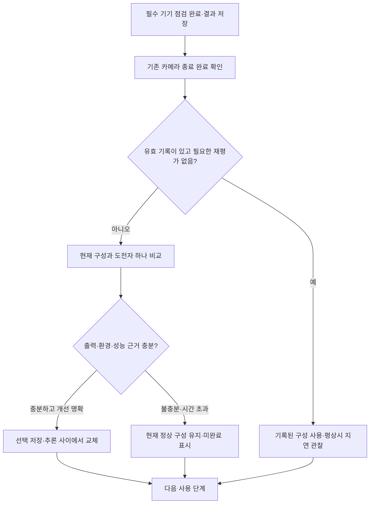

# WalkSafe 기기별 CPU·GPU 실행 구성 자동 선택 계획

2026-09-08. 상태: **1차 구현·통합·빌드·설치 완료, 로그인 이후 제품 흐름과 현장 검증 대기**. 성능 점검은 최대 300초이며 GPU 우선 비교와 사용 중 부하 적응을 원본 사용자 앱에 연결했다. 기존 WIP와 사용자 앱 데이터를 보존했다. 실제 측정과 미확인 범위는 [결과 보고서](../reports/walksafe-device-runtime-selection-20260908.md)에 기록한다.

## 1. 목표와 범위

기기 점검에서 현재 휴대폰에 맞는 **실행 방식과 모델 CPU 스레드 수**를 제한된 시간 안에 비교한다. CPU/GPU 사용률을 일정 퍼센트로 배분하거나 휴대폰 모델명별 하드코딩 표를 만드는 방식은 사용하지 않는다. 기기별 가능한 후보를 만들고, 정상 결과·전체 처리 지연·현재 활성 기능에 주는 영향을 측정해 선택한다.

사용자가 걱정하는 것은 한 기기·한 시점의 빠른 결과로 고른 고정 설정이 다른 앱·시스템 작업·발열·절전의 변화에 대응하지 못해 실제 안내를 지연시키는 상황이다. 원하는 결과는 **기기별 출발 설정을 실측하고, 사용 중에는 여유와 지연에 따라 작업량을 계속 조절하여 객체·거리 정보의 신선도와 추적·음성 반응을 함께 유지하는 것**이다. 높은 사용률 자체를 성공 기준으로 삼지 않으며, 필요한 성능을 얻을 수 있을 때 자원을 적극 활용한다.

첫 짧은 점검에서 모든 후보의 전역 최적값을 알아낸다고 보장하지 않는다. 확인된 설정을 유지하면서 더 나은 후보가 명확할 때 교체한다. 성능 선택 실패와 기존 필수 기능 점검 실패는 별개다.

이번 1차 범위는 동일 768 FLOAT32 모델·동일 전처리·동일 정밀도에서 CPU 전용과 GPU 위임 비교, CPU 스레드 자동 탐색, 저장·재측정·안전한 교체다. 재학습·양자화·입력 축소·NPU·라이브러리 전면 교체는 포함하지 않는다. CPU/GPU 별도 모델 실행기 2개는 기존 유효 결과 폐기 32.64% 때문에 후보에서 제외한다. 다음 프레임 CPU 전처리 중첩은 별도 Main 통합·지속 검증 후 2차 후보로 추가한다.

### 1.1 무엇을 CPU·GPU에 맡겨 비교하는가

| 1차 비교 계열 | 한 프레임의 처리 흐름 | 계열 안에서 탐색할 값 |
|---|---|---|
| 모델 CPU 전용 | CPU 입력 준비 → CPU 모델 계산 → CPU 결과 해석 | 모델 연산 CPU 스레드 수 |
| 모델 GPU 활용 | CPU 입력 준비 → GPU 지원 모델 연산 + CPU 잔여 모델 연산 → CPU 결과 해석 | GPU 사용 가능/실제 위임 여부, 잔여 모델 연산의 CPU 스레드 수 |

두 계열을 한 번씩만 시험하는 것이 아니라 계열 안의 여러 스레드 구성을 비교한다. CPU 전용은 **객체 인식 모델의 실행 방식**이며, 앱의 화면 표시·ARCore가 GPU를 쓰지 못하게 하는 시험이 아니다. 두 계열 모두 같은 카메라·Depth·추적 부하를 유지한다. CPU 스레드 4는 CPU 사용률 33% 같은 비율이 아니며, GPU 70%/CPU 30%처럼 배분하는 API도 사용하지 않는다. GPU 위임 라이브러리가 지원 가능한 모델 연산을 GPU에 배치하고 남은 연산을 CPU에서 실행한다.

이 역할 분담은 다음 프레임까지 동시에 계산한다는 뜻도 아니다. 2차 중첩 후보는 `GPU가 현재 프레임을 추론하는 동안 CPU가 다음 프레임의 입력을 준비`하는 방식이며, 현재 1차 자동 선택과 별도로 Main 통합·오래된 결과·Depth/추적 영향 검증을 통과시킨 뒤 후보에 추가한다.

### 1.2 기기 점검과 사용 중 조절의 역할

- **기기 점검:** GPU 활용 구성을 먼저 측정하고 CPU 기준 구성과 짧게 비교한다. GPU의 정확성·지연·실부하 우위가 명확하면 GPU 쪽 조정에 시간을 우선 배정한다. GPU 실패·이득 불확실·CPU 우위가 확인되면 CPU 정수 스레드 탐색을 확대한다.
- **사용 중 빠른 조절:** 현재 연산 지연·유효 결과 간격·stale/drop·카메라/Depth/추적 상태·열 상태를 관찰해 추론 시작 간격과 제출 작업량을 조절한다. 처리 중 입력을 무한 적재하지 않고 최신 입력을 우선한다. 여유가 안정적으로 회복될 때 점진적으로 처리 빈도를 높인다. 주기 조절로 한 번의 추론 지연까지 반드시 감소한다고 가정하지 않는다.
- **지속 변화의 느린 조절:** 정상 조건에서도 악화가 이어지거나 실행 계약이 바뀌면 7.1절의 안전한 점검 시점에 스레드 수·실행 구성을 재비교한다. 오류 복구와 현재 결과의 신선도 대응은 그 재점검을 기다리지 않는다.
- 앱은 시스템에 작업을 제출하고 운영체제/드라이버가 실제 자원을 배분한다. CPU/GPU의 일정 비율을 앱이 예약하거나 다른 앱의 사용량을 직접 조절하지 않는다. 작업 시간에 여유 계수를 적용해 실행 간격을 정하더라도 이것을 휴대폰 전체 CPU/GPU 사용률의 보장으로 해석하지 않는다.

## 2. 구현 착수 시 확인한 사실과 선행 수정

| 현재 사실 | 이번 계획에서의 조치 |
|---|---|
| 통합 모델 설정은 GPU strict, CPU 스레드 4이며 파서와 옵션 생성자 모두 1..8을 허용한다. | CPU 개수 조회를 정책에 주입하고 후보 범위를 동적으로 정한다. 옵션의 양수 검증과 기기별 허용 범위 검증을 분리한다. 고정 8을 다른 고정 상한으로 바꾸지 않는다. |
| Main은 CPU bootstrap 후 설정에 GPU가 있으면 항상 GPU를 준비·승격한다. | 선택권자를 한 곳으로 합친다. 저장된 CPU 선택을 늦은 기존 GPU 준비가 덮어쓸 수 없게 selection revision을 추가한다. |
| 통합 YUV 전처리는 `yuvDecodeMs=null`인데 기기 점검 정책은 이 필드를 필수로 요구한다. | **선행 회귀 수정.** 전처리 방식별 필요한 시간 필드와 최종 모델 실행 증거를 검증한다. 정상 FUSED 결과 거부/부분 결과 오인 통과를 모두 시험한다. 현재는 코드상 확인이며 기기 재현은 미실행이다. |
| S20 GPU 최초 준비 14.302초, 같은 캐시 복원 69ms가 관측됐다. | 초기화·워밍업과 반복 처리 시간을 분리하고 사용자 허용 예산 300초에 포함한다. 모든 후보 비교 완료는 보장하지 않는다. |
| 최종 구성요소 관측은 ARCore PAUSED·양수 Depth 0이었다. | 이 상태에서 정상 Depth 부하의 GPU 우수성을 판정하지 않는다. 활성 기능 범위에 맞는 실부하 확인이 필요하다. |
| CPU thread 수가 GPU 캐시 키에도 포함된다. | CPU 전용 최적 스레드 수와 GPU에 위임되지 않은 모델 연산의 CPU 스레드 수를 별도 설정으로 취급한다. 이 값은 앱의 전처리·음성·ARCore 스레드를 함께 조정하는 값이 아니며, 변경 시 재준비 비용이 생길 수 있다. |

근거: [기존 결과 보고서](/home/ddobagi/Hanium_Dreamup/docs/reports/walksafe-gpu-tracking-improvement-20260908.md), [설정](/home/ddobagi/Hanium_Dreamup/apps/android/app/src/main/assets/model-config/two_model_runtime.json), [옵션 검증](/home/ddobagi/Hanium_Dreamup/apps/android/app/src/main/java/kr/co/hanium/dreamup/walksafe/inference/TwoModelRuntimeConfig.kt:180), [기기 점검 판정](/home/ddobagi/Hanium_Dreamup/apps/android/app/src/main/java/kr/co/hanium/dreamup/walksafe/device/DeviceCheckDetectorExecutionPolicy.kt:7), [GPU 캐시 키](/home/ddobagi/Hanium_Dreamup/apps/android/app/src/main/java/kr/co/hanium/dreamup/walksafe/inference/GpuSerializationCache.kt:9).

## 3. 사용 흐름과 시간 예산

- **사용자가 허용한 추가 성능 점검 예산은 최대 5분(300초)다.** 준비·안정화·워밍업·출력 검사·측정·선정·교체·정리를 이 예산 안에 배치한다. 남은 시간에서 최종 확인·정리 예상 비용을 먼저 남기고 새 후보를 시작할지 판단한다. 충분한 근거가 모이면 일찍 종료하며 5분을 채우기 위해 측정하지 않는다.
- 초기 배분 예시는 준비 30초, GPU 우선/CPU 기준 선별 90초, 상위 후보 반복·출력 확인 60초, 실제 활성 기능 부하 관측 100초, 저장·교체·정리 20초다. 구현은 이를 고정된 타이머 다섯 개로 나누지 않고 공통 종료 시각을 사용한다. 선별 후 최종 후보 재준비·출력/반복 확인·live 비교·정리를 위해 90초를 남기고 새 선별 후보의 시작을 제한한다. GPU/CPU 각자 300초가 아니라 두 계열과 준비를 합한 예산이다. 개발용 전체 조합·장시간 지속 시험의 완료 예산이 아니다.
- 300초가 되면 새 측정·후보 시작·선정 수락을 종료하고 미완료를 표시한다. native 초기화/추론은 중간 강제 종료가 불가능할 수 있어 이미 진행 중인 작업의 실제 정리가 300초를 넘길 수 있다. 다음 카메라 사용까지 반드시 300초 안에 가능하다고 보장하지 않으며, 종료 대기와 측정 완료를 구분해 표시한다. 사용자 동의 없이 측정 예산 자체를 늘리지 않는다.
- 한 번에 현재 구성 A와 도전자 B 하나를 우선 비교한다. 남은 예산이 충분할 때만 다음 후보를 시도한다. 예산을 후보 수만큼 반복 연장하지 않는다.
- 초기 GPU 준비가 대부분의 시간을 쓰면 `PARTIAL`로 끝내고 현재 정상 구성을 유지한다. 늦게 끝난 준비는 활성 설정을 바꾸지 않는다. 생성된 native 캐시는 다음 점검에서 재사용할 수 있다.
- 선택 승인에 필요한 미완료 비교는 재평가 사유로 보관하고 7.1절의 다음 안전한 진입 시점과 빈도 제한에 따라 재개한다. 유효 profile이 있어도 이런 pending이 있으면 그 profile을 기준 A로 유지하며 비교한다. 우선순위가 낮아 시험하지 않은 다른 계열의 정수 값만으로 pending을 만들지 않는다. 앱 시작마다 전체 벤치마크를 반복하거나, 보행 도중 남은 시험을 몰래 실행하지 않는다. 미완료 상태도 정상적인 사용 진행이 가능하다.
- 기존의 180초 필수 기기 점검 timeout과 카메라 probe 15초 timeout을 연장·재사용하지 않는다. 필수 결과를 먼저 확정하고 해제한 후 별도 시도를 시작한다.
- 표시 문구 예: “기기에 맞는 처리 방식을 확인하고 있습니다.” / 시간 부족 시 “기본 처리 방식으로 계속합니다.” 사용자가 CPU·GPU·스레드 수를 선택하도록 요구하지 않는다. 화면 읽기 안내는 단계 진입·종료 시만 제공하고, 실제 발화 중 수집한 시간은 비교 표본에서 제외한다.
- pause·계정 변경·다른 화면 진입·보행 시작·새 점검 요청으로 lease가 무효화되면 정리만 수행하고 예전 화면 흐름을 전진시키지 않는다. 같은 유효 흐름의 완료·실패·시간 초과·건너뛰기만 다음 단계로 한 번 전환한다. 카메라가 필요한 다음 동작은 실제 정리 완료를 기다린다.

## 4. 기기별 후보 생성

`N = max(1, availableProcessors())`를 초기 탐색 범위의 정보로 쓴다. N은 VM에서 이용 가능하다고 보고한 프로세서 수이며 전용 코어 수·성능 코어 수·최대 소프트웨어 스레드 수가 아니다. 스레드를 특정 코어에 고정하거나 N개 성능을 독점한다고 가정하지 않는다.

1. 유효한 검증 프로필이 있으면 해당 구성이 현재 기준 A다. 없으면 기존 CPU 초기 설정을 `1..N`으로 제한한 값을 임시 기준으로 사용한다. 예: 기존 값 4이면 `min(4,N)`. 이는 빠르다고 확인된 값이 아니라 첫 실행의 호환 기본값이다.
2. 후보 영역은 **1부터 N까지 모든 정수**다. N=12이면 1~12 모두 가능하며 3·5·6·7·9·10·11도 배제하지 않는다. 기존 초안의 2의 거듭제곱 중심 1차 목록은 이 규칙으로 대체한다. 고정 비율 분할이나 코어 수별 정해진 정답 표를 만들지 않는다.
3. 시험 순서만 실제 결과에 맞춰 조정한다. 기준이 4이면 인접한 3·5를 먼저 비교하고, 5가 좋아지면 6 등 그 방향을 우선한다. 동등하거나 나빠지면 반대 방향과 남은 값을 비교한다. 스레드 수에 따른 속도가 한 방향으로만 변한다고 가정하지 않는다.
4. 인접 탐색에서 개선이 멈춰도 다른 미측정 값이 더 좋을 수 있으므로 남은 값은 후보 영역에서 배제하지 않는다. 인접 후보 중복 제거 후 선택한 계열의 나머지를 순환하며, 300초 예산 안에 못 본 값은 미시험으로 남긴다. 큰 N에서도 미리 모든 실행기를 만들지 않고 다음 정수 후보만 산출한다.
5. GPU를 지원하면 같은 모델의 strict GPU도 도전자로 넣는다. 첫 GPU 후보는 기존 GPU 옵션·잔여 CPU 모델 연산 스레드 4를 N으로 제한한 계약을 우선 활용한다. 해당 CPU 스레드 추가 탐색은 별도 후보이며 CPU 전용 우승값을 무조건 복사하지 않는다.
6. 후보 실행 직전 N을 다시 확인한다. 가용 범위가 바뀌면 그 비교를 무효로 하고 다음 기회에 새 후보군을 만든다. 저장값을 조용히 잘라 쓰면서 이전 성능 검증을 그대로 유효하다고 하지 않는다.

초기 비교 순서는 `미평가 strict GPU → CPU 기준 구성 확인 → 결과에 따라 우선 계열 선택`이다. GPU 우위가 명확하면 GPU 잔여 CPU 연산 스레드의 인접값·남은 정수를 우선 탐색한다. CPU 우위·GPU 실패이면 CPU 전용의 인접값·남은 정수를 우선 탐색한다. 우열이 불확실하면 양 계열의 인접 후보를 번갈아 비교한다. 현재 baseline은 소유권 규칙에 따라 그대로 재사용하며 중복 생성하지 않는다.

CPU 미시험 값이 남았다는 이유만으로, 이미 GPU 우위를 확인한 기기에서 매번 CPU 전체 탐색을 예약하지 않는다. 우선 계열 내의 진행 중 비교와 불확실한 비교만 재평가 pending으로 남기고, 아직 탐색하지 않은 다른 계열의 값은 미시험 범위로 기록한다. 다음 점검은 같은 결속의 저장된 큐 위치에서 재개한다. 중복·이미 판정한 후보는 건너뛰며, `PARTIAL` 후보는 큐 뒤로 이동해 다음 순환에서 재시도한다. GPU 준비의 반복 시간 초과가 CPU 기준 비교를 막지 않게 한다. 재시도는 캐시만 재사용하고 측정 표본은 새로 얻는다. 이 중단 규칙이 전체 후보의 전역 최적값을 증명하는 것은 아니다.

`ModelRuntimeOptions`/JSON은 양수 정수의 구조를 검증하고, 실제 후보·저장값을 실행 가능한 범위로 승인하는 책임은 기기 선택 정책에 둔다. 점검 횟수·동시 후보·시간 예산으로 과도한 탐색을 제한한다. 운영체제가 작업 스레드를 실제 코어에 배치하며 `numThreads`는 모델의 다중 스레드 지원 연산에 대한 요청 값이다.

## 5. 측정 방법: 동일 입력과 실제 부하를 분리

### 5.1 동일 입력의 출력·계산 비교

- 개발자가 재배포 조건을 확인한 작은 고정 시험 묶음을 준비한다. 양성·무객체·임계값 근처 사례를 포함하고 실제 사용자 촬영 영상·위치·계정을 저장하거나 전송하지 않는다. 기존 COCO 20장/7클래스는 개발 동등성 검증 자료이며 전체 모델 정확도의 답지는 아니다.
- 동일 모델 hash, 전처리·입력 순서·정밀도·파싱 기준으로 A와 B를 비교한다. 준비된 tensor를 공유하는 출력 동등성 시험과 YUV→tensor를 포함한 계산 시간 시험을 구분한다.
- 개발 단계의 전체 fixture 회귀를 먼저 통과시킨다. 기기 점검용 축소 묶음은 별도의 version/hash와 모든 필수 사례 완료 조건을 가진다. 탐지 0개인 카메라 장면만으로 정확도 통과를 선언하지 않는다.
- 순서 무관 raw 일대일 대응, 필터 후 클래스·박스·점수, 정답 매칭 보존이라는 기존 계약을 활용한다. raw 행 순열을 다시 실패 조건으로 삼지 않는다. 허용 오차를 속도 확보 목적으로 완화하지 않는다.
- 요청 delegate와 실제 delegate를 모두 기록한다. GPU 요청이 CPU fallback이면 GPU 성능 기록으로 인정하지 않는다.
- 초기화·최초 호출·워밍업·반복 측정을 별도 기록한다. GPU 컴파일 중의 CPU 표본은 비교에 쓰지 않는다. 안정화 시간도 점검 예산에 포함한다.

### 5.2 활성 기능과 함께 실행했을 때의 영향

- 새 calibration 카메라 lease로 실제 카메라·ARCore·필요한 영상 추적 작업을 실행한다. 후보 A/B는 같은 실행 주기·작업량에서 비교하고, 마지막 확인에는 기존 적응형 추론 주기를 적용한다.
- 실제 카메라 입력 결과는 캡처→완료 지연을 기록한다. 고정 fixture 처리 시간을 실제 카메라 지연으로 표시하지 않는다. 카메라 live 결과는 정답 비교의 대체가 아니다.
- 모델·전처리·결과 전달 지연, 유효 완료 수, stale/drop, 카메라의 고유 시각·프레임 간격, ARCore 상태·pose, Depth의 시각·양수 유효 표본, 영상 추적 비용과 화면 프레임 지연을 함께 기록한다.
- 현재 활성 기능이 metric Depth를 요구하면 TRACKING·pose·유효 Depth가 있는 조건에서만 그 기능 범위의 실행 구성을 승인한다. PAUSED·Depth 0·재투영뿐인 상태는 **실부하 미확인**이다. 기존 정책상 Depth를 지원하지 않아 영상 기능만 활성화된 기기는 그 기능 범위에 한해 비교할 수 있다.
- CPU 시험과 GPU 시험 사이 ARCore 상태·절전 모드·열 상태·가용 프로세서 수가 달라지면 해당 쌍은 성능 비교에서 제외한다. 외부 작업 영향을 충분히 분리하지 못하면 승자를 만들지 않는다.
- 사용자 점검에서는 현재 주변 작업과 기기 상태를 관찰하며 다른 앱을 조작하거나 인위적인 경쟁 부하를 발생시키지 않는다. 외부 부하에 대한 적응은 개발 단계에서 통제된 부하 증가·유지·해제 조건으로 별도 검증한다. 사용자 점검 중 부하 변화·회복이 실제 관측되지 않았다면 그 조건까지 검증했다고 표시하지 않는다.
- synthetic fixture와 calibration live 결과는 보행 위험 판단·안내·신고·사용자 추적 확인 횟수에 게시하지 않는다. 시험 데이터의 timestamp가 제품의 800ms 신선도를 갱신하지 않는다.

## 6. 선택 규칙

**정상 결과 → 비교 가능한 환경 → 반복되는 개선 → 실제 부하 확인** 순서로 통과해야 선택을 바꾼다. 가중치가 임의적인 종합 점수 하나로 정확도·Depth 문제를 빠른 평균값과 상쇄하지 않는다.

| 단계 | 조건 | 실패·불확실할 때 |
|---|---|---|
| 실행/출력 | 선언한 전체 점검 fixture 완료, 결과 동등성, 오류 없음, 실제 delegate 일치 | 후보 제외. 현재 정상 구성 유지 |
| 환경 | 같은 입력/주기/기능·열·절전·카메라 상태로 비교 가능 | 비교 미확인. 해당 시간들을 섞어 평균내지 않음 |
| 반복 개선 | A→B와 B→A 양쪽에서 개선, A 반복의 흔들림보다 큰 이득 | 현 구성 유지. 전역 최적이라고 부르지 않음 |
| 지연/유효성 | 전체 처리 지연이 잡음보다 명확히 개선되고, 유효 완료율·stale·긴 멈춤·다른 활성 기능이 악화되지 않음 | 지표 간 상충이면 승격하지 않음 |
| 부하 확인 | 선택 후보의 실제 적응형 실행에서 활성 기능·자원 정리 유지 | 선택 보류. component 성능만 기록 |

초기 구현용 비교안은 다음과 같다. 아래 반복 수·계수는 **시험할 정책 초깃값**이며 실측으로 오선택률을 검증한 뒤 조정한다.

- 최소 4개의 같은 입력 쌍을 포함하는 A→B 블록과 순서를 바꾼 B→A 블록을 얻는다. 마지막 별도 확인 블록을 통과시킨다. 표본이 적어 이 조건을 못 채우면 불확실이다.
- A를 전후 반복해 A/A 변동과 시간 경과의 흔들림을 측정한다. 짝지은 지연 차이의 중앙값·MAD를 사용한다.
- 개선 판정 여유 `U = max(시계 해상도, A/A 변동, 짝지은 차이의 2×MAD)`라는 초기 규칙으로, 양 방향 블록에서 B의 개선이 U보다 큰지 확인한다. 변동이 0이어도 독립 확인을 생략하지 않는다. 이는 신뢰구간이나 안전성 증명이 아닌 오선택을 줄이기 위한 탐색 규칙이다.
- 짧은 점검에서는 중앙값과 관측 최대값·유효 완료·폐기 원인을 본다. P95는 충분한 표본이 모인 진단 보고에만 쓴다. 예를 들어 40개부터 표시하더라도 표본 수·시간·불확실성을 같이 표기하고 40개가 신뢰성을 보장한다고 하지 않는다.
- 기존 구성이 있으면 애매한 차이로 교체하지 않는다. 최초 선택에서 두 CPU 구성이 동등하면 더 적은 스레드를 우선하되 소비 전력 최저라는 뜻으로 기록하지 않는다. 서로 다른 delegate의 속도가 비슷하면 입증되지 않은 전력 우열을 추정하지 않고 기본/기존 구성을 유지한다.
- 활성 구성은 `선택한 후보 중 우수·검증 범위 명시`로 기록한다. 짧은 측정만으로 안전 보행·거리 정확도·장시간 저발열을 승인하지 않는다.

## 7. 저장·재사용·재측정

계정 점검 저장소와 분리한 앱 전용 `walksafe_device_tuning` 저장소에 단일 검증된 profile을 원자적으로 저장한다. 계정 ID·Gateway 설치 ID·위치·영상은 포함하지 않는다.

- 결속 정보: 모델 SHA, 입력·전처리·정밀도 계약, 추론/추적/ARCore 관련 실행 계약 버전, 정책 버전, LiteRT/GPU 버전, ABI·OS build fingerprint, 읽을 수 있는 GPU 식별 정보, **실측한 활성 기능 범위**.
- 실행 정보: 요청/실제 delegate, CPU 스레드 수, fallback 정책, 시험한 후보와 측정 범위, 결과 요약·시각. GPU와 CPU 전용 스레드 값은 혼동하지 않는다.
- `PARTIAL/INCONCLUSIVE`는 활성 profile을 덮어쓰지 않는다. 필요하면 다음 후보 위치와 진단 사유만 별도로 보관한다. 서로 다른 점검 시도의 성능 표본을 이어 붙여 하나의 공정한 비교로 만들지 않는다.
- 저장 실패·스키마 오류·결속 불일치는 정상 기본 구성/이전 유효 구성으로 처리한다. 로그인 세션·동의 저장·필수 기능 PASS를 지우지 않는다.
- 저장된 검증 선택과 실제 활성 실행기/revision은 구분한다. 저장은 디스크 기록에만 원자적이며 실행기 교체와 하나의 트랜잭션이 아니다. 저장 뒤 취소·교체 거절이면 현재 실행기를 유지하고 활성화 완료를 표시하지 않는다. 취소 전에 시작된 저장이 끝난 경우에도 검증·결속이 유효한 기록만 다음 선택 시 재사용하며, 늦은 완료 callback으로 활성 실행기를 바꾸지 않는다.
- 모델·런타임·관련 실행 계약·OS/GPU 환경·활성 기능 변경 시 재평가한다. 일시적인 열·절전·프로세서 가용성 변화는 기존 pacing/재평가 대기 사유이며 매 프레임 영구 기록을 지우지 않는다.
- 로그아웃은 진행 중 시험만 취소한다. 이미 확인한 기기 성능 profile은 계정과 무관하게 유지한다. 앱 데이터 삭제 시 함께 제거되는 일반 기기 설정이다.

사용 중에는 경쟁 벤치마크를 수행하지 않는다. 현재 처리 시간·신선도·프레임 간격·열 상태를 낮은 비용으로 관찰하고 기존 적응형 주기를 조절한다. 재평가 사유와 실제 비교 실행 시점을 아래처럼 분리한다. 한 번의 지연·센서 튐으로 기능 중지나 delegate 왕복을 만들지 않는다.

### 7.1 재평가가 필요한 때와 실제 실행 시점

| 재평가 사유 | 비교를 실제 실행하는 시점 |
|---|---|
| 최초 선택 또는 유효 기록 없음 | 로그인과 필수 기기 점검이 정상 완료된 뒤, 안내 시작 전 성능 점검 화면에서 1회 |
| 모델·추론/추적 실행 계약·런타임·OS/GPU 환경·활성 기능 변경 | 변경을 확인한 다음 앱 전경 진입에서 필수 점검 유효성과 기존 카메라 검사 종료를 확인한 뒤, READY 상태의 점검 화면에서 1회 |
| 이전 비교가 미완료이거나 정상 환경에서도 성능 저하 지속 | 필요 표시만 남기고 다음 안전한 앱 전경 진입의 점검 화면에서 비교. 보행 중에는 실행하지 않음 |
| 사용자가 설정의 ‘성능 다시 확인’을 직접 실행 | 안내가 종료되고 카메라를 안전하게 취득할 수 있을 때 같은 측정 실행기로 비교 |
| 기록 유효·비교 완료·성능 정상 | 재비교 없음. 저장값 사용. 날짜가 지났다는 이유만으로 주기적 전체 탐색하지 않음 |

여기서 앱 전경 진입은 화면 복귀 이벤트 자체가 즉시 계산을 시작한다는 뜻이 아니다. 로그인·필수 점검 유효, 보행 READY, 초기 안내/동의 흐름 완료 또는 지정된 최초 측정 지점, 화면 lease, 기존 Depth 재확인/카메라 정리 완료가 모두 충족되어야 성능 점검 화면으로 연결한다. 보행을 계속하는 전경 복귀나 다른 사용자 작업 중에는 예약만 유지한다. 측정 화면에서 건너뛰면 같은 전경 진입에서 다시 띄우지 않는다.

지속 악화의 초기 검출 규칙은 **겹치지 않는 20초 창 3개 연속**으로 제안한다. 같은 구성·기능·정상 열/절전·ARCore 조건의 live 처리 지연과 stale/drop 비율을 정상 live 기준선 및 변동 폭과 비교한다. 고정 fixture의 빠른 기록을 보행 장면의 기준으로 쓰지 않는다. 정상 live 기준선이 없으면 먼저 실제 사용 관측으로 기준을 만들며 최적 선택이 입증됐다고 표시하지 않는다.

통계 비교 창마다 완료 표본 10개 이상이라는 초깃값을 두고, pause·환경 변화·표본 부족이면 연속 누적을 끊는다. 단, 정상 입력/작업 접수는 있는데 장기 미완료나 유효 결과 단절이 발생한 경우는 표본 부족으로 무시하지 않고 별도 이상 진단·재평가 사유로 남긴다. 기존 실행 오류·신선도 정책에 따른 복구는 즉시 적용하고 이 60초 관측을 기다리지 않는다.

불확실·미완료·지속 악화에 의한 **자동 재탐색은 같은 구성 계약에서 24시간에 한 번**을 초깃값으로 제한한다. 이는 새 전체 측정의 빈도 제한이며, 중요 계약 변경·사용자의 명시적 재검사·실행 오류 복구에는 적용하지 않는다. 시도 시작 시각을 기록해 취소·시간 초과도 같은 날 반복되지 않게 한다. 기기 시계/재부팅에 의한 제한 우회·영구 차단은 별도 시험한다. 20초·3창·표본 10개·24시간은 기능 시험으로 조정할 정책 값이고, 사용자 허용 측정 예산 300초와는 구분한다. 사용 중의 빠른 작업량 조절에는 24시간 제한이 없다.

현재 Main의 전경 복귀, 로그인 후 점검 복원, 최초 필수 PASS 완료에 공통 `maybeScheduleRuntimeCalibration()`을 연결한다. 성능 재측정을 위해 완료된 FirstRun/동의/필수 점검을 초기화하지 않는다. 기존 정상 PASS 화면에는 일반 성능 재측정 버튼이 없으므로 설정의 수동 진입은 신규 연결 사항이다.

## 8. 코드 구조와 수명주기

새 책임은 순수 선택 정책, Android 측정 실행기, 전용 저장소로 제한한다. 복잡도가 필요하면 실행기 안의 순수 시도 상태만 분리한다. 기존 factory·GPU owner·적응형 주기·점검 binding 패턴을 재사용한다.

| 담당 파일/지점 | 변경 계획 |
|---|---|
| `inference/RuntimeSelectionPolicy.kt` | CPU 힌트 기반 후보 생성, 시간 예산, 측정 요약 비교, 선택/보류 상태 |
| `device/AndroidRuntimeCalibrationRunner.kt` | 독립 worker/owner, fixture·실부하, 취소·정리, typed 결과. 제품 위험/보고 callback 없음 |
| `device/AndroidRuntimeCalibrationSession.kt` | 별도 점검 화면과 ARCore/CameraX 수명주기, 실제 카메라·추적·Depth·UI 측정 |
| `device/AndroidDeviceTuningProfileStore.kt` | 기기 전용 schema/결속 검증·원자적 저장, 기존 설정의 저장 패턴 활용 |
| `inference/RuntimeLoadMonitor.kt`, `AndroidRuntimeLoadObservationSource.kt` | 지속 악화 판단과 실제 UI/카메라 관측을 기존 적응형 주기에 연결 |
| `TwoModelRuntimeConfig.kt` | 기본값과 구조 검증 분리, 1..8 상한 제거 및 실행 정책의 동적 범위 검사 |
| `DeviceCheckDetectorExecutionPolicy.kt` | legacy/FUSED 별 실제 최종 추론 증거 판정 선행 수정 |
| `MainActivity.kt` | 필수 PASS 이후 선택 단계·단일 선택권자·카메라 lease·안전한 교체·취소 연결 |

통합 모델의 profile은 legacy fallback 두 모델에 전파하지 않는다. 현재 범용 `runtimeOverride`가 세 모델 모두를 바꾸므로 통합 모델의 effective config만 구성한다. 모델·옵션을 바꾸려면 새 interpreter를 준비하고 추론 사이에서 교체한다. 실행 중인 interpreter의 스레드를 프레임마다 바꾸지 않는다.

필수 점검 결과 저장·180초 timeout 해제 후, 기존 CameraX analyzer 중지→executor barrier→unbind→lifecycle 종료→CameraState.CLOSED를 확인한다. **종료 함수 호출이나 `session=null`만으로 카메라가 해제됐다고 보지 않는다.** `stopPostLoginCameraPipelinePreflight`의 종료 완료 callback 이후 다음 main-loop turn에 선택 단계를 시작한다.

선택은 FULL/LIMITED/PASS 뒤에 실행되므로 RUNNING을 요구하는 기존 `isPostLoginDeviceCheckBindingCurrent()`를 그대로 사용할 수 없다. 완료 snapshot의 live binding과 선택 attempt용 predicate를 따로 둔다. 실제 구현은 Main의 AR 목적 분기를 늘리는 대신 별도 `AndroidRuntimeCalibrationSession`의 카메라·tracker를 사용한다. 기존 위험·신고·음성 경로와 PREFLIGHT 입력에는 점검 프레임을 전달하지 않는다.

- 실행 lease: Activity 세대, 선택 revision·attempt, 완료 점검 snapshot/binding, first-run lease, 보행 epoch, profile 결속 hash. 시작·후보 전환·결과 수락·저장/승격 때 재확인한다.
- 후보 B 초기화·추론은 **실험 전용 worker**에서 수행한다. 기준 A는 현재 production 실행기를 빌려 기존 owner/추론 경로로 호출하며 별도 복제하지 않는다. runner는 결과 callback으로 순서를 조율하고 production detectorExecutor를 기다림으로 막지 않는다. 해당 큐에 추가하는 준비/교체 작업은 짧은 참조 교체뿐이다. native GPU 생성/호출/닫기는 같은 owner에서 수행한다.
- 동시에 현재 실행기와 후보 하나까지만 보유한다. runner는 B만 생성하고, 미선택 B의 실제 close 뒤 다음 후보를 만든다. 기준 A의 교체·해제는 Main만 담당한다. detectorExecutor에서 실제 참조 교체가 성공하면 B의 owner를 보존한 채 관리 책임을 Main으로 넘기고 runner는 닫지 않는다. 저장 실패·취소·교체 거절이면 runner가 B를 계속 소유하고 닫는다. 실제 메모리 압박/정리 불가 시 후보 생성을 중단한다. 앱 heap 크기를 GPU 메모리 예산으로 오해하지 않는다.
- 시간 초과·취소 후 신규 작업과 새로운 선정 저장/승격은 금지한다. 이미 시작된 디스크 저장의 완료와 활성 교체는 앞 절처럼 분리한다. native init/invoke가 반환하면 owner에서 닫는다. `shutdownNow`나 진행 중 Image 강제 close로 시간 제한을 구현하지 않는다.
- 실제 close 완료까지 카메라 lease와 drain 상태를 유지하고 중복 실험·보행 카메라 취득을 막는다. 화면 대기 예산과 실제 자원 종료 시간을 구분한다. 정리 대기 자체를 필수 점검 실패로 승격하지 않는다.
- 성능 profile 저장 실패를 기존 `RESULT_SAVE_FAILED`/로그인 `storageBlocked`와 연결하지 않는다. CPU 선택 후 늦은 GPU가 도착해도 새 선택 revision을 덮어쓰지 못하게 한다.

## 9. 구현 순서·병렬 분담·검증

| 단계 | 구현 담당과 산출물 | 검증 후 다음 단계 |
|---|---|---|
| 0. 기존 계약 보정 | Android/테스트 담당: FUSED 점검 거부 재현·수정, 현재 GPU 자동 승격과 필수 점검 종료 지점 회귀 | 정상 FUSED/legacy 통과, partial·최종실행없음·잘못된 시간 거부. 현재 앱의 필수 점검을 먼저 회귀 확인 |
| 1. 선택 정책·저장 | 정책 담당: 후보/판정/상태. 저장 담당: schema·결속·원자성. 서로 다른 파일 병렬 | N=1/2/3/8/8초과·동적 변화, 후보 중복/범위/overflow, noise·무효 표본, 잘못된 profile/저장 실패 시험 |
| 2. 측정 실행기 | runtime 담당: owner/fixture/측정. 테스트 담당: 지연·노이즈·취소 재현 harness를 병렬 작성 | 순서 반전·출력 오차·GPU fallback·준비 timeout·리소스 소유권 직접 시험 |
| 3. Main 통합 | Root 또는 단일 Android 담당만 Main 편집. 독립 검토자는 읽기 전용 | 필수 PASS 보존, 화면 전환 한 번, 카메라 종료 callback, 선택 revision, 계정/전경/보행 race 확인 |
| 4. 기기 검증·설정 조정 | Root가 Gradle/ADB를 순차 수행, 다른 담당은 로그 분석·독립 검토 | S20 cold/warm·저장 재사용·ARCore 정상/PAUSED·취소. 다른 SoC 실기기 검증 전에는 범용 성능 입증 주장 금지 |
| 5. 전달·기록 | Root 통합·APK/보고서/daylog | 설치본 확인·기존 데이터 유지·실제 검증과 미검증 분리 |

행동 검증의 필수 사례:

- 1..N 전체 정수 후보(3/5/6/7/9/10/11 포함), N=1/2/3/8/12 이상과 N 변화, 인접 후보 실패 후 다른 정수 탐색, GPU 미지원, GPU 요청 후 실제 CPU fallback, 스레드 변경으로 GPU 캐시 무효화.
- 최초/변경/지속 악화/미완료/수동의 재평가 진입, 정상 기록 재사용, 같은 전경 및 24시간 재시도 제한, 시계 변경·재부팅, 20초 창 연속성·환경 변화·완료 0 단절 진단, 기존 오류 복구가 측정 예약을 기다리지 않음.
- GPU 우위/CPU 우위/불확실/실패에 따른 탐색 순서, 다른 계열의 미시험 값과 재시도가 필요한 pending 구분, GPU 준비 시간 초과 후 CPU 기준 비교 진행, 300초 deadline 및 조기 종료·정리 예산 보존.
- 개발 부하 시험: 다른 작업을 모사한 CPU/GPU 부하 증가·유지·해제에서 접수/완료 간격·진행 중/대기 작업 수·stale/drop·카메라/Depth/추적/UI/음성 반응·주기 완화와 점진 회복을 관찰한다. 입력은 있는데 완료가 끊기는 경우도 포함한다. 적체를 막기 위해 추론 빈도를 낮추는 정상 대응을 완료 FPS 감소만으로 실패 처리하지 않는다. 일시 부하로 영구 profile을 덮어쓰지 않으며, 주기 완화만으로 한 번의 추론 지연이 줄었다고 판정하지 않는다.
- 비슷한 속도·노이즈·A/B 순서 역전·열 변화·시간 경과에 따른 drift·정상 결과 0개·MAD 0·단일 이상치에서 무근거 승자 없음.
- fixed fixture 출력 불일치/행 순열/무객체, 워밍업·꼬리 완료 분모, stale/drop, PAUSED·Depth0·오래된 재투영·pose 없음 구분.
- 초기화/추론/교체/저장 직전의 pause·새 점검·계정 전환·보행 시작·destroy: 늦은 저장/승격 없음, owner 위반·이중 close·이미지 조기 close 없음.
- 모든 후보 실패·시간 초과·최적화 저장 실패에도 필수 PASS/동의/로그인/정상 baseline 유지. 실제 native 정리가 끝나기 전에 카메라 재취득 없음.
- CPU 선택 뒤 기존 GPU 준비 완료가 와도 CPU 유지. 통합 모델 profile이 다른 legacy 모델에 적용되지 않음.
- 최종 Main에서 결과 선택→실제 요청/활성 delegate·스레드 일치→안내 시작/종료까지 확인. 구성요소 시험만으로 이 통합 검증을 대신하지 않음.

실기기 장기 검증에서는 점검의 선택값이 예산을 넉넉히 준 별도 비교의 우수 후보들과 얼마나 일치하는지 확인한다. 실시간 안내의 카메라·Depth·추적·음성 응답을 함께 본다. FPS 단독 수치로 안전성을 판정하지 않고 상대속도·경고거리·총 안내 지연의 여유를 별도 검증한다. 다른 기기는 실제 확보한 범위만 기록하며 N을 가짜로 주입한 단위시험을 다른 SoC 성능 검증으로 부르지 않는다.

## 10. 공식 근거와 이번 작성의 검증 범위

- [Android availableProcessors](<https://developer.android.com/reference/java/lang/Runtime#availableProcessors()>)는 VM에서 이용 가능한 프로세서 수이며 값이 바뀔 수 있음을 명시한다.
- [LiteRT setNumThreads](<https://developers.google.com/edge/api/tflite/java/org/tensorflow/lite/Interpreter.Options#setNumThreads(int)>)는 다중 스레드 지원 연산의 스레드 요청 설정이다. 앱 전체 스레드/코어 배분 API가 아니다.
- [Google 성능 가이드](https://developers.google.com/edge/litert/conversion/tensorflow/build/best_practices)는 가속기별 비교, 앱 전체 프로파일링, 스레드 증가의 자원·동시 작업 영향을 설명한다.
- [GPU 지원·캐시 문서](https://developers.google.com/edge/litert/performance/gpu), [GPU Android 문서](https://developers.google.com/edge/litert/android/gpu). 현재 프로젝트의 Interpreter/GPU 1.4.0 계약을 기준으로 하며 새로운 CompiledModel API 전환을 이번 작업에 섞지 않는다.

이 계획은 두 독립 담당의 코드 통합 조사·측정/시험 설계 검토를 Root가 취합한 것이다. 사용자 최신 결정의 최대 5분(300초) 측정 예산과 GPU 우선·사용 중 자원 변화 대응을 반영했다. 후보 순서·시간 배분·반복 수·노이즈 계수·지속 악화/재시도 규칙은 구현 시험에서 검증할 정책 초깃값이다. 설계 승인 후 제품 코드 구현과 APK 빌드를 진행했다. 실제 검증 상태와 미확인 범위는 아래 구현 기록 및 결과 보고서에 별도로 기록한다.

## 11. 단계별 실행 결과와 남은 검증

| 단계 | 실행 결과 | 검증 상태 |
|---|---|---|
| 0. 기존 점검 오판 수정 | FUSED 전처리의 모델별 최종 완료 증거 보강 | 실패 재현 후 13회귀 통과 |
| 1. 정책·저장·입력·부하 | 1..N 후보, GPU 우선, fixture 출력/GT 비교, 저장·24시간 제한, 부하 관측을 병렬 구현 | 담당별 시험·독립 검토 완료 |
| 2. 실행기·카메라 세션 | 기준/후보만 보유, 실제 이미지 인수·반환, 선택·취소·자원 종료 | 종료 타이머 잔류 결함을 실제 기기에서 찾아 수정하고 재검증 |
| 3. Main 통합 | 필수 점검 후 진입·수동 설정·저장값 복원·참조 교체·기존 실행기 종료·사용 중 관측 연결 | 코드 검토·앱 회귀 통과. 로그인 이후 화면 흐름의 실기기 E2E는 대기 |
| 4. 빌드·실기기 시험 | 앱 단위 2,645통과·기존 1skip, lint 오류0·경고143, debug APK 빌드. S20 lifecycle 및 실제 UI 부하 시험 통과 | 첫 분리 비교 GPU5 우위 관측. 최종 수정본의 두 번째 metric 비교는 시작조건 증거 부족으로 미평가 |
| 5. 설치·전달 | 최종 APK를 기존 앱에 업데이트 설치, 설치본 SHA 일치·Main 로그인 화면 재진입 확인 | 앱 데이터·권한 유지. 결과 보고서에 측정/미측정 범위 기록 |

다음 검증은 사용자가 원본 앱에 로그인한 상태에서 필수 점검 PASS → 자동 성능 점검 → 저장 선택 재사용 → 설정의 수동 재점검 흐름을 실제로 확인하는 것이다. 현재 로그인 화면이므로 이 흐름을 통과했다고 기록하지 않는다. 정상 Depth 입력을 확보한 재비교, 다른 기종·장시간 보행·객체 운동·물리적 음성 출력은 별도 현장 검증 항목으로 남는다. 근거는 `work/device-tuning/` 아래에 보관한다.
