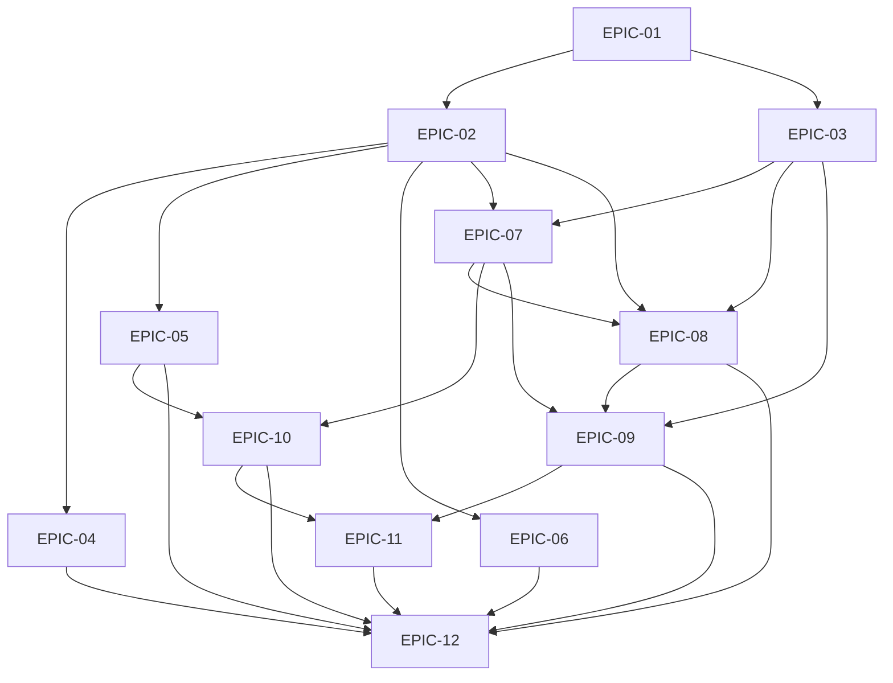

# WalkSafe 전체 완성 계획 재기준선 R001

- 문서 ID: `WS-WALKSAFE-COMPLETION-PLAN-REBASELINE-20260729-R001`
- 버전: `1.0.0`
- 상태: `PLAN_REVIEWED_NOT_ACTIVATED`
- 작성일: `2026-07-29`
- 선행 계획:
  - `plans/features/2026-07-26_artifact_completion_execution_plan.md`
  - `docs/control/execution/artifact-audits/20260727/final-257/remaining-work-execution-plan.md`
- 기계 판독 manifest:
  `plans/features/2026-07-29_walksafe_plan_rebaseline_r001/plan-manifest.json`
- 계획 결함 대장:
  `plans/features/2026-07-29_walksafe_plan_rebaseline_r001/planning-defect-register.json`
- Gap 재평가 후보 대장:
  `plans/features/2026-07-29_walksafe_plan_rebaseline_r001/gap-reassessment-candidates.json`
- Gap 근거 snapshot:
  `plans/features/2026-07-29_walksafe_plan_rebaseline_r001/gap-evidence-bindings.json`
- 역사 replay 관찰 기준선:
  `plans/features/2026-07-29_walksafe_plan_rebaseline_r001/historical-replay-baseline-binding.json`
- detached 출력 결속:
  `plans/features/2026-07-29_walksafe_plan_rebaseline_r001/plan-output-bindings.json`
- post-package 독립검수 receipt:
  `plans/features/2026-07-29_walksafe_plan_rebaseline_r001/independent-plan-review-r001.md`

## 0. 이번 작업의 경계

이 문서는 현재 계획을 최신 사실에 맞게 보완하는 plan-only successor다.
이번 작성으로 다음 행위가 실행되거나 승인된 것으로 보지 않는다.

- 제품 코드·설정·제품 시험 변경
- Goal materialization, `GOAL_STARTED`, checkpoint focus 전환
- canonical Gap·Backlog r022 적용
- formal 279 실행 또는 PASS
- 실기기·현장·사용자·배포·복구훈련
- owner 승인, 독립 전문검토, 실제 이벤트
- artifact 상태 승격 또는 release credit

현재 v2.4 package, sequence 39 tail, canonical binding, 126/257
closed-equivalent, open 131, `NOT_ELIGIBLE`은 그대로 유지한다.

```text
PLAN_CANDIDATE_PREPARED=true
PLAN_REVIEWED=true
PLAN_REBASELINED=false
PLAN_ACTIVATED=false
EXECUTION_STARTED=false
```

## 1. 현재 재기준선

| 축 | 현재 값 | 계획 해석 |
|---|---:|---|
| Goal package | v2.4 `ACTIVE` | 이 문서가 v2.4를 변경하거나 대체하지 않음 |
| ready frontier | `EPIC-03`, `EPIC-12` | 실행 leaf가 materialize된 상태가 아님 |
| 내부 목표 완료 slice | 13 | 저장소 내부 목표이며 제품·정식 완료가 아님 |
| canonical Gap | r021, 68건 | 1건만 직접 재평가하고 67건을 이월한 오래된 진단 |
| 정식 완료 판정 | `IMPLEMENTED 0` | 이번 계획에서도 증가시키지 않음 |
| formal 시험 | `0/279 PASS`, 전부 `NOT_RUN` | 계획과 실행을 분리 |
| 실제 기기·현장 | 0 | 내부 시험으로 대체 금지 |
| release gate | `0/5 CLOSED` | 면제·자동종결 금지 |
| artifact closed-equivalent | 126/257 | `OK_BASELINE 124 + 현재범위 N/A 2` |
| artifact open | 131/257 | 아래 네 lane으로 exact 분할 |
| release | `NOT_ELIGIBLE` | 제출 준비와 제품 출시를 분리 |

`OK_BASELINE 124`는 현재범위 내용·승인·실행·출시 완료 124건을 뜻하지
않는다. 전역 artifact completion claim은 0이고, R011 Ready25도
content observation만 결속했으며 acceptance·execution·approval·event credit은
0이다.

## 2. 계획 정본 보완 원칙

1. 기존 r001~r021, v2.4, sequence 1~39, R001 handoff와 R003 계획은
   직접 고치지 않는다.
2. 상태·설명·다음 포인터만 바뀌면 Gap r022와 Backlog r022 후보를 만든 뒤
   v2.4의 허용된 canonical update 절차를 별도로 준비한다.
3. 정책↔Gap mapping, hard dependency, Goal schema나 정적 구조가 바뀌면
   v2.4를 제자리 수정하지 않고 v2.5 successor package 후보를 준비한다.
4. 둘 중 어느 경우도 이 plan-only 작업 중 checkpoint에 적용하지 않는다.
5. 코드가 존재한다는 이유만으로 `IMPLEMENTED`로 올리지 않는다. 내부 코드와
   시험이 확인되더라도 실기기·formal·외부 경계가 남으면 최대 `PARTIAL`이다.
6. Backlog의 수동 `next_single_action`은 68행 재평가와 ready frontier를
   통과해 파생된 값이어야 한다.
7. v2.4 정적 계획은 locked이며 제자리 수정은 금지한다. 전이 이력은 현재
   tail sequence 39까지 append-only다. canonical 전이는 별도 승인 뒤
   append-only event로만, 구조 변경은 v2.5 successor로만 수행한다.

## 3. 계획 결함과 우선 교정

상세 상태는 planning defect register가 정본이다. 우선 교정 대상은 다음과 같다.

| 우선 | 결함 | 계획 교정 |
|---:|---|---|
| P0 | R001 handoff가 이미 끝난 self-digest를 즉시 작업으로 지시 | R002 plan handoff에서 완료 사실과 새 계획 경계를 명시 |
| P0 | r021의 67/68 carry-forward | exact 68 live reassessment와 changed/carry-forward 집합 생성 |
| P0 | GAP-008·017이 존재하는 adminapp을 `MISSING`으로 판정 | 최대 `PARTIAL` 후보로 교차 재평가 |
| P0 | FP-046/GAP-055가 privacy deletion 구현을 반영하지 않음 | 최대 `PARTIAL` 후보로 교차 재평가 |
| P0 | Backlog가 order 20~22를 건너뛰고 FP-048을 지시 | 상태 재평가 뒤 결정적 선택 규칙으로 포인터 재계산 |
| P1 | GAP-025 current text 오복사 | FP-016 실제 화면·음성·뒤로가기 경계로 교정 |
| P1 | GAP-036·044의 새 fail-closed/망 정책 미반영 | 최대 `PARTIAL` 후보로 재평가 |
| P1 | 여러 Gap current text가 새 내부 구현을 누락 | 상태와 설명을 분리해 TEXT_FIX |
| P1 | R003 artifact 계획이 open 133을 사용 | 최신 R011 exact open 131로 successor 작성 |
| P1 | 124 baseline을 완료처럼 읽을 위험 | 진행·내용·승인·실행·종결·출시 축을 분리 |
| P2 | frozen wrapper 35 failure가 history/live bytes를 혼합 | 별도 비차단 technical-debt lane으로 계획 |
| P2 | AGENTS/runbook의 v2.3·과거 focus 문구가 현재 v2.4와 충돌 | 활성 파일 직접 수정 없이 successor/addendum 후보 설계 |

## 4. 전체 의존성 구조

고정된 일렬 단계가 아니라 아래 hard dependency DAG를 따른다.



정확한 완료 dependency는 다음과 같다.

- EPIC-02·03은 EPIC-01 완료 필요
- EPIC-04·05·06은 EPIC-02 완료 필요
- EPIC-07은 EPIC-02·03 완료 필요
- EPIC-08은 EPIC-02·03·07 완료 필요
- EPIC-10은 EPIC-05·07 완료 필요
- EPIC-09는 EPIC-03·07·08 완료 필요
- EPIC-11은 EPIC-09·10 완료 필요
- EPIC-12 완료는 EPIC-04·05·06·08·09·10·11 완료 필요

EPIC-12가 현재 `READY`인 것은 계획·환경 준비 branch를 열 수 있다는 뜻이며,
정식시험을 조기 실행하거나 완료할 수 있다는 뜻이 아니다.

## 5. 단계 계획

### P0. 계획 재기준선 후보 작성

현재 승인 범위에서 수행할 수 있는 마지막 단계다. 제품 실행은 하지 않는다.

#### P0-A. 입력 봉인

- checkpoint, v2.4 manifest, Gap r021, Backlog r021, R011 exact257 ledger,
  R001 handoff의 path·SHA-256·byte length를 고정한다.
- source가 달라지면 후보를 다시 계산하고 이전 값을 조용히 재사용하지 않는다.

검증:

- 모든 source path 존재
- physical SHA-256 exact match
- 68 Gap, 257 artifact, open 131 산술 일치

#### P0-B. exact 68 live reassessment 설계

각 Gap에 아래 필드를 갖춘 후보 행을 만든다.

- `gap_id`, `source_policy_id`, r021 status
- r021 행 `assessment_sha256`
- current code/test evidence의 path·SHA-256·bytes·symbol/test·observed fact
- `KEEP`, `REASSESS_UP`, `REASSESS_DOWN`, `TEXT_FIX`,
  `NEEDS_EVIDENCE`
- 보수적 candidate status
- 내부 구현 잔여와 EPIC-12·외부 검증 잔여
- changed/carry-forward 사유

현재 확인된 우선 후보:

- `MISSING → PARTIAL` 후보: GAP-008, GAP-017, GAP-054, GAP-055
- `CONFLICTING → PARTIAL` 후보: GAP-036, GAP-044, GAP-052
- 상태 유지 + 설명 교정 후보:
  GAP-002, GAP-005, GAP-025, GAP-028, GAP-030, GAP-034,
  GAP-040, GAP-041, GAP-042, GAP-045, GAP-049, GAP-053
- 상태 변경 + 별도 설명 교정 후보: GAP-052, GAP-054, GAP-055
- `IMPLEMENTED` 후보: 0

위 후보는 새 canonical r022가 아니며, exact 68 독립 검수 전 상태 전이에
사용하지 않는다.

#### P0-C. Gap·Backlog r022 후보 계약

Gap r022 후보:

- 68개 고유 행과 정책↔Gap 1:1
- 실제 changed set와 `reassessment_scope` 일치
- carry-forward 0건도 근거를 가짐
- current text 오복사·오래된 module 설명 0
- 내부 근거와 외부 `NOT_RUN` 경계 분리

Backlog r022 후보:

- Gap r022와 동일한 pair fingerprint
- hard dependency를 우선하고 order는 tie-breaker로만 사용
- 이미 내부 목표에 도달한 leaf를 다시 선택하지 않음
- `MISSING/PARTIAL/CONFLICTING`과 실제 내부 잔여를 구분
- earliest ready P0 leaf를 `next_single_action`으로 결정
- FP-048을 미리 고정하지 않음

#### P0-D. 정적 구조 변경 분류 규칙

- status·text·포인터만 변경: v2.4 canonical update 후보
- policy↔Gap mapping·hard dependency·Goal schema 변경: v2.5 package 후보
- 판정이 모호하면 활성화하지 않고 독립 검수 finding으로 남김

현재 완료된 것은 분류 규칙 정의뿐이다. exact 68 결과가 없으므로 실제 분류
결과는 `PENDING_EXACT68`이며 v2.4·v2.5 후보를 만들거나 적용하지 않았다.

#### P0-E. plan-only 독립 검수

성공 기준:

- source binding 오류 0
- exact set 누락·중복 0
- 잘못된 완료·승인·실행·release claim 0
- 다음 leaf 선결정 0
- BLOCKING/MAJOR/MINOR findings 0
- `EXECUTION_STARTED=false`

결과: `2026-07-29` 의미 검수와 물리 결속 검수가 각각
`BLOCKING/MAJOR/MINOR = 0/0/0`으로 종료됐다. 이 결과는 계획 후보의 품질
판정이며 실행·승인·canonical·artifact·release credit는 0이다.

### E1. 계획 정본 전환과 leaf 선택 — 향후 실행

이 단계부터는 이번 사용자 지시의 범위 밖이다.

- r022 또는 필요 시 v2.5 후보를 별도 승인·검증
- canonical update 또는 successor package activation
- ready frontier 재계산
- 정확히 하나의 Work Item materialize·READY
- full start gate와 별도 `GOAL_STARTED`

이번 plan-only 작업에서는 수행하지 않는다.

### E2. EPIC-02·03 내부 coverage 완성 — 향후 실행

재평가 결과로 남은 실제 내부 잔여만 처리한다.

- EPIC-02: 보행 시작조건·실제 lifecycle 연계의 저장소 내부 잔여
- EPIC-03:
  - 관리자 실제 검수·기관전달 업무
  - privacy deletion의 실제 저장소별 연계·부분실패 복구
  - 암호화·키 분리·회전·감사
  - 관리자 외부 복구수단 provisioning 경계

종료 기준:

- 모든 소유 정책·Gap에 대체되지 않은 final Work Item 정확히 1개
- targeted/component regression PASS
- Gap·Backlog successor와 내부 evidence
- 정식·실기기·외부 항목은 `NOT_RUN` 유지

### E3. EPIC-04·05·06 병렬 내부 구현 — 향후 실행

EPIC-02 완료 뒤 파일 충돌 없는 leaf만 병렬 준비한다.

- EPIC-04: 도착 사용자 확인, 이탈 중지·설명·선택·재탐색
- EPIC-05: 승인 모델 fence, 거리·품질 gate, 위험 메시지·진동 계약
- EPIC-06: wake word·청취 cue·오프라인 음성, 접근 가능한 안전정지

canonical Goal은 동시에 하나만 `IN_PROGRESS`로 두고, 같은 Goal 내부의
read-only 조사·테스트 설계·문서 영향·독립검수만 병렬화한다.

### E4. 데이터·신고·AI·서버 — 향후 실행

의존 branch:

- EPIC-07 승인 원본 schema·권리·보존·삭제 생명주기
- EPIC-08은 EPIC-02·03·07 완료 뒤 암호화 영속 queue·고정 ID·receipt·
  재부팅 복구를 처리
- EPIC-10은 EPIC-05·07 완료 뒤 승인 dataset·평가·TFLite 동등성·
  모델 bundle을 처리
- EPIC-09는 EPIC-03·07·08 완료 뒤 용량상태·비용·배터리·발열·
  안전정지를 처리

EPIC-08과 EPIC-10은 각 hard dependency가 충족된 뒤 독립 branch로 준비할 수
있다. 후보 모델의 외부신고 사용 차단은 다른 기능보다 높은 P0 안전 우선순위를
가진다.

### E5. 배포·운영 준비 — 향후 실행

- signed immutable candidate
- production configuration·secret·role separation
- canary·rollback·backup/restore·recovery 절차
- 지원 기기·OS·TMAP·Gateway·Backend·DB·model manifest

절차 문서만으로 실제 배포·훈련 완료를 주장하지 않는다.

### E6. EPIC-12 정식 검증·출시 — 향후 실행

- approved test-plan receipt
- formal 279
- 실제 기기·현장·TalkBack·장시간·보안·개인정보·AI
- 5개 release gate, `waived=false`
- TST-22·REL-02 권한 있는 결정
- 실제 배포·운영·인계·종료 사건

같은 immutable candidate에 결속되지 않은 결과를 합산하지 않는다.

## 6. 기능 Work Item 공통 반복

```text
정책·Gap exact pair
  → fail-first 수용기준
  → 최소 구현
  → targeted/component regression
  → implementation·verification evidence
  → Gap·Backlog successor 후보
  → 독립검수
  → canonical transition
  → 다음 ready frontier
```

계획·코드·시험·산출물 중 어느 하나만 끝나도 전체 완료로 올리지 않는다.

## 7. artifact open 131 종결 lane

정확한 ID 집합은 R011 ledger의 `queue_route.current`에서 파생한다.

| Lane | 수 | 현재 의미 | 향후 종료조건 |
|---|---:|---|---|
| A `INTERNAL_READY` | 62 | 내용·계약 준비 후보 | required content·trace·review·적격 승인 |
| B fact/owner/attest | 24 | FACT 6 + OWNER 14 + ATTEST 4 | 실제 귀속 가능한 사실·결정·독립 확인 |
| C `INTERNAL_RUN_REQUIRED` | 24 | 실행 절차/환경 필요 | 실제 run raw evidence·receipt·review |
| D `REAL_EVENT_PENDING` | 21 | 실제 기기·배포·기관·인수 등 | 정당하게 발생한 실제 사건 receipt |
| 합계 | 131 | open exact set | 누락·중복 0 |

Lane A와 독립적인 B 준비는 병렬 가능하다. C는 관련 code/build/data/candidate와
권한·환경이 준비된 뒤에만 실행한다. D는 증거를 만들기 위해 사건을 발생시키지
않으며 정당한 실제 사건이 생길 때만 닫는다.

현재범위 N/A로 닫힌 `DLV-DSC-04`, `DLV-WS-16`은 새 범위·trigger가 생기지
않는 한 open lane으로 되돌리지 않는다.

상세 successor:
`docs/control/execution/artifact-audits/20260727/final-257/remaining-work-execution-plan-r004-plan-only-successor.md`

## 8. 병렬 운영 규칙

- root/merge 담당자 한 명만 canonical 후보 파일을 작성한다.
- 병렬 에이전트는 read-only audit, 근거수집, test design, 독립검수를 담당한다.
- 같은 파일에 복수 writer를 두지 않는다.
- 제품 실행 단계에서도 canonical `IN_PROGRESS` leaf는 하나다.
- `HEAVY` 작업은 향후 실행 승인 뒤 resource pilot과 lease가 있을 때만 시작한다.
- plan-only 단계에서는 build, model evaluation, full regression, formal,
  device, deploy 작업을 시작하지 않는다.

### 8.1 비차단 역사 replay 기술부채 lane

`TD-HISTORICAL-REPLAY-RESOLVER`는 제품 완성 DAG와 분리한다.

- 관찰 기준선 상태: `UNVERIFIED_OBSERVATION_PENDING_M0`
- 관찰 기준선: `458 passed, 1 skipped, 35 failed`
- seq38·seq39 residual: 각각 233, ordered digest 동일
  `df20bb768b73049f3580fd795a95ddb2f32282233decb8237e3c08d84c4e4436`
- seq39 신규 회귀: 0
- source snapshot binding:
  `plans/features/2026-07-29_walksafe_plan_rebaseline_r001/historical-replay-baseline-binding.json`

| 단계 | 현재 상태 | 향후 종료조건 | credit |
|---|---|---|---:|
| M0 | `NOT_STARTED_OUT_OF_CURRENT_SCOPE` | seq38·seq39 residual·digest·frozen source hash를 immutable receipt로 봉인 | 0 |
| M1 | `NOT_STARTED_OUT_OF_CURRENT_SCOPE` | 35 test와 233 residual의 root/cascade 분류에 unknown 0 | 0 |
| M2 | `NOT_STARTED_OUT_OF_CURRENT_SCOPE` | `(path, expected_sha256, mode, event context)` fail-closed resolver 계약과 negative case 승인 | 0 |
| M3 | `NOT_STARTED_OUT_OF_CURRENT_SCOPE` | 분류된 root만 줄이고 seq38/39 동일성과 신규 residual 0 유지 | 0 |
| M4 | `NOT_STARTED_OUT_OF_CURRENT_SCOPE` | FP014·FP047 append-only history matrix를 event-local snapshot으로 통과 | 0 |
| M5 | `NOT_STARTED_OUT_OF_CURRENT_SCOPE` | 합법적 sealed preimage가 모두 있을 때만 35/233 zero 종결 | 0 |

각 행의 execution·approval·artifact·release credit는 모두 0이다. M0 전에는
위 수치를 검증 완료 기준선이나 종결 근거로 사용하지 않는다.

error 문자열 무시, 현재 파일을 과거 preimage로 복사, 봉인 bytes 합성,
v2.2/v2.3 수정은 금지한다. 이 lane은 seq39 findings 0과 신규 회귀 0 판정을
소급 변경하지 않는다.

## 9. 진행률과 보고

단일 전체 백분율을 사용하지 않는다.

- Plan: source pinned / exact68 assessed / r022 candidate / reviewed / activated
- Feature: KEEP / PARTIAL / CONFLICTING / MISSING / BLOCKED / IMPLEMENTED
- Artifact: baseline / content / accepted / approved / run / event / closed
- Verification: internal / formal / device / field / external / gate
- Release: candidate / signed / deployed / accepted / eligible

`content-authored`, `packet materialized`, `review observation`은 acceptance,
execution, closure와 별도 축으로 보고한다.

## 10. plan-only 완료조건

- 계획 source binding이 최신 checkpoint·r021·R011에 일치
- predecessor와 plan output이 detached SHA-256·bytes receipt로 결속됨
- 계획 결함과 교정 경로가 고유 ID로 관리됨
- exact68 재평가 방법과 r022 계약이 정의됨
- hard dependency DAG와 다음 leaf 선택 규칙이 정의됨
- artifact open 131이 exact 네 lane으로 분할됨
- 병렬 writer·resource·승인 경계가 정의됨
- 과장된 완료·시험·승인·event·release claim 0
- 활성 checkpoint·Goal·Gap·Backlog·artifact state 변화 0
- 독립 plan review findings 0

## 11. 다음 행동

독립 plan review findings 0을 완료했으므로 실행 없이 대기한다. 사용자가 추후
실행을 별도로 지시하면 P0의 exact68 canonical successor 준비부터 시작한다.
그 전에는 FP-048 또는 다른 기능 leaf를 materialize하거나 코드를 변경하지
않는다.
